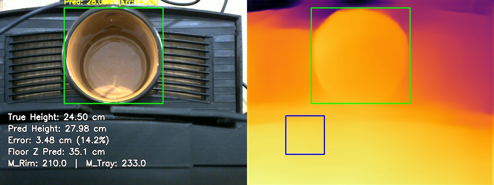
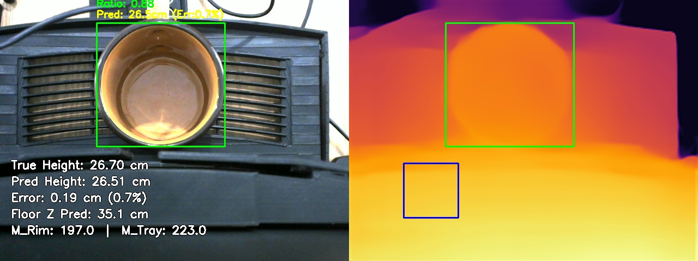
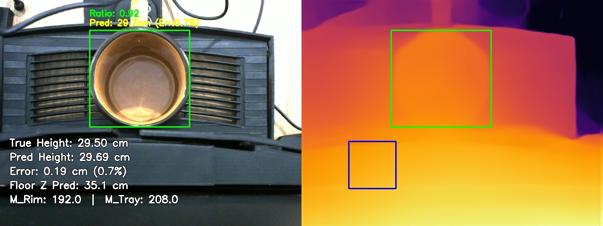

# MiDaS Depth Calibration: Final Validation Report
Generated on: 2026-04-01 11:00:10

## 1. Calibration Parameters
The system is currently using the **Linear Inverse Depth Model**:
$$ Z = \frac{a}{R + b} + c $$

| Parameter | Value |
| :--- | :--- |
| **a (Scale)** | -654.06 |
| **b (Offset)** | 0.00 |
| **c (Base)** | 1005.52 |
| **Tray ROI** | (100, 300, 200, 400) |
| **Predicted Floor Z** | **35.15 cm** |

## 2. Global Accuracy Summary
- **Total Samples Validated**: 3
- **Mean Absolute Error (MAE)**: **1.29 cm**

## 3. Individual Breakdown
| Snapshot | M_rim | M_tray | Ratio | True Z | Pred Z | Error % |
| :--- | :--- | :--- | :--- | :--- | :--- | :--- |
| cup_24.5cm_1774845977.jpg | 210.0 | 233.0 | **0.90** | 24.50cm | 27.98cm | 14.2% |
| cup_26.7cm_1774846019.jpg | 197.0 | 223.0 | **0.88** | 26.70cm | 26.51cm | 0.7% |
| cup_29.5cm_1774846042.jpg | 192.0 | 208.0 | **0.92** | 29.50cm | 29.69cm | 0.7% |

## 4. Visual Evidence
### Sample: cup_24.5cm_1774845977.jpg

**Math Trace**:
- Absolute Floor Distance (Predicted): **35.15 cm**
- $R = 210.0 / 233.0 = 0.901$
- $Z = (-654.06 / (0.901 + 0.00)) + 1005.52 = 279.8 mm$
- **Result**: 27.98 cm

---

### Sample: cup_26.7cm_1774846019.jpg

**Math Trace**:
- Absolute Floor Distance (Predicted): **35.15 cm**
- $R = 197.0 / 223.0 = 0.883$
- $Z = (-654.06 / (0.883 + 0.00)) + 1005.52 = 265.1 mm$
- **Result**: 26.51 cm

---

### Sample: cup_29.5cm_1774846042.jpg

**Math Trace**:
- Absolute Floor Distance (Predicted): **35.15 cm**
- $R = 192.0 / 208.0 = 0.923$
- $Z = (-654.06 / (0.923 + 0.00)) + 1005.52 = 296.9 mm$
- **Result**: 29.69 cm

---

