# MiDaS Depth Calibration: Final Validation Report
Generated on: 2026-04-27 15:07:59

## 1. Calibration Parameters
The system is currently using the **Pure Physics Multiplier Model**:
$$ Z = (\frac{Z_{tray}}{R}) \times \alpha $$

| Parameter | Value |
| :--- | :--- |
| **Alpha Multiplier** | 1.0000 |
| **Tray ROI** | (0, 260, 30, 350) |
| **Predicted Floor Z** | **23.17 cm** |

## 2. Global Accuracy Summary
| Metric | Value | Description |
| :--- | :--- | :--- |
| **Mean Absolute Error (MAE)** | **3.54 cm** | Average absolute distance off target. |
| **Root Mean Sq Error (RMSE)** | **4.49 cm** | Punishes severe outliers heavily. |
| **Standard Deviation ($\sigma$)** | **3.72 cm** | Consistency of the error spread. |
| **Mean Abs Pct Error (MAPE)** | **26.8%** | Average percentage distance off target. |
| **Strict ($\delta < 5mm$)** | **4.9%** | Predictions within 5mm of True Z. |
| **Standard ($\delta < 1cm$)** | **19.5%** | Predictions within 10mm of True Z. |
| **Loose ($\delta < 2cm$)** | **39.0%** | Predictions within 20mm of True Z. |
| **Valid Test Set Frames** | **41** | Total snapshots successfully evaluated. |

## 3. Individual Breakdown
| Snapshot | M_rim | M_tray | Ratio | True Z | Pred Z | Error % |
| :--- | :--- | :--- | :--- | :--- | :--- | :--- |
| test_tray18.5cm_rim11.0cm_1777272964.jpg | 240.0 | 194.0 | **1.24** | 11.00cm | 14.95cm | 35.9% |
| test_tray18.8cm_rim11.2cm_1777273681.jpg | 253.0 | 206.0 | **1.23** | 11.20cm | 15.31cm | 36.7% |
| test_tray20.5cm_rim10.3cm_1777276090.jpg | 244.0 | 159.0 | **1.53** | 10.30cm | 13.36cm | 29.7% |
| test_tray20.6cm_rim13.0cm_1777273119.jpg | 252.0 | 162.0 | **1.56** | 13.00cm | 13.24cm | 1.9% |
| test_tray20.7cm_rim10.5cm_1777276149.jpg | 249.0 | 152.0 | **1.64** | 10.50cm | 12.64cm | 20.3% |
| test_tray21.0cm_rim13.4cm_1777273958.jpg | 255.0 | 170.0 | **1.50** | 13.40cm | 14.00cm | 4.5% |
| test_tray21.1cm_rim13.0cm_1777272620.jpg | 255.0 | 184.0 | **1.39** | 13.00cm | 15.23cm | 17.1% |
| test_tray21.2cm_rim11.0cm_1777275784.jpg | 253.0 | 121.0 | **2.09** | 11.00cm | 10.14cm | 7.8% |
| test_tray21.2cm_rim13.1cm_1777272848.jpg | 255.0 | 149.0 | **1.71** | 13.10cm | 12.39cm | 5.4% |
| test_tray21.5cm_rim10.4cm_1776319920.jpg | 255.0 | 111.0 | **2.30** | 10.40cm | 9.36cm | 10.0% |
| test_tray21.5cm_rim14.0cm_1776319380.jpg | 234.0 | 95.0 | **2.46** | 14.00cm | 8.73cm | 37.7% |
| test_tray21.6cm_rim11.4cm_1777276288.jpg | 243.0 | 80.0 | **3.04** | 11.40cm | 7.11cm | 37.6% |
| test_tray21.7cm_rim14.3cm_1777273361.jpg | 252.0 | 73.0 | **3.45** | 14.30cm | 6.29cm | 56.0% |
| test_tray22.1cm_rim11.9cm_1777275722.jpg | 250.0 | 32.0 | **7.81** | 11.90cm | 2.83cm | 76.2% |
| test_tray22.4cm_rim11.2cm_1777274219.jpg | 254.0 | 93.0 | **2.73** | 11.20cm | 8.20cm | 26.8% |
| test_tray22.6cm_rim11.4cm_1777274335.jpg | 255.0 | 79.0 | **3.23** | 11.40cm | 7.00cm | 38.6% |
| test_tray22.8cm_rim15.3cm_1776319430.jpg | 237.0 | 73.0 | **3.25** | 15.30cm | 7.02cm | 54.1% |
| test_tray23.0cm_rim11.1cm_1776319882.jpg | 255.0 | 104.0 | **2.45** | 11.10cm | 9.38cm | 15.5% |
| test_tray23.0cm_rim12.8cm_1777275628.jpg | 240.0 | 48.0 | **5.00** | 12.80cm | 4.60cm | 64.1% |
| test_tray23.3cm_rim11.9cm_1777274426.jpg | 255.0 | 55.0 | **4.64** | 11.90cm | 5.03cm | 57.8% |
| test_tray23.4cm_rim15.9cm_1777272457.jpg | 255.0 | 145.0 | **1.76** | 15.90cm | 13.31cm | 16.3% |
| test_tray23.4cm_rim15.9cm_1777272475.jpg | 240.0 | 167.0 | **1.44** | 15.90cm | 16.28cm | 2.4% |
| test_tray23.5cm_rim16.0cm_1776319468.jpg | 195.0 | 120.0 | **1.62** | 16.00cm | 14.46cm | 9.6% |
| test_tray23.7cm_rim13.5cm_1777275440.jpg | 194.0 | 87.0 | **2.23** | 13.50cm | 10.63cm | 21.3% |
| test_tray23.8cm_rim12.0cm_1777274556.jpg | 214.0 | 93.0 | **2.30** | 12.00cm | 10.34cm | 13.8% |
| test_tray24.0cm_rim13.9cm_1776319711.jpg | 191.0 | 48.0 | **3.98** | 13.90cm | 6.03cm | 56.6% |
| test_tray24.0cm_rim16.4cm_1777273247.jpg | 173.0 | 49.0 | **3.53** | 16.40cm | 6.80cm | 58.6% |
| test_tray24.1cm_rim12.9cm_1777274769.jpg | 220.0 | 83.0 | **2.65** | 12.90cm | 9.09cm | 29.5% |
| test_tray24.5cm_rim13.3cm_1777274870.jpg | 251.0 | 125.0 | **2.01** | 13.30cm | 12.20cm | 8.3% |
| test_tray24.6cm_rim17.1cm_1776319507.jpg | 199.0 | 107.0 | **1.86** | 17.10cm | 13.23cm | 22.6% |
| test_tray24.7cm_rim14.5cm_1777275384.jpg | 199.0 | 70.0 | **2.84** | 14.50cm | 8.69cm | 40.1% |
| test_tray24.95cm_rim14.85cm_1776319655.jpg | 185.0 | 44.0 | **4.20** | 14.85cm | 5.93cm | 60.0% |
| test_tray25.1cm_rim10.4cm_1776319971.jpg | 192.0 | 41.0 | **4.68** | 10.40cm | 5.36cm | 48.5% |
| test_tray25.1cm_rim13.9cm_1777274943.jpg | 221.0 | 105.0 | **2.10** | 13.90cm | 11.93cm | 14.2% |
| test_tray25.4cm_rim14.3cm_1777275019.jpg | 226.0 | 119.0 | **1.90** | 14.30cm | 13.37cm | 6.5% |
| test_tray25.4cm_rim18.0cm_1777272752.jpg | 230.0 | 140.0 | **1.64** | 18.00cm | 15.46cm | 14.1% |
| test_tray25.9cm_rim18.4cm_1776319547.jpg | 176.0 | 116.0 | **1.52** | 18.40cm | 17.07cm | 7.2% |
| test_tray26.0cm_rim14.8cm_1777275098.jpg | 201.0 | 131.0 | **1.53** | 14.80cm | 16.95cm | 14.5% |
| test_tray26.3cm_rim16.1cm_1777275315.jpg | 187.0 | 125.0 | **1.50** | 16.10cm | 17.58cm | 9.2% |
| test_tray26.6cm_rim15.4cm_1777275167.jpg | 179.0 | 109.0 | **1.64** | 15.40cm | 16.20cm | 5.2% |
| test_tray26.6cm_rim16.5cm_1777275227.jpg | 230.0 | 136.0 | **1.69** | 16.50cm | 15.73cm | 4.7% |

## 4. Visual Evidence
### Sample: test_tray18.5cm_rim11.0cm_1777272964.jpg
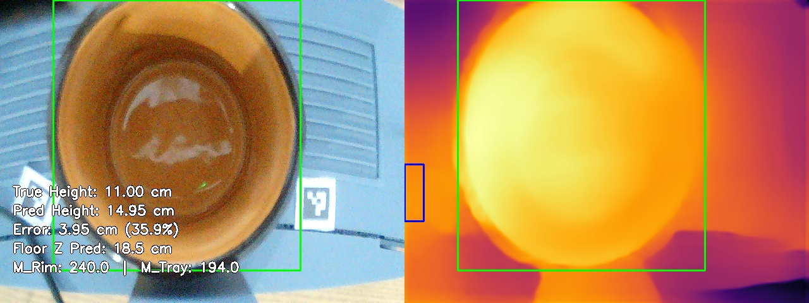

**Math Trace**:
- Absolute Floor Distance (Predicted): **18.50 cm**
- $R = 240.0 / 194.0 = 1.237$
- $Z = (18.5 / 1.237) \times 1.0000 = 15.0 cm$
- **Result**: 14.95 cm

---

### Sample: test_tray18.8cm_rim11.2cm_1777273681.jpg
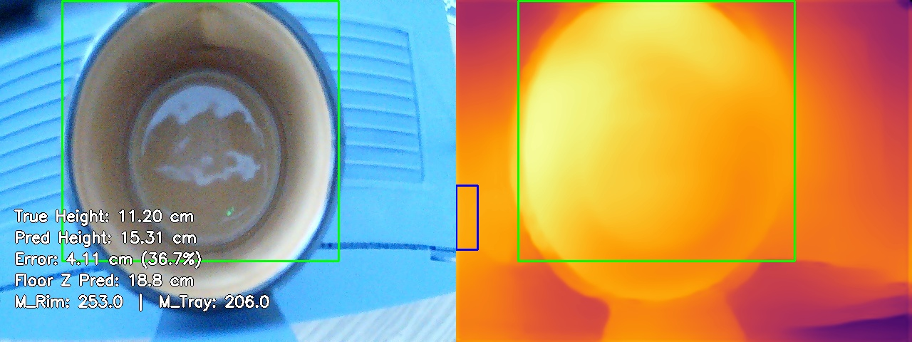

**Math Trace**:
- Absolute Floor Distance (Predicted): **18.80 cm**
- $R = 253.0 / 206.0 = 1.228$
- $Z = (18.8 / 1.228) \times 1.0000 = 15.3 cm$
- **Result**: 15.31 cm

---

### Sample: test_tray20.5cm_rim10.3cm_1777276090.jpg
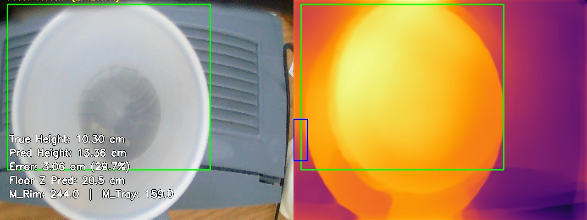

**Math Trace**:
- Absolute Floor Distance (Predicted): **20.50 cm**
- $R = 244.0 / 159.0 = 1.535$
- $Z = (20.5 / 1.535) \times 1.0000 = 13.4 cm$
- **Result**: 13.36 cm

---

### Sample: test_tray20.6cm_rim13.0cm_1777273119.jpg
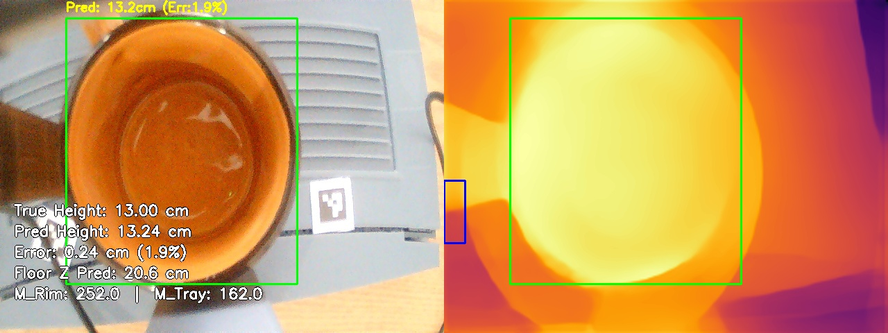

**Math Trace**:
- Absolute Floor Distance (Predicted): **20.60 cm**
- $R = 252.0 / 162.0 = 1.556$
- $Z = (20.6 / 1.556) \times 1.0000 = 13.2 cm$
- **Result**: 13.24 cm

---

### Sample: test_tray20.7cm_rim10.5cm_1777276149.jpg
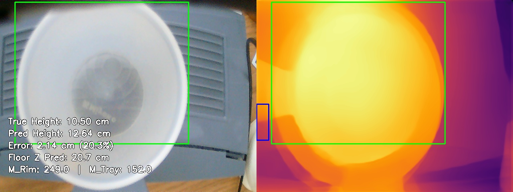

**Math Trace**:
- Absolute Floor Distance (Predicted): **20.70 cm**
- $R = 249.0 / 152.0 = 1.638$
- $Z = (20.7 / 1.638) \times 1.0000 = 12.6 cm$
- **Result**: 12.64 cm

---

### Sample: test_tray21.0cm_rim13.4cm_1777273958.jpg
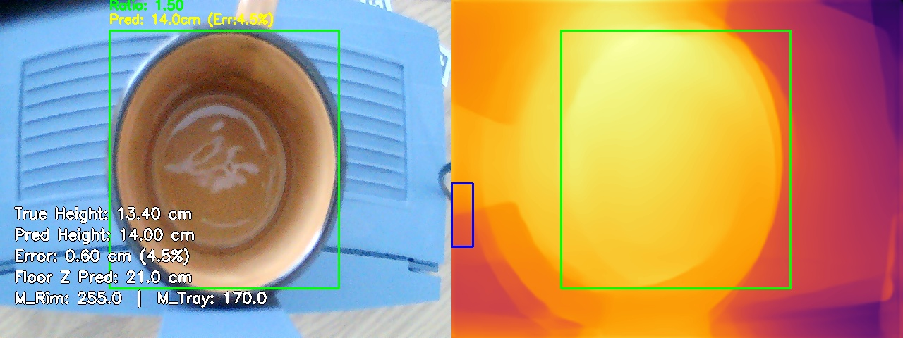

**Math Trace**:
- Absolute Floor Distance (Predicted): **21.00 cm**
- $R = 255.0 / 170.0 = 1.500$
- $Z = (21.0 / 1.500) \times 1.0000 = 14.0 cm$
- **Result**: 14.00 cm

---

### Sample: test_tray21.1cm_rim13.0cm_1777272620.jpg
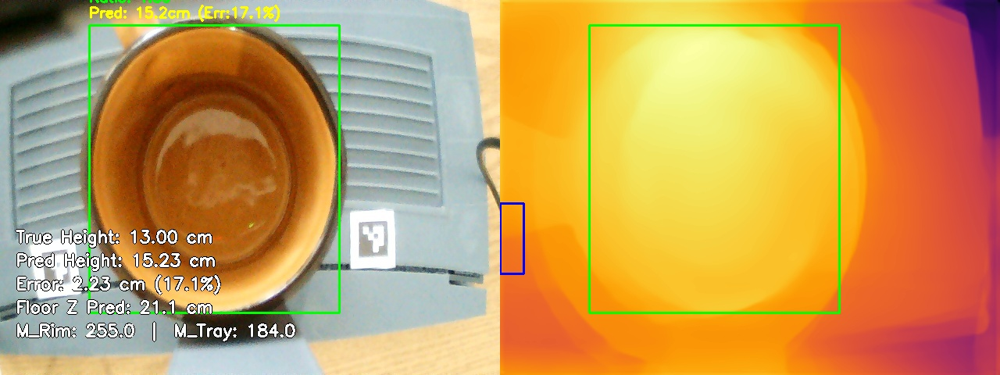

**Math Trace**:
- Absolute Floor Distance (Predicted): **21.10 cm**
- $R = 255.0 / 184.0 = 1.386$
- $Z = (21.1 / 1.386) \times 1.0000 = 15.2 cm$
- **Result**: 15.23 cm

---

### Sample: test_tray21.2cm_rim11.0cm_1777275784.jpg
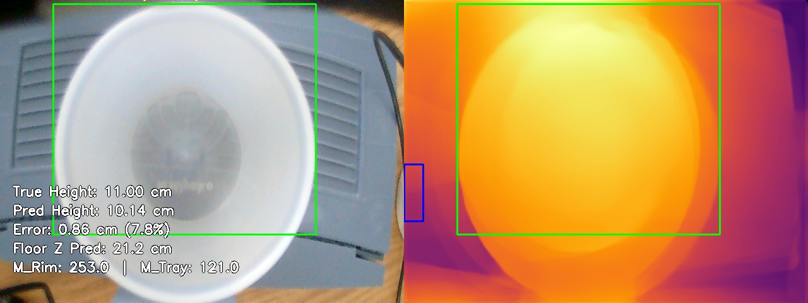

**Math Trace**:
- Absolute Floor Distance (Predicted): **21.20 cm**
- $R = 253.0 / 121.0 = 2.091$
- $Z = (21.2 / 2.091) \times 1.0000 = 10.1 cm$
- **Result**: 10.14 cm

---

### Sample: test_tray21.2cm_rim13.1cm_1777272848.jpg
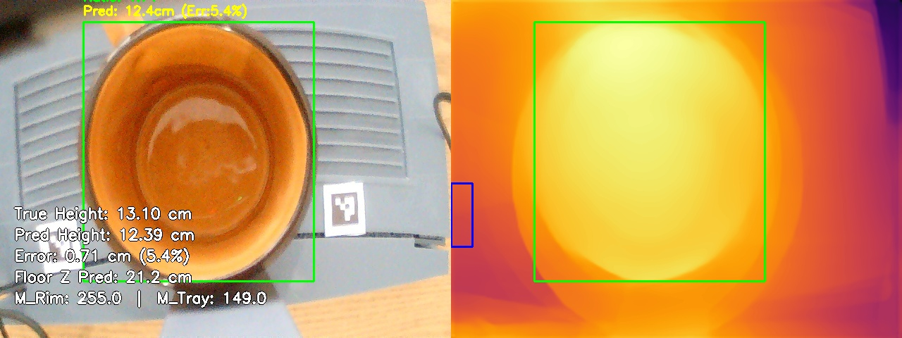

**Math Trace**:
- Absolute Floor Distance (Predicted): **21.20 cm**
- $R = 255.0 / 149.0 = 1.711$
- $Z = (21.2 / 1.711) \times 1.0000 = 12.4 cm$
- **Result**: 12.39 cm

---

### Sample: test_tray21.5cm_rim10.4cm_1776319920.jpg
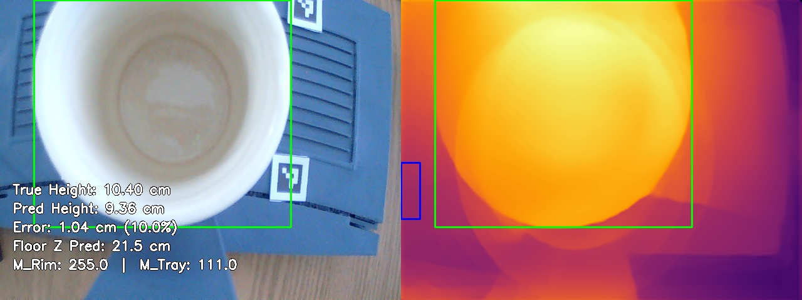

**Math Trace**:
- Absolute Floor Distance (Predicted): **21.50 cm**
- $R = 255.0 / 111.0 = 2.297$
- $Z = (21.5 / 2.297) \times 1.0000 = 9.4 cm$
- **Result**: 9.36 cm

---

### Sample: test_tray21.5cm_rim14.0cm_1776319380.jpg
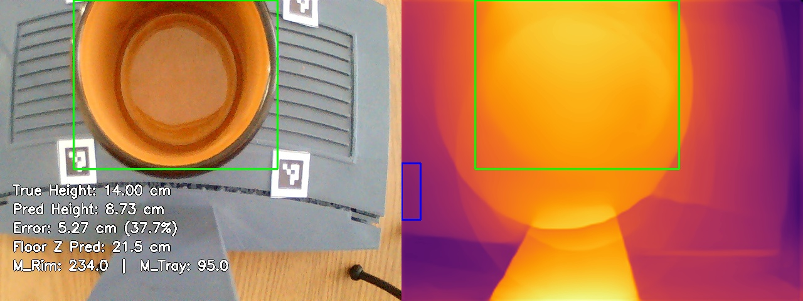

**Math Trace**:
- Absolute Floor Distance (Predicted): **21.50 cm**
- $R = 234.0 / 95.0 = 2.463$
- $Z = (21.5 / 2.463) \times 1.0000 = 8.7 cm$
- **Result**: 8.73 cm

---

### Sample: test_tray21.6cm_rim11.4cm_1777276288.jpg
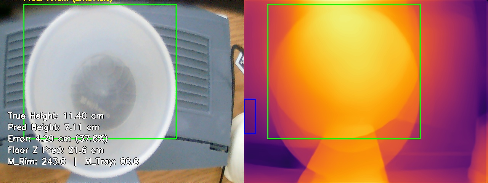

**Math Trace**:
- Absolute Floor Distance (Predicted): **21.60 cm**
- $R = 243.0 / 80.0 = 3.038$
- $Z = (21.6 / 3.038) \times 1.0000 = 7.1 cm$
- **Result**: 7.11 cm

---

### Sample: test_tray21.7cm_rim14.3cm_1777273361.jpg
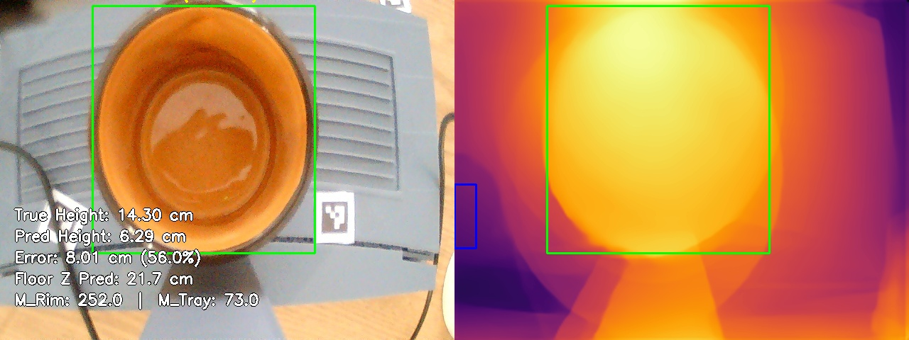

**Math Trace**:
- Absolute Floor Distance (Predicted): **21.70 cm**
- $R = 252.0 / 73.0 = 3.452$
- $Z = (21.7 / 3.452) \times 1.0000 = 6.3 cm$
- **Result**: 6.29 cm

---

### Sample: test_tray22.1cm_rim11.9cm_1777275722.jpg
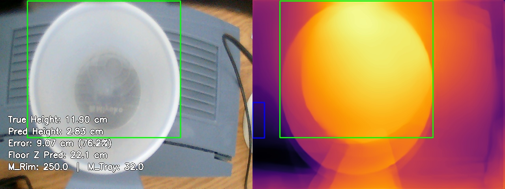

**Math Trace**:
- Absolute Floor Distance (Predicted): **22.10 cm**
- $R = 250.0 / 32.0 = 7.812$
- $Z = (22.1 / 7.812) \times 1.0000 = 2.8 cm$
- **Result**: 2.83 cm

---

### Sample: test_tray22.4cm_rim11.2cm_1777274219.jpg
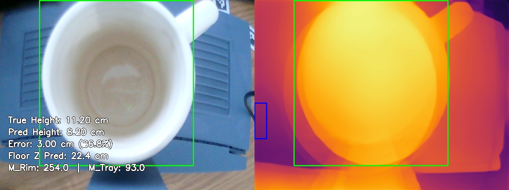

**Math Trace**:
- Absolute Floor Distance (Predicted): **22.40 cm**
- $R = 254.0 / 93.0 = 2.731$
- $Z = (22.4 / 2.731) \times 1.0000 = 8.2 cm$
- **Result**: 8.20 cm

---

### Sample: test_tray22.6cm_rim11.4cm_1777274335.jpg
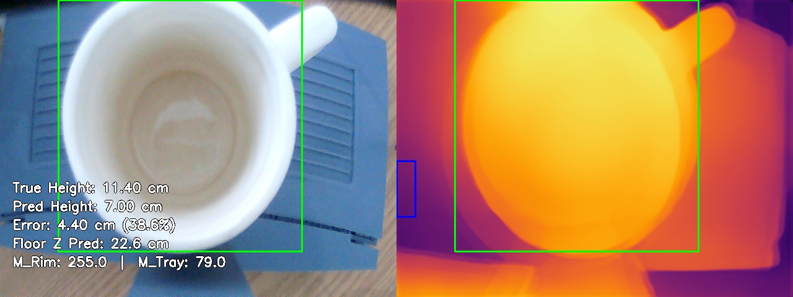

**Math Trace**:
- Absolute Floor Distance (Predicted): **22.60 cm**
- $R = 255.0 / 79.0 = 3.228$
- $Z = (22.6 / 3.228) \times 1.0000 = 7.0 cm$
- **Result**: 7.00 cm

---

### Sample: test_tray22.8cm_rim15.3cm_1776319430.jpg
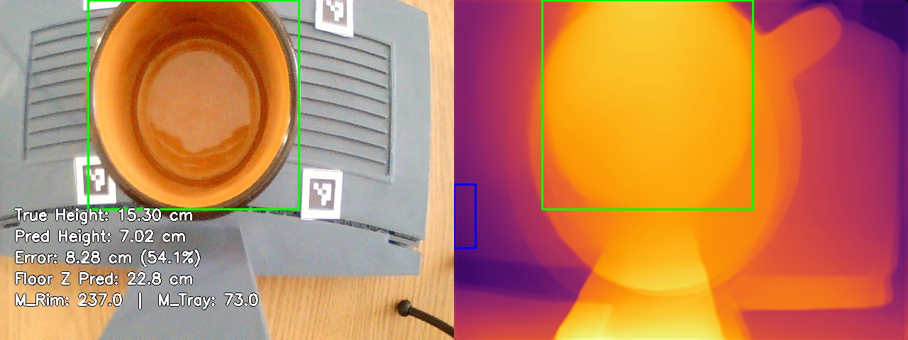

**Math Trace**:
- Absolute Floor Distance (Predicted): **22.80 cm**
- $R = 237.0 / 73.0 = 3.247$
- $Z = (22.8 / 3.247) \times 1.0000 = 7.0 cm$
- **Result**: 7.02 cm

---

### Sample: test_tray23.0cm_rim11.1cm_1776319882.jpg
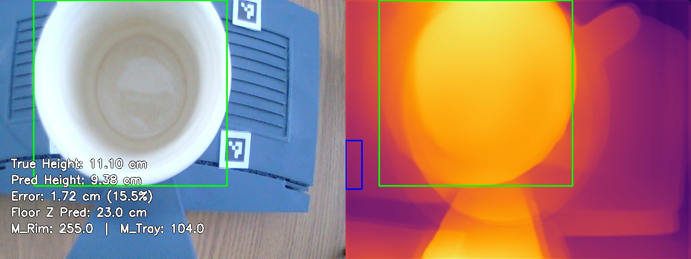

**Math Trace**:
- Absolute Floor Distance (Predicted): **23.00 cm**
- $R = 255.0 / 104.0 = 2.452$
- $Z = (23.0 / 2.452) \times 1.0000 = 9.4 cm$
- **Result**: 9.38 cm

---

### Sample: test_tray23.0cm_rim12.8cm_1777275628.jpg
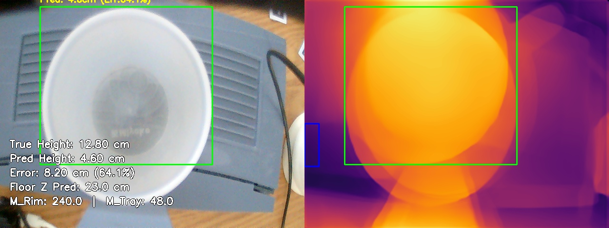

**Math Trace**:
- Absolute Floor Distance (Predicted): **23.00 cm**
- $R = 240.0 / 48.0 = 5.000$
- $Z = (23.0 / 5.000) \times 1.0000 = 4.6 cm$
- **Result**: 4.60 cm

---

### Sample: test_tray23.3cm_rim11.9cm_1777274426.jpg
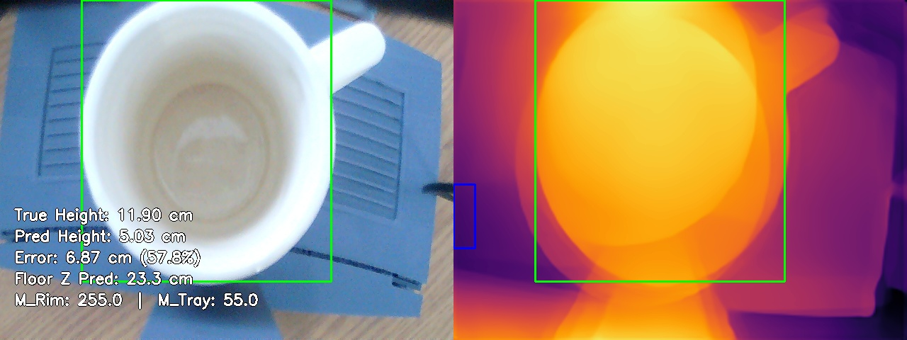

**Math Trace**:
- Absolute Floor Distance (Predicted): **23.30 cm**
- $R = 255.0 / 55.0 = 4.636$
- $Z = (23.3 / 4.636) \times 1.0000 = 5.0 cm$
- **Result**: 5.03 cm

---

### Sample: test_tray23.4cm_rim15.9cm_1777272457.jpg
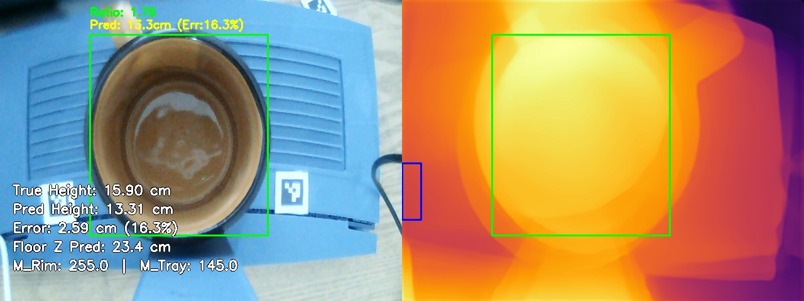

**Math Trace**:
- Absolute Floor Distance (Predicted): **23.40 cm**
- $R = 255.0 / 145.0 = 1.759$
- $Z = (23.4 / 1.759) \times 1.0000 = 13.3 cm$
- **Result**: 13.31 cm

---

### Sample: test_tray23.4cm_rim15.9cm_1777272475.jpg
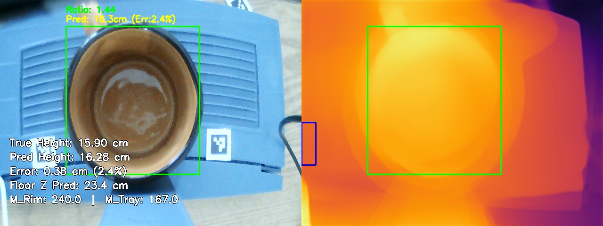

**Math Trace**:
- Absolute Floor Distance (Predicted): **23.40 cm**
- $R = 240.0 / 167.0 = 1.437$
- $Z = (23.4 / 1.437) \times 1.0000 = 16.3 cm$
- **Result**: 16.28 cm

---

### Sample: test_tray23.5cm_rim16.0cm_1776319468.jpg
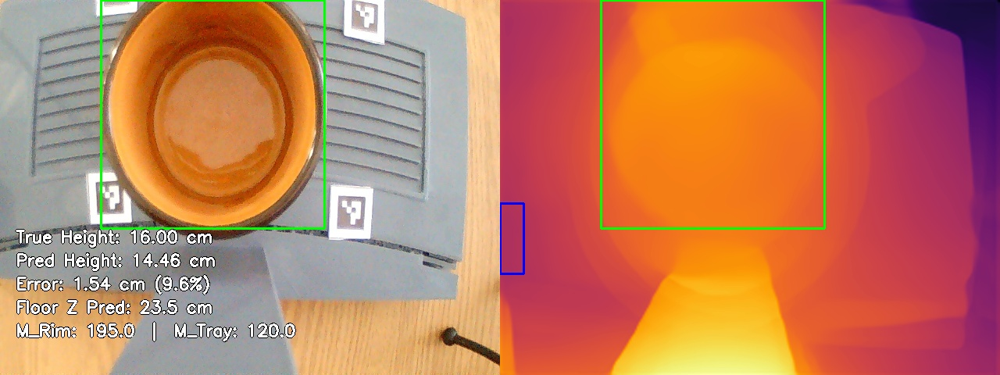

**Math Trace**:
- Absolute Floor Distance (Predicted): **23.50 cm**
- $R = 195.0 / 120.0 = 1.625$
- $Z = (23.5 / 1.625) \times 1.0000 = 14.5 cm$
- **Result**: 14.46 cm

---

### Sample: test_tray23.7cm_rim13.5cm_1777275440.jpg
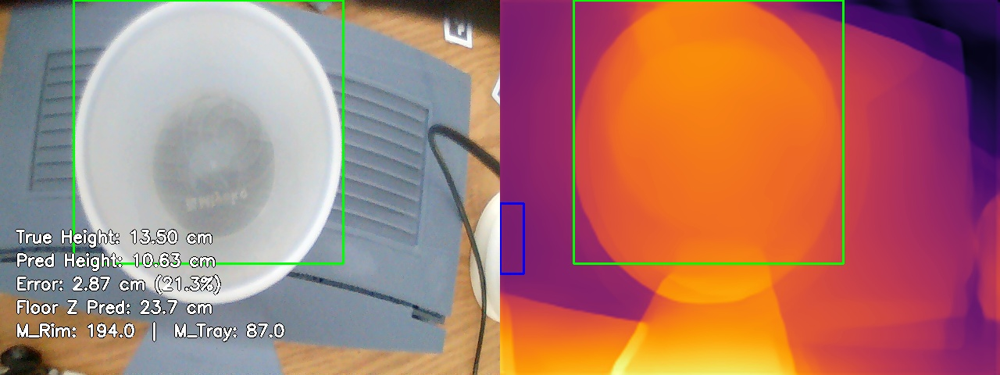

**Math Trace**:
- Absolute Floor Distance (Predicted): **23.70 cm**
- $R = 194.0 / 87.0 = 2.230$
- $Z = (23.7 / 2.230) \times 1.0000 = 10.6 cm$
- **Result**: 10.63 cm

---

### Sample: test_tray23.8cm_rim12.0cm_1777274556.jpg
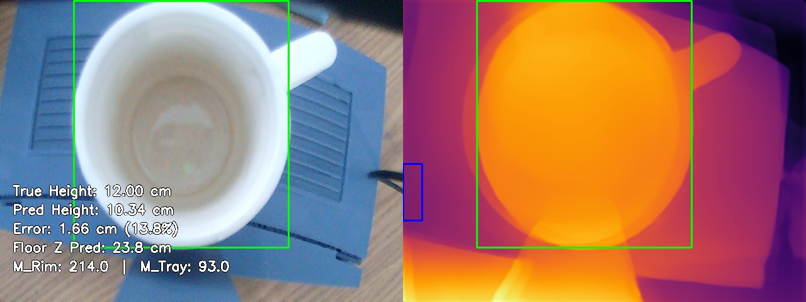

**Math Trace**:
- Absolute Floor Distance (Predicted): **23.80 cm**
- $R = 214.0 / 93.0 = 2.301$
- $Z = (23.8 / 2.301) \times 1.0000 = 10.3 cm$
- **Result**: 10.34 cm

---

### Sample: test_tray24.0cm_rim13.9cm_1776319711.jpg
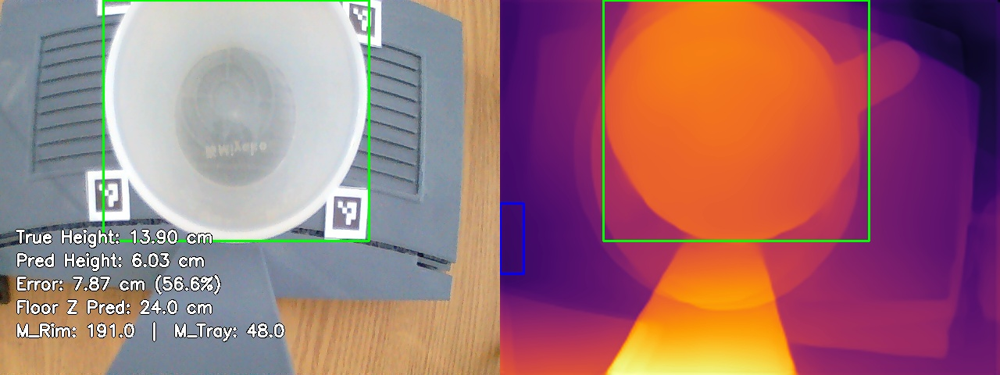

**Math Trace**:
- Absolute Floor Distance (Predicted): **24.00 cm**
- $R = 191.0 / 48.0 = 3.979$
- $Z = (24.0 / 3.979) \times 1.0000 = 6.0 cm$
- **Result**: 6.03 cm

---

### Sample: test_tray24.0cm_rim16.4cm_1777273247.jpg
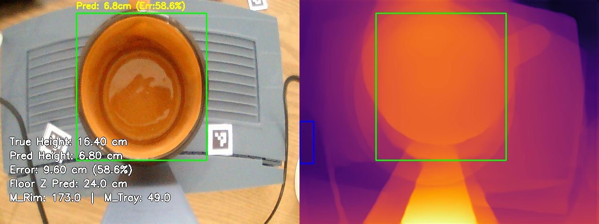

**Math Trace**:
- Absolute Floor Distance (Predicted): **24.00 cm**
- $R = 173.0 / 49.0 = 3.531$
- $Z = (24.0 / 3.531) \times 1.0000 = 6.8 cm$
- **Result**: 6.80 cm

---

### Sample: test_tray24.1cm_rim12.9cm_1777274769.jpg
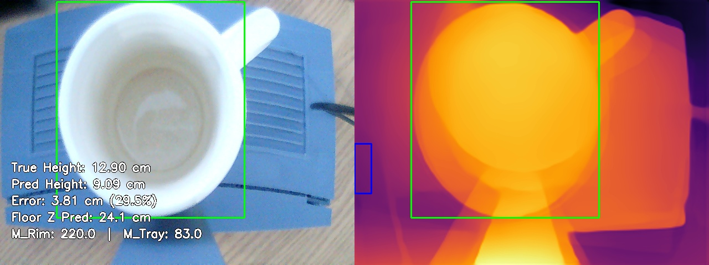

**Math Trace**:
- Absolute Floor Distance (Predicted): **24.10 cm**
- $R = 220.0 / 83.0 = 2.651$
- $Z = (24.1 / 2.651) \times 1.0000 = 9.1 cm$
- **Result**: 9.09 cm

---

### Sample: test_tray24.5cm_rim13.3cm_1777274870.jpg
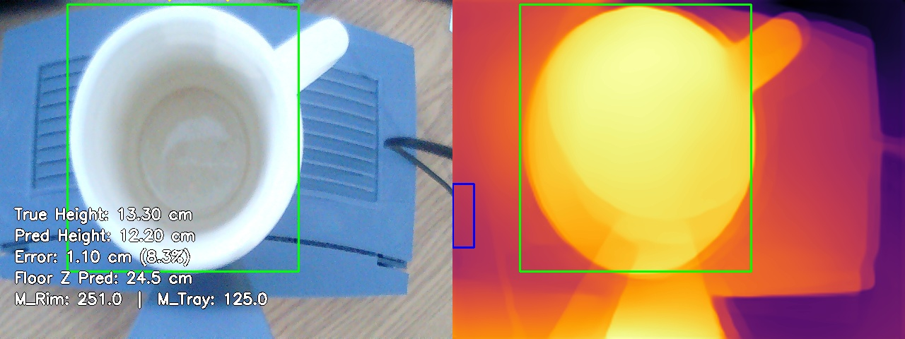

**Math Trace**:
- Absolute Floor Distance (Predicted): **24.50 cm**
- $R = 251.0 / 125.0 = 2.008$
- $Z = (24.5 / 2.008) \times 1.0000 = 12.2 cm$
- **Result**: 12.20 cm

---

### Sample: test_tray24.6cm_rim17.1cm_1776319507.jpg
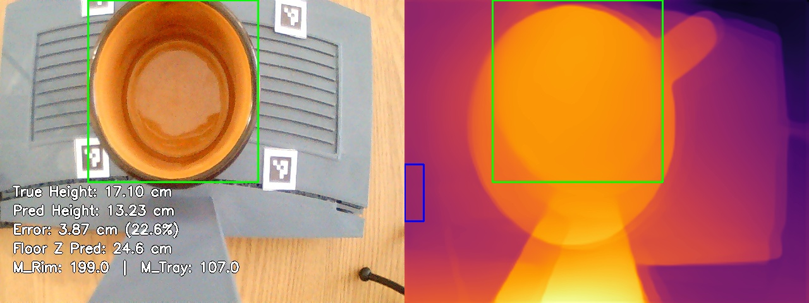

**Math Trace**:
- Absolute Floor Distance (Predicted): **24.60 cm**
- $R = 199.0 / 107.0 = 1.860$
- $Z = (24.6 / 1.860) \times 1.0000 = 13.2 cm$
- **Result**: 13.23 cm

---

### Sample: test_tray24.7cm_rim14.5cm_1777275384.jpg
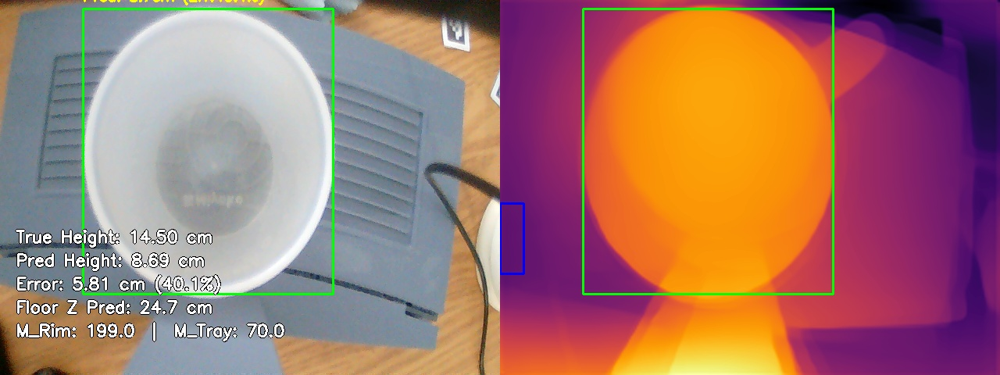

**Math Trace**:
- Absolute Floor Distance (Predicted): **24.70 cm**
- $R = 199.0 / 70.0 = 2.843$
- $Z = (24.7 / 2.843) \times 1.0000 = 8.7 cm$
- **Result**: 8.69 cm

---

### Sample: test_tray24.95cm_rim14.85cm_1776319655.jpg
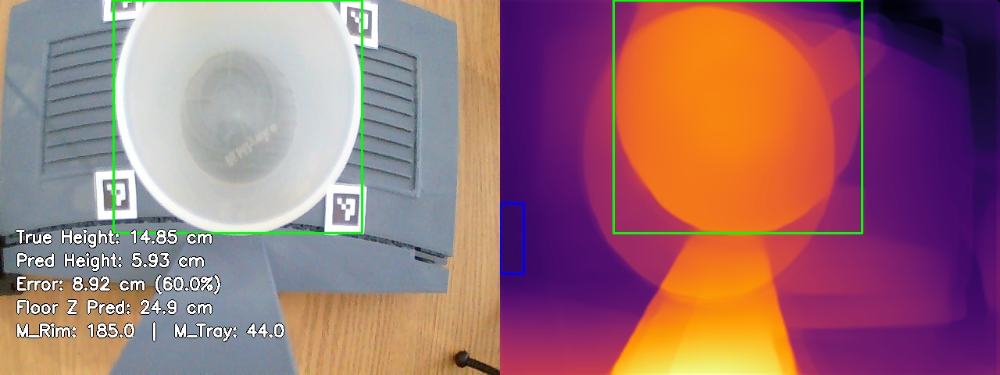

**Math Trace**:
- Absolute Floor Distance (Predicted): **24.95 cm**
- $R = 185.0 / 44.0 = 4.205$
- $Z = (24.9 / 4.205) \times 1.0000 = 5.9 cm$
- **Result**: 5.93 cm

---

### Sample: test_tray25.1cm_rim10.4cm_1776319971.jpg
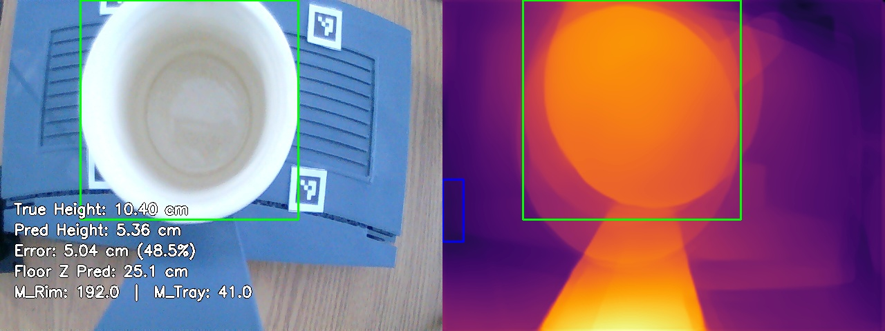

**Math Trace**:
- Absolute Floor Distance (Predicted): **25.10 cm**
- $R = 192.0 / 41.0 = 4.683$
- $Z = (25.1 / 4.683) \times 1.0000 = 5.4 cm$
- **Result**: 5.36 cm

---

### Sample: test_tray25.1cm_rim13.9cm_1777274943.jpg
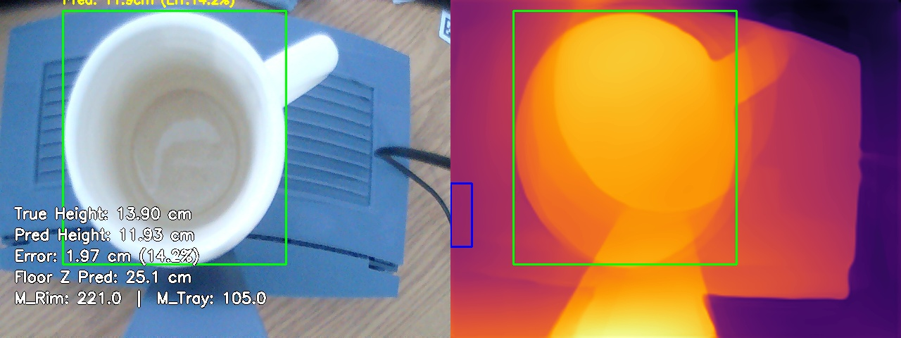

**Math Trace**:
- Absolute Floor Distance (Predicted): **25.10 cm**
- $R = 221.0 / 105.0 = 2.105$
- $Z = (25.1 / 2.105) \times 1.0000 = 11.9 cm$
- **Result**: 11.93 cm

---

### Sample: test_tray25.4cm_rim14.3cm_1777275019.jpg
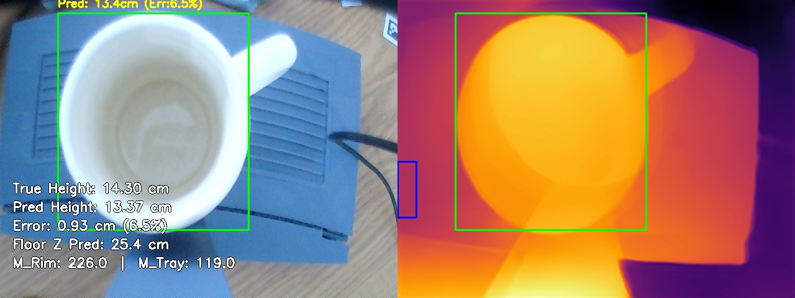

**Math Trace**:
- Absolute Floor Distance (Predicted): **25.40 cm**
- $R = 226.0 / 119.0 = 1.899$
- $Z = (25.4 / 1.899) \times 1.0000 = 13.4 cm$
- **Result**: 13.37 cm

---

### Sample: test_tray25.4cm_rim18.0cm_1777272752.jpg
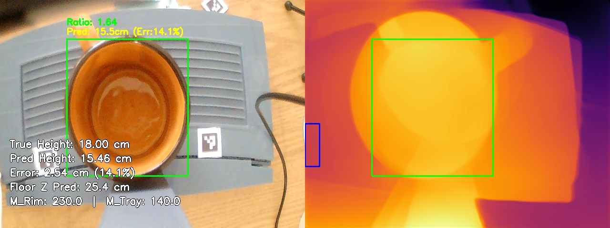

**Math Trace**:
- Absolute Floor Distance (Predicted): **25.40 cm**
- $R = 230.0 / 140.0 = 1.643$
- $Z = (25.4 / 1.643) \times 1.0000 = 15.5 cm$
- **Result**: 15.46 cm

---

### Sample: test_tray25.9cm_rim18.4cm_1776319547.jpg
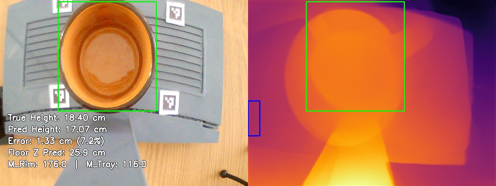

**Math Trace**:
- Absolute Floor Distance (Predicted): **25.90 cm**
- $R = 176.0 / 116.0 = 1.517$
- $Z = (25.9 / 1.517) \times 1.0000 = 17.1 cm$
- **Result**: 17.07 cm

---

### Sample: test_tray26.0cm_rim14.8cm_1777275098.jpg
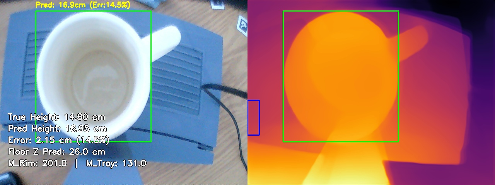

**Math Trace**:
- Absolute Floor Distance (Predicted): **26.00 cm**
- $R = 201.0 / 131.0 = 1.534$
- $Z = (26.0 / 1.534) \times 1.0000 = 16.9 cm$
- **Result**: 16.95 cm

---

### Sample: test_tray26.3cm_rim16.1cm_1777275315.jpg
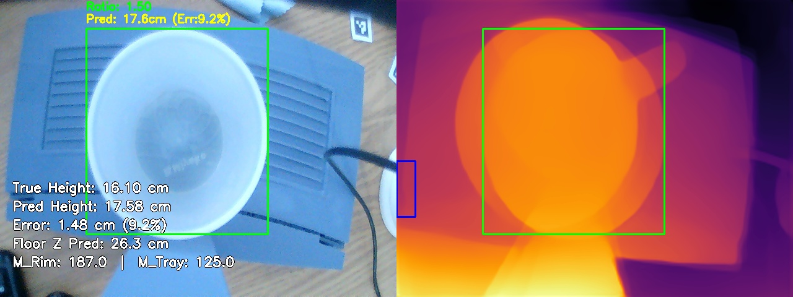

**Math Trace**:
- Absolute Floor Distance (Predicted): **26.30 cm**
- $R = 187.0 / 125.0 = 1.496$
- $Z = (26.3 / 1.496) \times 1.0000 = 17.6 cm$
- **Result**: 17.58 cm

---

### Sample: test_tray26.6cm_rim15.4cm_1777275167.jpg
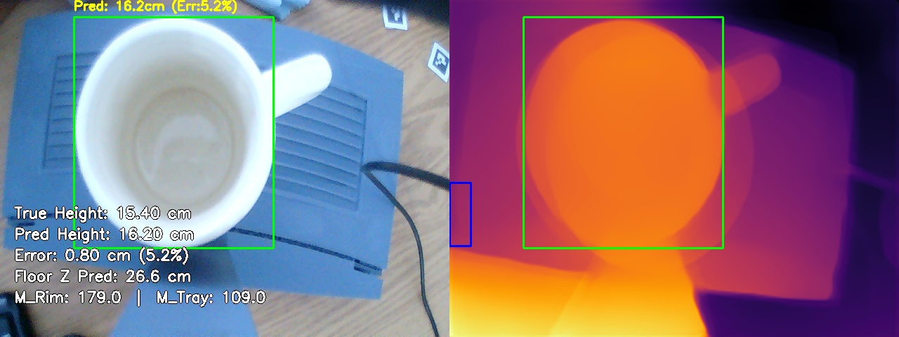

**Math Trace**:
- Absolute Floor Distance (Predicted): **26.60 cm**
- $R = 179.0 / 109.0 = 1.642$
- $Z = (26.6 / 1.642) \times 1.0000 = 16.2 cm$
- **Result**: 16.20 cm

---

### Sample: test_tray26.6cm_rim16.5cm_1777275227.jpg
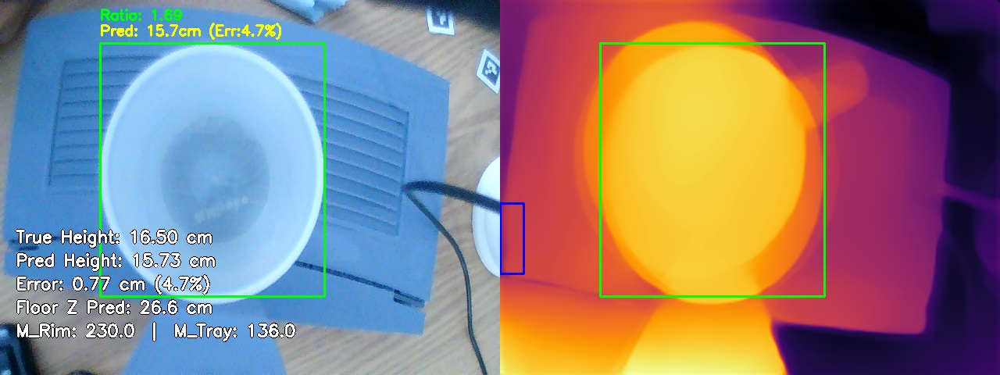

**Math Trace**:
- Absolute Floor Distance (Predicted): **26.60 cm**
- $R = 230.0 / 136.0 = 1.691$
- $Z = (26.6 / 1.691) \times 1.0000 = 15.7 cm$
- **Result**: 15.73 cm

---

