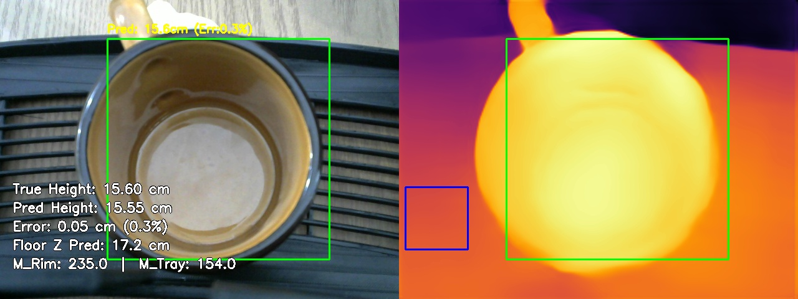
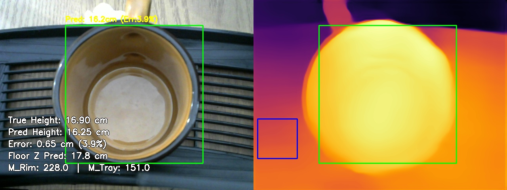
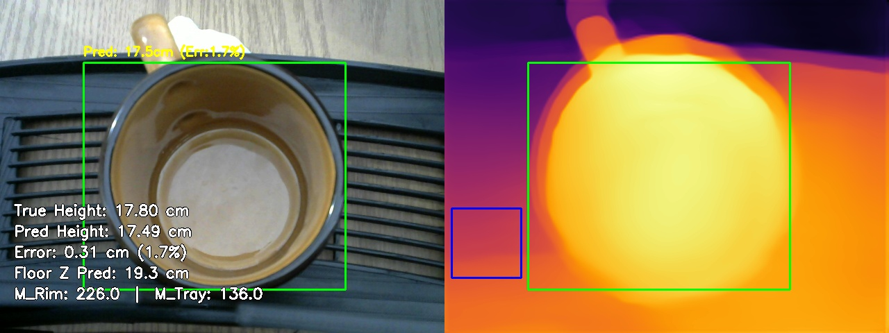
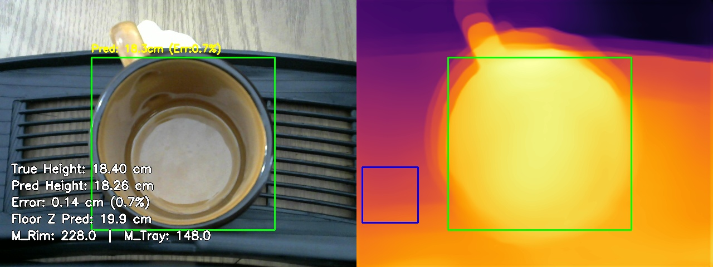
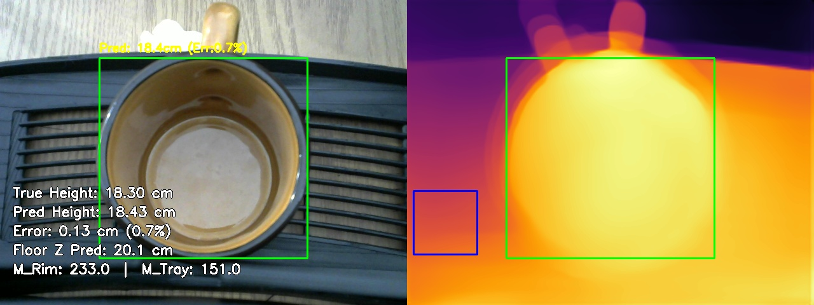
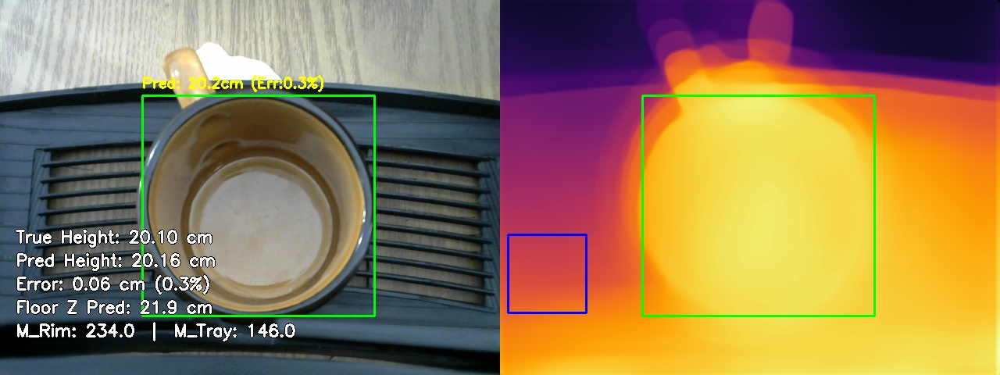
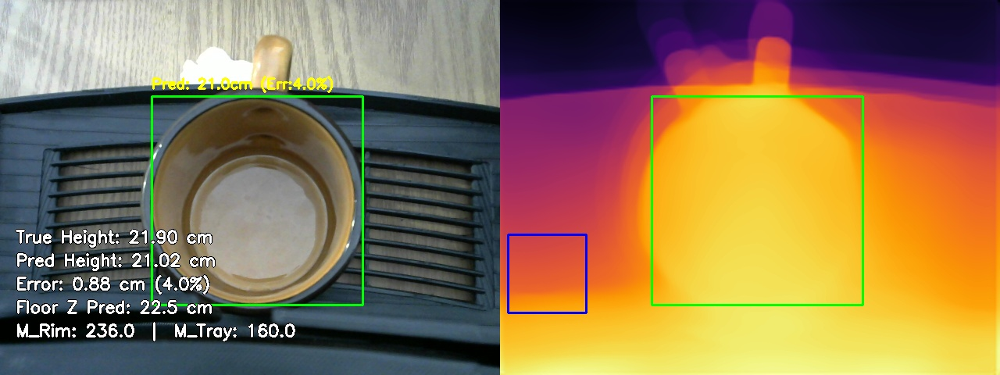
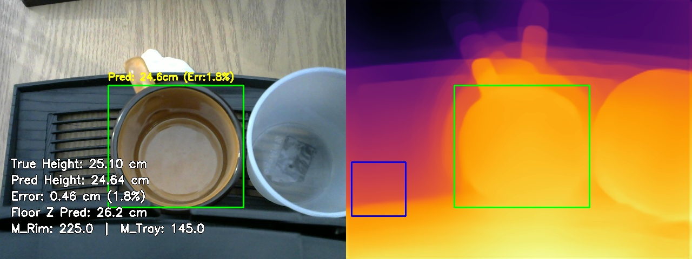
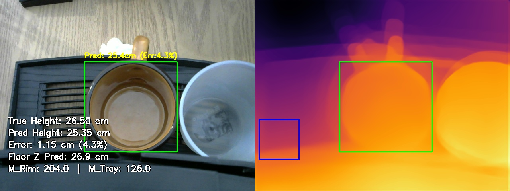
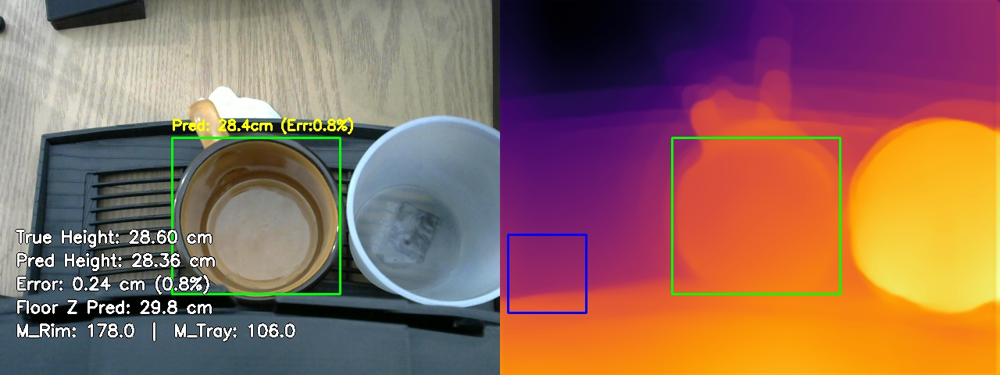

# MiDaS Depth Calibration: Multivariate Validation Report
Generated on: 2026-04-02 15:36:02

## 1. Calibration Parameters
The system is currently using the **Multivariate Linear Regression Model**:
$$ Z_{rim} = C_1 \cdot M_{rim} + C_2 \cdot M_{tray} + C_3 \cdot Z_{tray} + C_4 $$

| Parameter | Value |
| :--- | :--- |
| **C1 (Rim Weight)** | -0.0200 |
| **C2 (Tray Weight)** | -0.0009 |
| **C3 (Lens Disp. Weight)** | 0.9149 |
| **C4 (Bias/Shift)** | -0.9109 |
| **Tray ROI** | (10, 300, 110, 400) |
| **Predicted Average Floor Z** | **22.16 cm** |

## 2. Global Accuracy Summary

| Metric | Value | Description |
| :--- | :--- | :--- |
| **Mean Absolute Error (MAE)** | **0.41 cm** | Average absolute distance off target. |
| **Root Mean Sq Error (RMSE)** | **0.54 cm** | Punishes severe outliers heavily. |
| **Standard Deviation ($\sigma$)** | **0.40 cm** | Consistency of the error spread. |
| **Mean Abs Pct Error (MAPE)** | **1.9%** | Average percentage distance off target. |
| **Strict ($\delta < 5mm$)** | **70.0%** | Predictions within 5mm of True Z. |
| **Standard ($\delta < 1cm$)** | **90.0%** | Predictions within 10mm of True Z. |
| **Loose ($\delta < 2cm$)** | **100.0%** | Predictions within 20mm of True Z. |
| **Valid Test Set Frames** | **10** | Total snapshots successfully evaluated. |

## 3. Individual Breakdown
| Snapshot | M_rim | M_tray | True Z | Pred Z | Error % |
| :--- | :--- | :--- | :--- | :--- | :--- |
| calib_tray23.3cm_rim15.6cm_1775102929.jpg | 235.0 | 154.0 | 15.60cm | 15.55cm | 0.3% |
| calib_tray23.9cm_rim16.9cm_1775104013.jpg | 228.0 | 151.0 | 16.90cm | 16.25cm | 3.9% |
| calib_tray25.2cm_rim17.8cm_1775103244.jpg | 226.0 | 136.0 | 17.80cm | 17.49cm | 1.7% |
| calib_tray26.1cm_rim18.4cm_1775103325.jpg | 228.0 | 148.0 | 18.40cm | 18.26cm | 0.7% |
| calib_tray26.4cm_rim18.3cm_1775104073.jpg | 233.0 | 151.0 | 18.30cm | 18.43cm | 0.7% |
| calib_tray28.3cm_rim20.1cm_1775103379.jpg | 234.0 | 146.0 | 20.10cm | 20.16cm | 0.3% |
| calib_tray29.3cm_rim21.9cm_1775104111.jpg | 236.0 | 160.0 | 21.90cm | 21.02cm | 4.0% |
| calib_tray33.0cm_rim25.1cm_1775103562.jpg | 225.0 | 145.0 | 25.10cm | 24.64cm | 1.8% |
| calib_tray33.3cm_rim26.5cm_1775104186.jpg | 204.0 | 126.0 | 26.50cm | 25.35cm | 4.3% |
| calib_tray36.0cm_rim28.6cm_1775103633.jpg | 178.0 | 106.0 | 28.60cm | 28.36cm | 0.8% |

## 4. Visual Evidence
### Sample: calib_tray23.3cm_rim15.6cm_1775102929.jpg

**Math Trace**:
- Absolute Floor Distance (Predicted): **17.18 cm**
- $Z_{rim} = (-0.0200 \cdot 235.0) + (-0.0009 \cdot 154.0) + (0.9149 \cdot 23.3) + -0.9109 = 15.6 cm$
- **Result**: 15.55 cm

---

### Sample: calib_tray23.9cm_rim16.9cm_1775104013.jpg

**Math Trace**:
- Absolute Floor Distance (Predicted): **17.79 cm**
- $Z_{rim} = (-0.0200 \cdot 228.0) + (-0.0009 \cdot 151.0) + (0.9149 \cdot 23.9) + -0.9109 = 16.2 cm$
- **Result**: 16.25 cm

---

### Sample: calib_tray25.2cm_rim17.8cm_1775103244.jpg

**Math Trace**:
- Absolute Floor Distance (Predicted): **19.29 cm**
- $Z_{rim} = (-0.0200 \cdot 226.0) + (-0.0009 \cdot 136.0) + (0.9149 \cdot 25.2) + -0.9109 = 17.5 cm$
- **Result**: 17.49 cm

---

### Sample: calib_tray26.1cm_rim18.4cm_1775103325.jpg

**Math Trace**:
- Absolute Floor Distance (Predicted): **19.87 cm**
- $Z_{rim} = (-0.0200 \cdot 228.0) + (-0.0009 \cdot 148.0) + (0.9149 \cdot 26.1) + -0.9109 = 18.3 cm$
- **Result**: 18.26 cm

---

### Sample: calib_tray26.4cm_rim18.3cm_1775104073.jpg

**Math Trace**:
- Absolute Floor Distance (Predicted): **20.08 cm**
- $Z_{rim} = (-0.0200 \cdot 233.0) + (-0.0009 \cdot 151.0) + (0.9149 \cdot 26.4) + -0.9109 = 18.4 cm$
- **Result**: 18.43 cm

---

### Sample: calib_tray28.3cm_rim20.1cm_1775103379.jpg

**Math Trace**:
- Absolute Floor Distance (Predicted): **21.92 cm**
- $Z_{rim} = (-0.0200 \cdot 234.0) + (-0.0009 \cdot 146.0) + (0.9149 \cdot 28.3) + -0.9109 = 20.2 cm$
- **Result**: 20.16 cm

---

### Sample: calib_tray29.3cm_rim21.9cm_1775104111.jpg

**Math Trace**:
- Absolute Floor Distance (Predicted): **22.54 cm**
- $Z_{rim} = (-0.0200 \cdot 236.0) + (-0.0009 \cdot 160.0) + (0.9149 \cdot 29.3) + -0.9109 = 21.0 cm$
- **Result**: 21.02 cm

---

### Sample: calib_tray33.0cm_rim25.1cm_1775103562.jpg

**Math Trace**:
- Absolute Floor Distance (Predicted): **26.24 cm**
- $Z_{rim} = (-0.0200 \cdot 225.0) + (-0.0009 \cdot 145.0) + (0.9149 \cdot 33.0) + -0.9109 = 24.6 cm$
- **Result**: 24.64 cm

---

### Sample: calib_tray33.3cm_rim26.5cm_1775104186.jpg

**Math Trace**:
- Absolute Floor Distance (Predicted): **26.91 cm**
- $Z_{rim} = (-0.0200 \cdot 204.0) + (-0.0009 \cdot 126.0) + (0.9149 \cdot 33.3) + -0.9109 = 25.4 cm$
- **Result**: 25.35 cm

---

### Sample: calib_tray36.0cm_rim28.6cm_1775103633.jpg

**Math Trace**:
- Absolute Floor Distance (Predicted): **29.80 cm**
- $Z_{rim} = (-0.0200 \cdot 178.0) + (-0.0009 \cdot 106.0) + (0.9149 \cdot 36.0) + -0.9109 = 28.4 cm$
- **Result**: 28.36 cm

---

