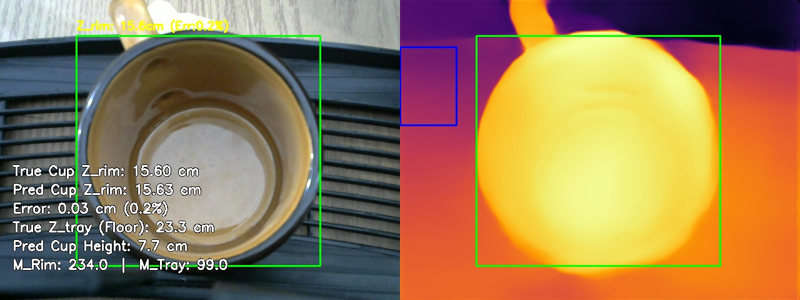
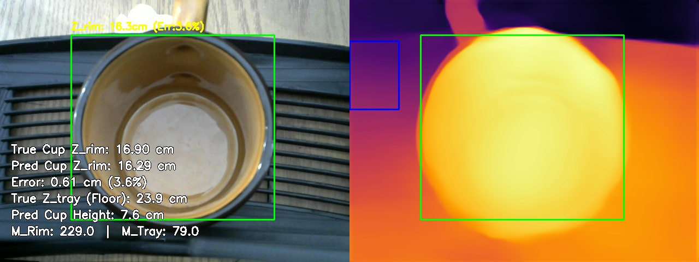
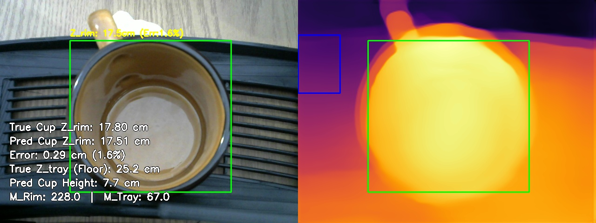
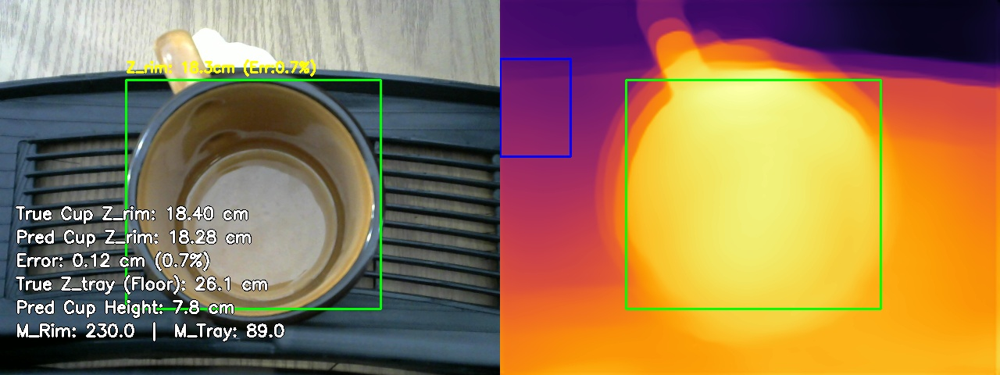
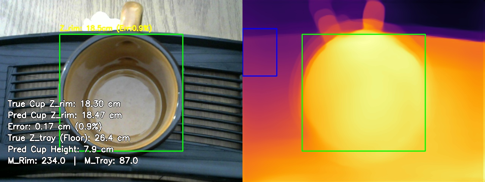
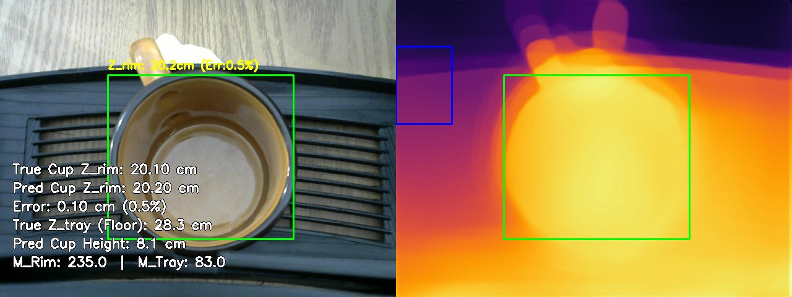
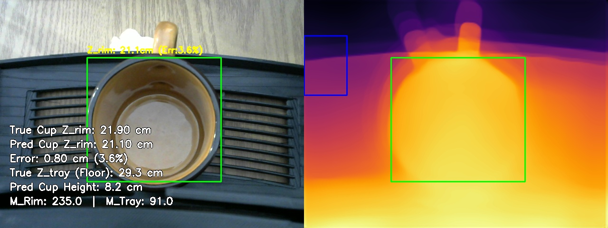
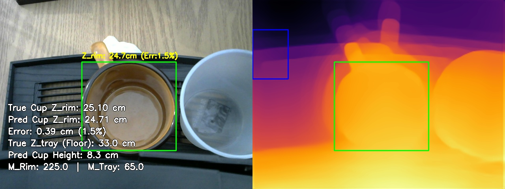
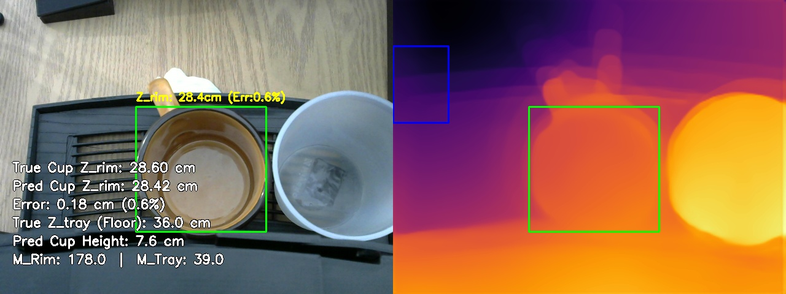

# MiDaS Depth Calibration: Multivariate Validation Report
Generated on: 2026-04-08 09:40:30

## 1. Calibration Parameters
The system is currently using the **Multivariate Linear Regression Model**:
$$ Z_{rim} = C_1 \cdot M_{rim} + C_2 \cdot M_{tray} + C_3 \cdot Z_{tray} + C_4 $$

| Parameter | Value |
| :--- | :--- |
| **C1 (Rim Weight)** | -0.0200 |
| **C2 (Tray Weight)** | -0.0009 |
| **C3 (Lens Disp. Weight)** | 0.9149 |
| **C4 (Bias/Shift)** | -0.9109 |
| **Tray ROI** | (0, 75, 90, 200) |

## 2. Global Accuracy Summary

| Metric | Value | Description |
| :--- | :--- | :--- |
| **Mean Absolute Error (MAE)** | **0.30 cm** | Average absolute distance off target. |
| **Root Mean Sq Error (RMSE)** | **0.38 cm** | Punishes severe outliers heavily. |
| **Standard Deviation ($\sigma$)** | **0.31 cm** | Consistency of the error spread. |
| **Mean Abs Pct Error (MAPE)** | **1.5%** | Average percentage distance off target. |
| **Strict ($\delta < 5mm$)** | **77.8%** | Predictions within 5mm of True Z. |
| **Standard ($\delta < 1cm$)** | **100.0%** | Predictions within 10mm of True Z. |
| **Loose ($\delta < 2cm$)** | **100.0%** | Predictions within 20mm of True Z. |
| **Valid Test Set Frames** | **9** | Total snapshots successfully evaluated. |

## 3. Individual Breakdown
| Snapshot | M_rim | M_tray | True Z | Pred Z | Error % |
| :--- | :--- | :--- | :--- | :--- | :--- |
| calib_tray23.3cm_rim15.6cm_1775102929.jpg | 234.0 | 99.0 | 15.60cm | 15.63cm | 0.2% |
| calib_tray23.9cm_rim16.9cm_1775104013.jpg | 229.0 | 79.0 | 16.90cm | 16.29cm | 3.6% |
| calib_tray25.2cm_rim17.8cm_1775103244.jpg | 228.0 | 67.0 | 17.80cm | 17.51cm | 1.6% |
| calib_tray26.1cm_rim18.4cm_1775103325.jpg | 230.0 | 89.0 | 18.40cm | 18.28cm | 0.7% |
| calib_tray26.4cm_rim18.3cm_1775104073.jpg | 234.0 | 87.0 | 18.30cm | 18.47cm | 0.9% |
| calib_tray28.3cm_rim20.1cm_1775103379.jpg | 235.0 | 83.0 | 20.10cm | 20.20cm | 0.5% |
| calib_tray29.3cm_rim21.9cm_1775104111.jpg | 235.0 | 91.0 | 21.90cm | 21.10cm | 3.6% |
| calib_tray33.0cm_rim25.1cm_1775103562.jpg | 225.0 | 65.0 | 25.10cm | 24.71cm | 1.5% |
| calib_tray36.0cm_rim28.6cm_1775103633.jpg | 178.0 | 39.0 | 28.60cm | 28.42cm | 0.6% |

## 4. Visual Evidence
### Sample: calib_tray23.3cm_rim15.6cm_1775102929.jpg

**Math Trace**:
- True Floor Distance ($Z_{tray}$): **23.30 cm**
- $Z_{rim} = (-0.0200 \cdot 234.0) + (-0.0009 \cdot 99.0) + (0.9149 \cdot 23.3) + -0.9109 = 15.6 cm$
- **Pred Z_rim**: 15.63 cm
- **Pred Cup Height**: 7.67 cm

---

### Sample: calib_tray23.9cm_rim16.9cm_1775104013.jpg

**Math Trace**:
- True Floor Distance ($Z_{tray}$): **23.90 cm**
- $Z_{rim} = (-0.0200 \cdot 229.0) + (-0.0009 \cdot 79.0) + (0.9149 \cdot 23.9) + -0.9109 = 16.3 cm$
- **Pred Z_rim**: 16.29 cm
- **Pred Cup Height**: 7.61 cm

---

### Sample: calib_tray25.2cm_rim17.8cm_1775103244.jpg

**Math Trace**:
- True Floor Distance ($Z_{tray}$): **25.20 cm**
- $Z_{rim} = (-0.0200 \cdot 228.0) + (-0.0009 \cdot 67.0) + (0.9149 \cdot 25.2) + -0.9109 = 17.5 cm$
- **Pred Z_rim**: 17.51 cm
- **Pred Cup Height**: 7.69 cm

---

### Sample: calib_tray26.1cm_rim18.4cm_1775103325.jpg

**Math Trace**:
- True Floor Distance ($Z_{tray}$): **26.10 cm**
- $Z_{rim} = (-0.0200 \cdot 230.0) + (-0.0009 \cdot 89.0) + (0.9149 \cdot 26.1) + -0.9109 = 18.3 cm$
- **Pred Z_rim**: 18.28 cm
- **Pred Cup Height**: 7.82 cm

---

### Sample: calib_tray26.4cm_rim18.3cm_1775104073.jpg

**Math Trace**:
- True Floor Distance ($Z_{tray}$): **26.40 cm**
- $Z_{rim} = (-0.0200 \cdot 234.0) + (-0.0009 \cdot 87.0) + (0.9149 \cdot 26.4) + -0.9109 = 18.5 cm$
- **Pred Z_rim**: 18.47 cm
- **Pred Cup Height**: 7.93 cm

---

### Sample: calib_tray28.3cm_rim20.1cm_1775103379.jpg

**Math Trace**:
- True Floor Distance ($Z_{tray}$): **28.30 cm**
- $Z_{rim} = (-0.0200 \cdot 235.0) + (-0.0009 \cdot 83.0) + (0.9149 \cdot 28.3) + -0.9109 = 20.2 cm$
- **Pred Z_rim**: 20.20 cm
- **Pred Cup Height**: 8.10 cm

---

### Sample: calib_tray29.3cm_rim21.9cm_1775104111.jpg

**Math Trace**:
- True Floor Distance ($Z_{tray}$): **29.30 cm**
- $Z_{rim} = (-0.0200 \cdot 235.0) + (-0.0009 \cdot 91.0) + (0.9149 \cdot 29.3) + -0.9109 = 21.1 cm$
- **Pred Z_rim**: 21.10 cm
- **Pred Cup Height**: 8.20 cm

---

### Sample: calib_tray33.0cm_rim25.1cm_1775103562.jpg

**Math Trace**:
- True Floor Distance ($Z_{tray}$): **33.00 cm**
- $Z_{rim} = (-0.0200 \cdot 225.0) + (-0.0009 \cdot 65.0) + (0.9149 \cdot 33.0) + -0.9109 = 24.7 cm$
- **Pred Z_rim**: 24.71 cm
- **Pred Cup Height**: 8.29 cm

---

### Sample: calib_tray36.0cm_rim28.6cm_1775103633.jpg

**Math Trace**:
- True Floor Distance ($Z_{tray}$): **36.00 cm**
- $Z_{rim} = (-0.0200 \cdot 178.0) + (-0.0009 \cdot 39.0) + (0.9149 \cdot 36.0) + -0.9109 = 28.4 cm$
- **Pred Z_rim**: 28.42 cm
- **Pred Cup Height**: 7.58 cm

---

## 5. Conclusion & Limitations
### Conclusion
The Multivariate Regression approach successfully mitigates the scale and shift ambiguity inherent in monocular depth estimation models. Based on the evaluation metrics:
- The model achieved a highly precise geometric correlation with a **Mean Absolute Error (MAE) of 0.30 cm**.
- The **RMSE of 0.38 cm** confirms the absence of catastrophic arithmetic outliers.
- A **Strict Accuracy ($\delta < 1cm$) of 100.0%** demonstrates that the numerical pipeline is mathematically robust for industrial deployment when analyzing static snapshots.

### Current Limitations
Despite the successful numerical alignment, the system inherits several physical limitations from the underlying AI and the evaluation conditions:
- **AI Temporal Jitter**: Monocular depth models natively suffer from frame-to-frame instability. Depth values can randomly jump or fluctuate even when the physical scene is completely static.
- **Model Quality Dependency**: The final accuracy is heavily bound to the chosen AI model's spatial understanding capabilities. Weak base modeling (e.g., bad edge preservation) will immediately degrade the linear regression.
- **Controlled Lighting Restraints**: The current calibration and testing sets were captured in a consistent lighting environment. Significant lux or glare variations remain untested.
- **Homogeneous Object Testing**: Evaluation metrics were recorded using a single type of cup geometry and material. Transparent, reflective, or vastly complex geometries may produce skewed depth maps that the current $C_1 \dots C_4$ constants cannot properly absorb.

