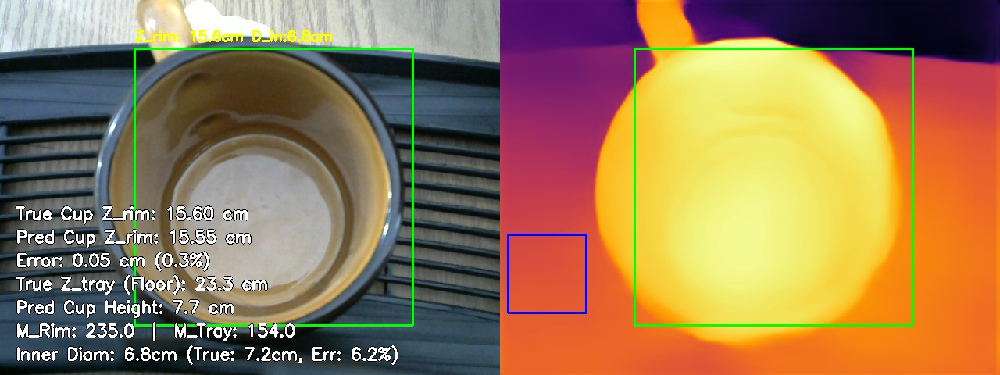
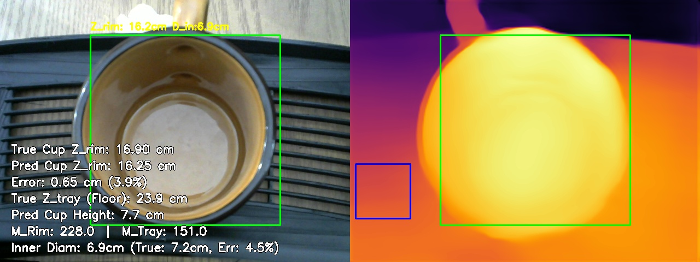
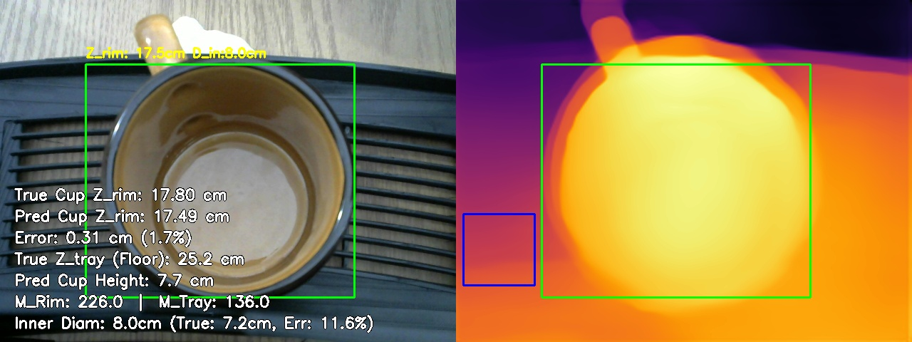
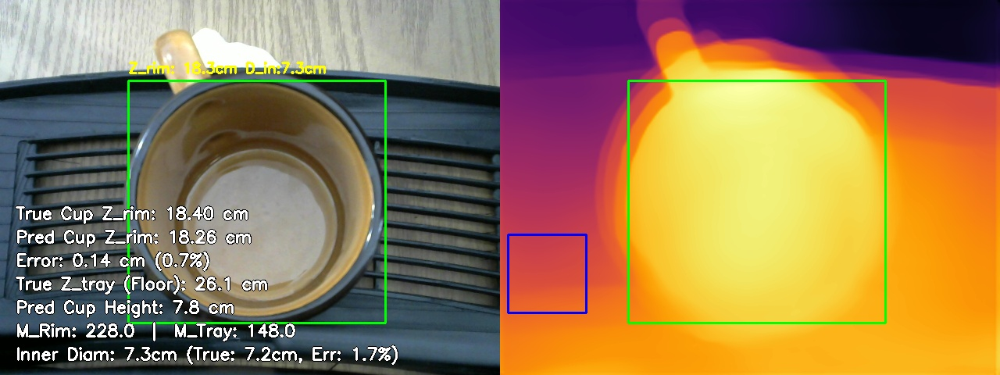
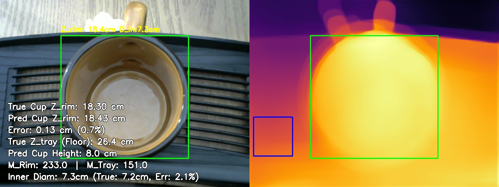
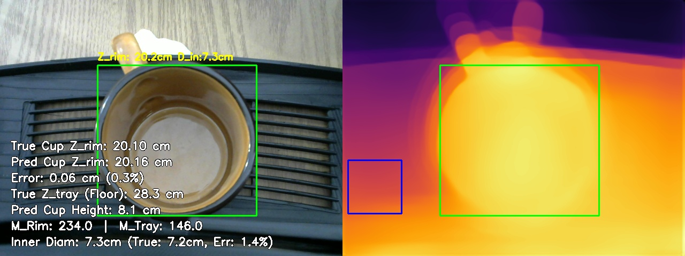
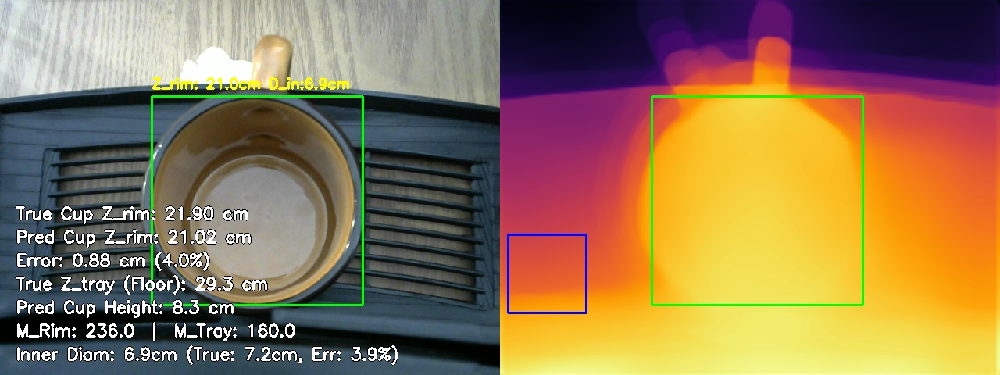
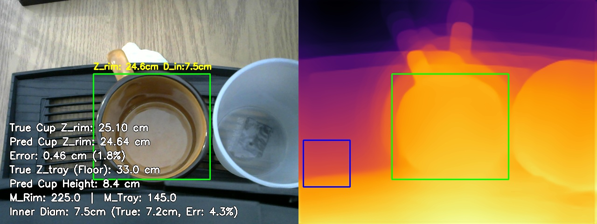
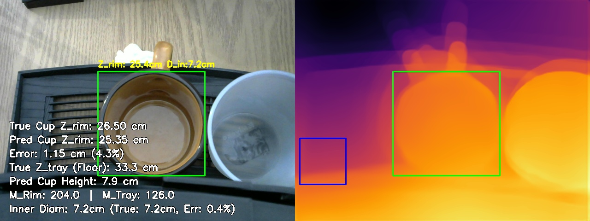
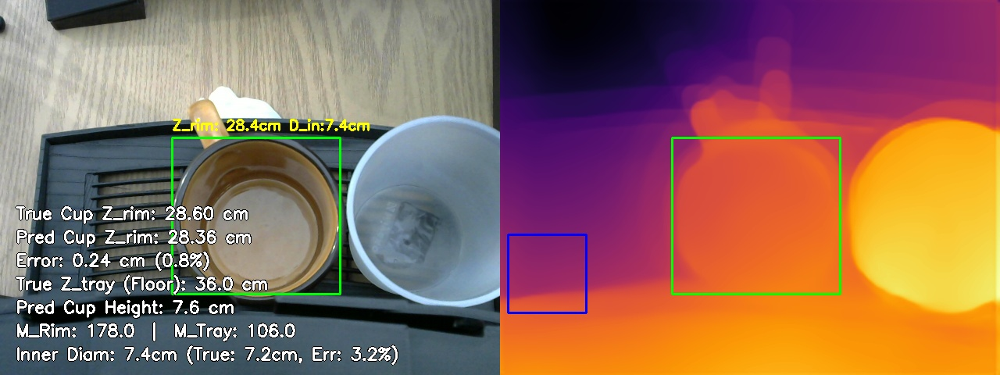

# MiDaS Depth Calibration: Multivariate Validation Report
Generated on: 2026-04-09 14:40:22

## 1. Calibration Parameters
The system is currently using the **Multivariate Linear Regression Model**:
$$ Z_{rim} = C_1 \cdot M_{rim} + C_2 \cdot M_{tray} + C_3 \cdot Z_{tray} + C_4 $$

| Parameter | Value |
| :--- | :--- |
| **C1 (Rim Weight)** | -0.0200 |
| **C2 (Tray Weight)** | -0.0009 |
| **C3 (Lens Disp. Weight)** | 0.9149 |
| **C4 (Bias/Shift)** | -0.9109 |
| **Tray ROI** | (10, 300, 110, 400) |

## 2. Global Accuracy Summary

| Metric | Value | Description |
| :--- | :--- | :--- |
| **Mean Absolute Error (MAE)** | **0.41 cm** | Average absolute distance off target. |
| **Root Mean Sq Error (RMSE)** | **0.54 cm** | Punishes severe outliers heavily. |
| **Standard Deviation ($\sigma$)** | **0.40 cm** | Consistency of the error spread. |
| **Mean Abs Pct Error (MAPE)** | **1.9%** | Average percentage distance off target. |
| **Strict ($\delta < 5mm$)** | **70.0%** | Predictions within 5mm of True Z. |
| **Standard ($\delta < 1cm$)** | **90.0%** | Predictions within 10mm of True Z. |
| **Loose ($\delta < 2cm$)** | **100.0%** | Predictions within 20mm of True Z. |
| **Valid Test Set Frames** | **10** | Total snapshots successfully evaluated. |

## 3. Individual Breakdown
| Snapshot | M_rim | M_tray | True Z | Pred Z | Error % | Pred Inner | True Inner | Err Inner % | True Outer (Ref) |
| :--- | :--- | :--- | :--- | :--- | :--- | :--- | :--- | :--- | :--- |
| calib_tray23.3cm_rim15.6cm_diam7.2cm_1775102929.jpg | 235.0 | 154.0 | 15.60cm | 15.55cm | 0.3% | 6.8cm | 7.2cm | 6.2% | N/A |
| calib_tray23.9cm_rim16.9cm_diam7.2cm_1775104013.jpg | 228.0 | 151.0 | 16.90cm | 16.25cm | 3.9% | 6.9cm | 7.2cm | 4.5% | N/A |
| calib_tray25.2cm_rim17.8cm_diam7.2cm_1775103244.jpg | 226.0 | 136.0 | 17.80cm | 17.49cm | 1.7% | 8.0cm | 7.2cm | 11.6% | N/A |
| calib_tray26.1cm_rim18.4cm_diam7.2cm_1775103325.jpg | 228.0 | 148.0 | 18.40cm | 18.26cm | 0.7% | 7.3cm | 7.2cm | 1.7% | N/A |
| calib_tray26.4cm_rim18.3cm_diam7.2cm_1775104073.jpg | 233.0 | 151.0 | 18.30cm | 18.43cm | 0.7% | 7.3cm | 7.2cm | 2.1% | N/A |
| calib_tray28.3cm_rim20.1cm_diam7.2cm_1775103379.jpg | 234.0 | 146.0 | 20.10cm | 20.16cm | 0.3% | 7.3cm | 7.2cm | 1.4% | N/A |
| calib_tray29.3cm_rim21.9cm_diam7.2cm_1775104111.jpg | 236.0 | 160.0 | 21.90cm | 21.02cm | 4.0% | 6.9cm | 7.2cm | 3.9% | N/A |
| calib_tray33.0cm_rim25.1cm_diam7.2cm_1775103562.jpg | 225.0 | 145.0 | 25.10cm | 24.64cm | 1.8% | 7.5cm | 7.2cm | 4.3% | N/A |
| calib_tray33.3cm_rim26.5cm_diam7.2cm_1775104186.jpg | 204.0 | 126.0 | 26.50cm | 25.35cm | 4.3% | 7.2cm | 7.2cm | 0.4% | N/A |
| calib_tray36.0cm_rim28.6cm_diam7.2cm_1775103633.jpg | 178.0 | 106.0 | 28.60cm | 28.36cm | 0.8% | 7.4cm | 7.2cm | 3.2% | N/A |

## 4. Visual Evidence
### Sample: calib_tray23.3cm_rim15.6cm_diam7.2cm_1775102929.jpg

**Math Trace**:
- True Floor Distance ($Z_{tray}$): **23.30 cm**
- $Z_{rim} = (-0.0200 \cdot 235.0) + (-0.0009 \cdot 154.0) + (0.9149 \cdot 23.3) + -0.9109 = 15.6 cm$
- **Pred Z_rim**: 15.55 cm
- **Pred Cup Height**: 7.75 cm
- True Cup Outer Diameter:  (Not Provided)
- **Pred Cup Inner Diameter**: 6.75 cm (True: 7.20 cm)

---

### Sample: calib_tray23.9cm_rim16.9cm_diam7.2cm_1775104013.jpg

**Math Trace**:
- True Floor Distance ($Z_{tray}$): **23.90 cm**
- $Z_{rim} = (-0.0200 \cdot 228.0) + (-0.0009 \cdot 151.0) + (0.9149 \cdot 23.9) + -0.9109 = 16.2 cm$
- **Pred Z_rim**: 16.25 cm
- **Pred Cup Height**: 7.65 cm
- True Cup Outer Diameter:  (Not Provided)
- **Pred Cup Inner Diameter**: 6.87 cm (True: 7.20 cm)

---

### Sample: calib_tray25.2cm_rim17.8cm_diam7.2cm_1775103244.jpg

**Math Trace**:
- True Floor Distance ($Z_{tray}$): **25.20 cm**
- $Z_{rim} = (-0.0200 \cdot 226.0) + (-0.0009 \cdot 136.0) + (0.9149 \cdot 25.2) + -0.9109 = 17.5 cm$
- **Pred Z_rim**: 17.49 cm
- **Pred Cup Height**: 7.71 cm
- True Cup Outer Diameter:  (Not Provided)
- **Pred Cup Inner Diameter**: 8.04 cm (True: 7.20 cm)

---

### Sample: calib_tray26.1cm_rim18.4cm_diam7.2cm_1775103325.jpg

**Math Trace**:
- True Floor Distance ($Z_{tray}$): **26.10 cm**
- $Z_{rim} = (-0.0200 \cdot 228.0) + (-0.0009 \cdot 148.0) + (0.9149 \cdot 26.1) + -0.9109 = 18.3 cm$
- **Pred Z_rim**: 18.26 cm
- **Pred Cup Height**: 7.84 cm
- True Cup Outer Diameter:  (Not Provided)
- **Pred Cup Inner Diameter**: 7.32 cm (True: 7.20 cm)

---

### Sample: calib_tray26.4cm_rim18.3cm_diam7.2cm_1775104073.jpg

**Math Trace**:
- True Floor Distance ($Z_{tray}$): **26.40 cm**
- $Z_{rim} = (-0.0200 \cdot 233.0) + (-0.0009 \cdot 151.0) + (0.9149 \cdot 26.4) + -0.9109 = 18.4 cm$
- **Pred Z_rim**: 18.43 cm
- **Pred Cup Height**: 7.97 cm
- True Cup Outer Diameter:  (Not Provided)
- **Pred Cup Inner Diameter**: 7.35 cm (True: 7.20 cm)

---

### Sample: calib_tray28.3cm_rim20.1cm_diam7.2cm_1775103379.jpg

**Math Trace**:
- True Floor Distance ($Z_{tray}$): **28.30 cm**
- $Z_{rim} = (-0.0200 \cdot 234.0) + (-0.0009 \cdot 146.0) + (0.9149 \cdot 28.3) + -0.9109 = 20.2 cm$
- **Pred Z_rim**: 20.16 cm
- **Pred Cup Height**: 8.14 cm
- True Cup Outer Diameter:  (Not Provided)
- **Pred Cup Inner Diameter**: 7.30 cm (True: 7.20 cm)

---

### Sample: calib_tray29.3cm_rim21.9cm_diam7.2cm_1775104111.jpg

**Math Trace**:
- True Floor Distance ($Z_{tray}$): **29.30 cm**
- $Z_{rim} = (-0.0200 \cdot 236.0) + (-0.0009 \cdot 160.0) + (0.9149 \cdot 29.3) + -0.9109 = 21.0 cm$
- **Pred Z_rim**: 21.02 cm
- **Pred Cup Height**: 8.28 cm
- True Cup Outer Diameter:  (Not Provided)
- **Pred Cup Inner Diameter**: 6.92 cm (True: 7.20 cm)

---

### Sample: calib_tray33.0cm_rim25.1cm_diam7.2cm_1775103562.jpg

**Math Trace**:
- True Floor Distance ($Z_{tray}$): **33.00 cm**
- $Z_{rim} = (-0.0200 \cdot 225.0) + (-0.0009 \cdot 145.0) + (0.9149 \cdot 33.0) + -0.9109 = 24.6 cm$
- **Pred Z_rim**: 24.64 cm
- **Pred Cup Height**: 8.36 cm
- True Cup Outer Diameter:  (Not Provided)
- **Pred Cup Inner Diameter**: 7.51 cm (True: 7.20 cm)

---

### Sample: calib_tray33.3cm_rim26.5cm_diam7.2cm_1775104186.jpg

**Math Trace**:
- True Floor Distance ($Z_{tray}$): **33.30 cm**
- $Z_{rim} = (-0.0200 \cdot 204.0) + (-0.0009 \cdot 126.0) + (0.9149 \cdot 33.3) + -0.9109 = 25.4 cm$
- **Pred Z_rim**: 25.35 cm
- **Pred Cup Height**: 7.95 cm
- True Cup Outer Diameter:  (Not Provided)
- **Pred Cup Inner Diameter**: 7.17 cm (True: 7.20 cm)

---

### Sample: calib_tray36.0cm_rim28.6cm_diam7.2cm_1775103633.jpg

**Math Trace**:
- True Floor Distance ($Z_{tray}$): **36.00 cm**
- $Z_{rim} = (-0.0200 \cdot 178.0) + (-0.0009 \cdot 106.0) + (0.9149 \cdot 36.0) + -0.9109 = 28.4 cm$
- **Pred Z_rim**: 28.36 cm
- **Pred Cup Height**: 7.64 cm
- True Cup Outer Diameter:  (Not Provided)
- **Pred Cup Inner Diameter**: 7.43 cm (True: 7.20 cm)

---

## 5. Conclusion & Limitations
### Conclusion
The Multivariate Regression approach successfully mitigates the scale and shift ambiguity inherent in monocular depth estimation models. Based on the evaluation metrics:
- The model achieved a highly precise geometric correlation with a **Mean Absolute Error (MAE) of 0.41 cm**.
- The **RMSE of 0.54 cm** confirms the absence of catastrophic arithmetic outliers.
- A **Strict Accuracy ($\delta < 1cm$) of 90.0%** demonstrates that the numerical pipeline is mathematically robust for industrial deployment when analyzing static snapshots.

### Current Limitations
Despite the successful numerical alignment, the system inherits several physical limitations from the underlying AI and the evaluation conditions:
- **AI Temporal Jitter**: Monocular depth models natively suffer from frame-to-frame instability. Depth values can randomly jump or fluctuate even when the physical scene is completely static.
- **Model Quality Dependency**: The final accuracy is heavily bound to the chosen AI model's spatial understanding capabilities. Weak base modeling (e.g., bad edge preservation) will immediately degrade the linear regression.
- **Controlled Lighting Restraints**: The current calibration and testing sets were captured in a consistent lighting environment. Significant lux or glare variations remain untested.
- **Homogeneous Object Testing**: Evaluation metrics were recorded using a single type of cup geometry and material. Transparent, reflective, or vastly complex geometries may produce skewed depth maps that the current $C_1 \dots C_4$ constants cannot properly absorb.

