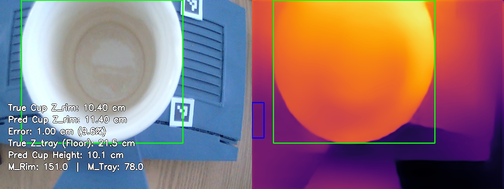
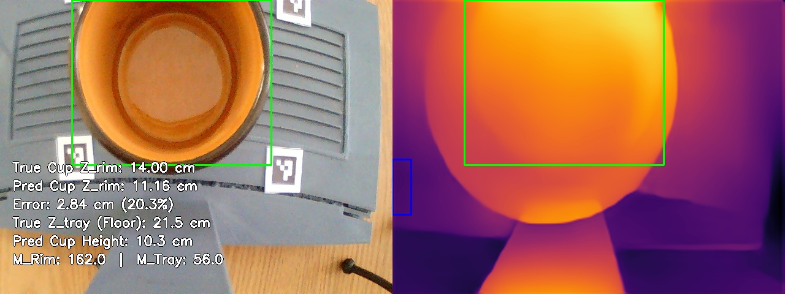
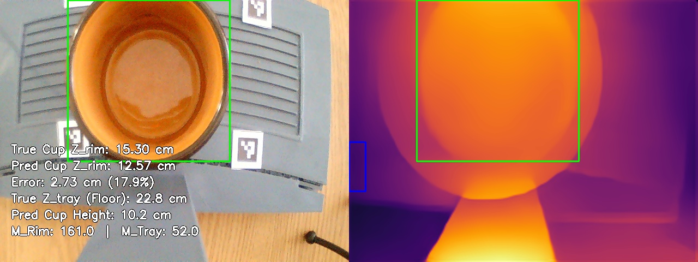
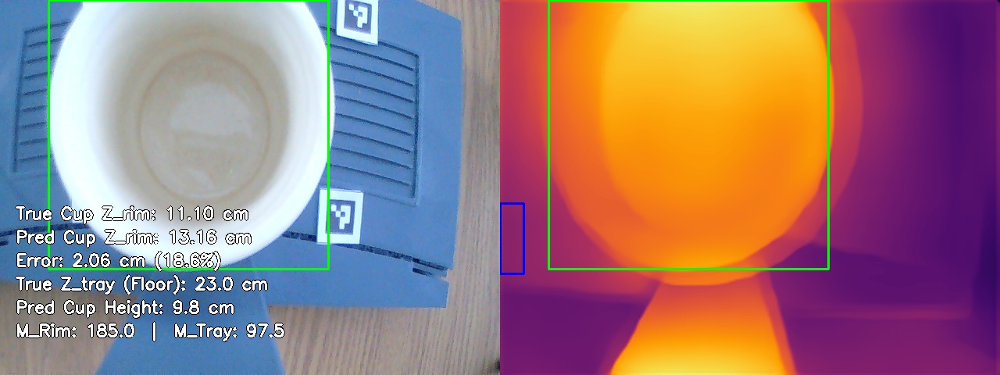
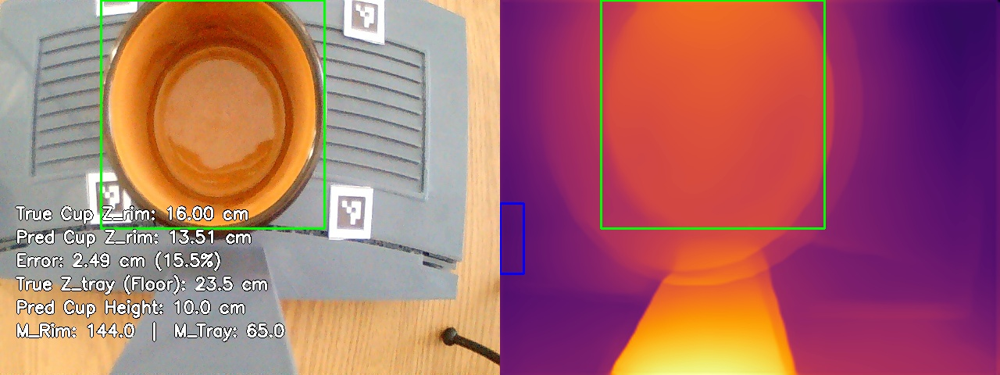
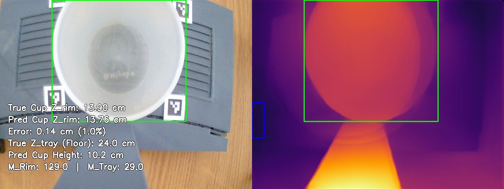
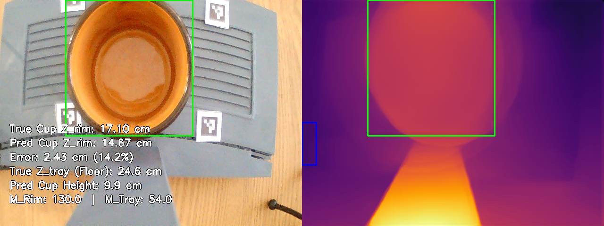
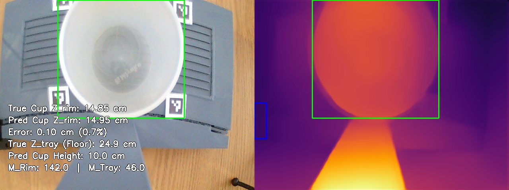
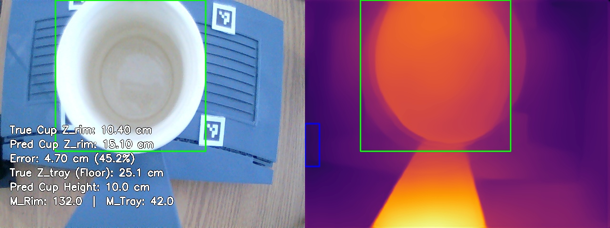
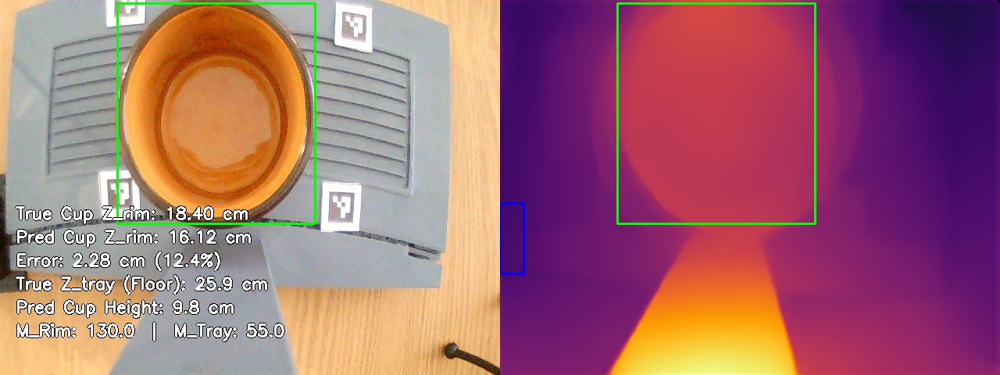

# MiDaS Depth Calibration: Multivariate Validation Report
Generated on: 2026-04-16 13:49:20

## 1. Calibration Parameters
The system is currently using the **Multivariate Linear Regression Model**:
$$ Z_{rim} = C_1 \cdot M_{rim} + C_2 \cdot M_{tray} + C_3 \cdot Z_{tray} + C_4 $$

| Parameter | Value |
| :--- | :--- |
| **C1 (Rim Weight)** | -0.0026 |
| **C2 (Tray Weight)** | 0.0095 |
| **C3 (Lens Disp. Weight)** | 1.1113 |
| **C4 (Bias/Shift)** | -12.8446 |
| **Tray ROI** | (0, 260, 30, 350) |

## 2. Global Accuracy Summary

| Metric | Value | Description |
| :--- | :--- | :--- |
| **Mean Absolute Error (MAE)** | **2.08 cm** | Average absolute distance off target. |
| **Root Mean Sq Error (RMSE)** | **2.45 cm** | Punishes severe outliers heavily. |
| **Standard Deviation ($\sigma$)** | **2.40 cm** | Consistency of the error spread. |
| **Mean Abs Pct Error (MAPE)** | **15.5%** | Average percentage distance off target. |
| **Strict ($\delta < 5mm$)** | **20.0%** | Predictions within 5mm of True Z. |
| **Standard ($\delta < 1cm$)** | **30.0%** | Predictions within 10mm of True Z. |
| **Loose ($\delta < 2cm$)** | **30.0%** | Predictions within 20mm of True Z. |
| **Valid Test Set Frames** | **10** | Total snapshots successfully evaluated. |

## 3. Individual Breakdown
| Snapshot | M_rim | M_tray | True Z | Pred Z | Error % |
| :--- | :--- | :--- | :--- | :--- | :--- |
| test_tray21.5cm_rim10.4cm_1776319920.jpg | 151.0 | 78.0 | 10.40cm | 11.40cm | 9.6% |
| test_tray21.5cm_rim14.0cm_1776319380.jpg | 162.0 | 56.0 | 14.00cm | 11.16cm | 20.3% |
| test_tray22.8cm_rim15.3cm_1776319430.jpg | 161.0 | 52.0 | 15.30cm | 12.57cm | 17.9% |
| test_tray23.0cm_rim11.1cm_1776319882.jpg | 185.0 | 97.5 | 11.10cm | 13.16cm | 18.6% |
| test_tray23.5cm_rim16.0cm_1776319468.jpg | 144.0 | 65.0 | 16.00cm | 13.51cm | 15.5% |
| test_tray24.0cm_rim13.9cm_1776319711.jpg | 129.0 | 29.0 | 13.90cm | 13.76cm | 1.0% |
| test_tray24.6cm_rim17.1cm_1776319507.jpg | 130.0 | 54.0 | 17.10cm | 14.67cm | 14.2% |
| test_tray24.95cm_rim14.85cm_1776319655.jpg | 142.0 | 46.0 | 14.85cm | 14.95cm | 0.7% |
| test_tray25.1cm_rim10.4cm_1776319971.jpg | 132.0 | 42.0 | 10.40cm | 15.10cm | 45.2% |
| test_tray25.9cm_rim18.4cm_1776319547.jpg | 130.0 | 55.0 | 18.40cm | 16.12cm | 12.4% |

## 4. Visual Evidence
### Sample: test_tray21.5cm_rim10.4cm_1776319920.jpg

**Math Trace**:
- True Floor Distance ($Z_{tray}$): **21.50 cm**
- $Z_{rim} = (-0.0026 \cdot 151.0) + (0.0095 \cdot 78.0) + (1.1113 \cdot 21.5) + -12.8446 = 11.4 cm$
- **Pred Z_rim**: 11.40 cm
- **Pred Cup Height**: 10.10 cm

---

### Sample: test_tray21.5cm_rim14.0cm_1776319380.jpg

**Math Trace**:
- True Floor Distance ($Z_{tray}$): **21.50 cm**
- $Z_{rim} = (-0.0026 \cdot 162.0) + (0.0095 \cdot 56.0) + (1.1113 \cdot 21.5) + -12.8446 = 11.2 cm$
- **Pred Z_rim**: 11.16 cm
- **Pred Cup Height**: 10.34 cm

---

### Sample: test_tray22.8cm_rim15.3cm_1776319430.jpg

**Math Trace**:
- True Floor Distance ($Z_{tray}$): **22.80 cm**
- $Z_{rim} = (-0.0026 \cdot 161.0) + (0.0095 \cdot 52.0) + (1.1113 \cdot 22.8) + -12.8446 = 12.6 cm$
- **Pred Z_rim**: 12.57 cm
- **Pred Cup Height**: 10.23 cm

---

### Sample: test_tray23.0cm_rim11.1cm_1776319882.jpg

**Math Trace**:
- True Floor Distance ($Z_{tray}$): **23.00 cm**
- $Z_{rim} = (-0.0026 \cdot 185.0) + (0.0095 \cdot 97.5) + (1.1113 \cdot 23.0) + -12.8446 = 13.2 cm$
- **Pred Z_rim**: 13.16 cm
- **Pred Cup Height**: 9.84 cm

---

### Sample: test_tray23.5cm_rim16.0cm_1776319468.jpg

**Math Trace**:
- True Floor Distance ($Z_{tray}$): **23.50 cm**
- $Z_{rim} = (-0.0026 \cdot 144.0) + (0.0095 \cdot 65.0) + (1.1113 \cdot 23.5) + -12.8446 = 13.5 cm$
- **Pred Z_rim**: 13.51 cm
- **Pred Cup Height**: 9.99 cm

---

### Sample: test_tray24.0cm_rim13.9cm_1776319711.jpg

**Math Trace**:
- True Floor Distance ($Z_{tray}$): **24.00 cm**
- $Z_{rim} = (-0.0026 \cdot 129.0) + (0.0095 \cdot 29.0) + (1.1113 \cdot 24.0) + -12.8446 = 13.8 cm$
- **Pred Z_rim**: 13.76 cm
- **Pred Cup Height**: 10.24 cm

---

### Sample: test_tray24.6cm_rim17.1cm_1776319507.jpg

**Math Trace**:
- True Floor Distance ($Z_{tray}$): **24.60 cm**
- $Z_{rim} = (-0.0026 \cdot 130.0) + (0.0095 \cdot 54.0) + (1.1113 \cdot 24.6) + -12.8446 = 14.7 cm$
- **Pred Z_rim**: 14.67 cm
- **Pred Cup Height**: 9.93 cm

---

### Sample: test_tray24.95cm_rim14.85cm_1776319655.jpg

**Math Trace**:
- True Floor Distance ($Z_{tray}$): **24.95 cm**
- $Z_{rim} = (-0.0026 \cdot 142.0) + (0.0095 \cdot 46.0) + (1.1113 \cdot 24.9) + -12.8446 = 14.9 cm$
- **Pred Z_rim**: 14.95 cm
- **Pred Cup Height**: 10.00 cm

---

### Sample: test_tray25.1cm_rim10.4cm_1776319971.jpg

**Math Trace**:
- True Floor Distance ($Z_{tray}$): **25.10 cm**
- $Z_{rim} = (-0.0026 \cdot 132.0) + (0.0095 \cdot 42.0) + (1.1113 \cdot 25.1) + -12.8446 = 15.1 cm$
- **Pred Z_rim**: 15.10 cm
- **Pred Cup Height**: 10.00 cm

---

### Sample: test_tray25.9cm_rim18.4cm_1776319547.jpg

**Math Trace**:
- True Floor Distance ($Z_{tray}$): **25.90 cm**
- $Z_{rim} = (-0.0026 \cdot 130.0) + (0.0095 \cdot 55.0) + (1.1113 \cdot 25.9) + -12.8446 = 16.1 cm$
- **Pred Z_rim**: 16.12 cm
- **Pred Cup Height**: 9.78 cm

---

## 5. Conclusion & Limitations
### Conclusion
The Multivariate Regression approach successfully mitigates the scale and shift ambiguity inherent in monocular depth estimation models. Based on the evaluation metrics:
- The model achieved a highly precise geometric correlation with a **Mean Absolute Error (MAE) of 2.08 cm**.
- The **RMSE of 2.45 cm** confirms the absence of catastrophic arithmetic outliers.
- A **Strict Accuracy ($\delta < 1cm$) of 30.0%** demonstrates that the numerical pipeline is mathematically robust for industrial deployment when analyzing static snapshots.

### Current Limitations
Despite the successful numerical alignment, the system inherits several physical limitations from the underlying AI and the evaluation conditions:
- **AI Temporal Jitter**: Monocular depth models natively suffer from frame-to-frame instability. Depth values can randomly jump or fluctuate even when the physical scene is completely static.
- **Model Quality Dependency**: The final accuracy is heavily bound to the chosen AI model's spatial understanding capabilities. Weak base modeling (e.g., bad edge preservation) will immediately degrade the linear regression.
- **Controlled Lighting Restraints**: The current calibration and testing sets were captured in a consistent lighting environment. Significant lux or glare variations remain untested.
- **Homogeneous Object Testing**: Evaluation metrics were recorded using a single type of cup geometry and material. Transparent, reflective, or vastly complex geometries may produce skewed depth maps that the current $C_1 \dots C_4$ constants cannot properly absorb.

