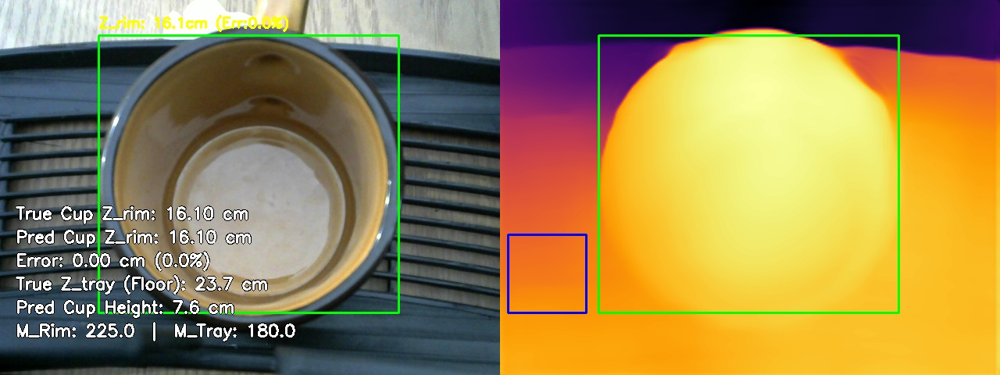
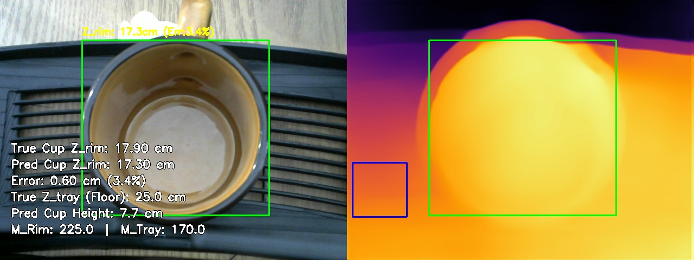
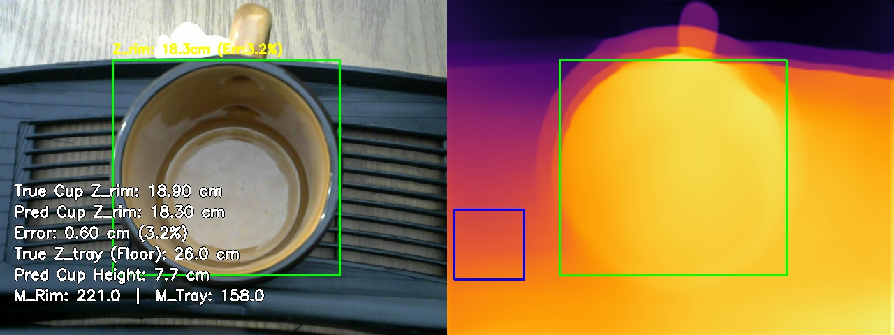
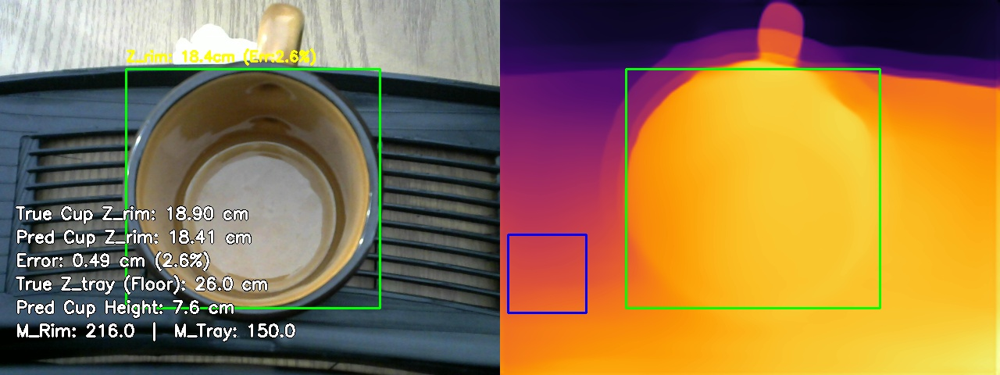
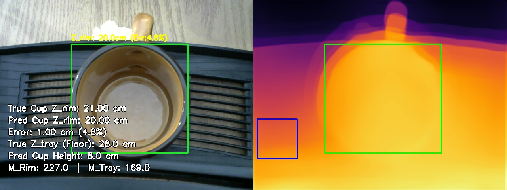
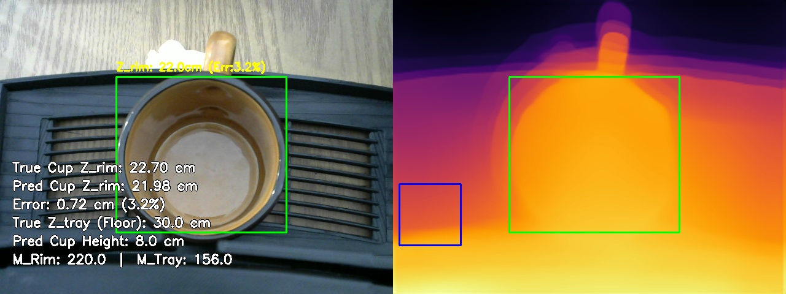
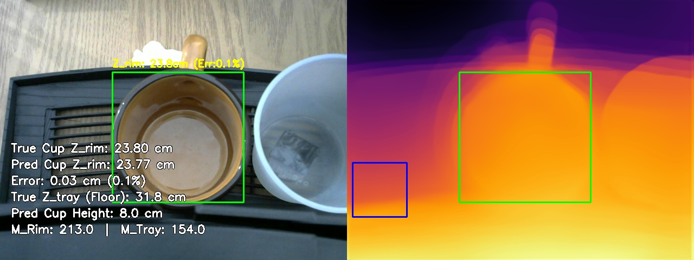
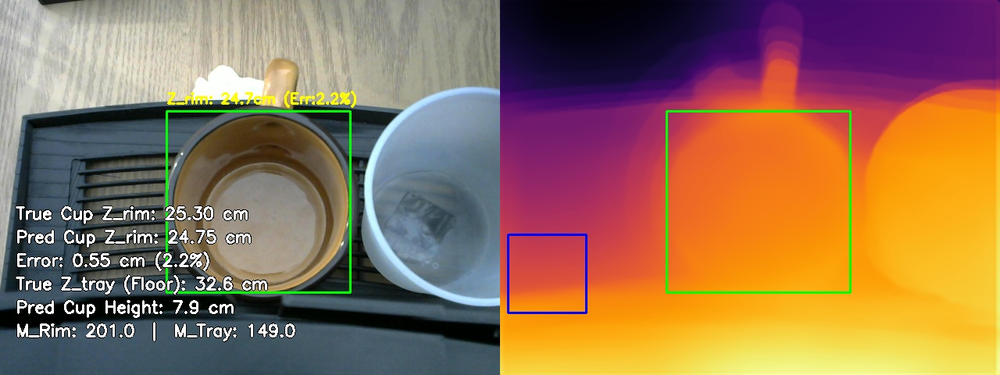
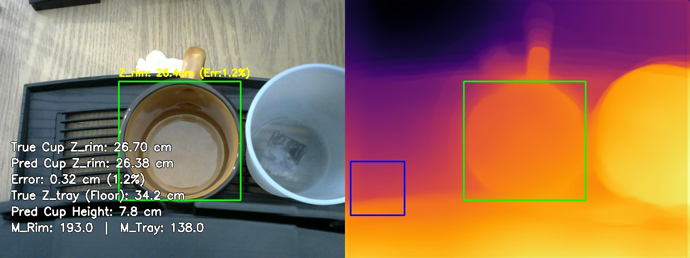
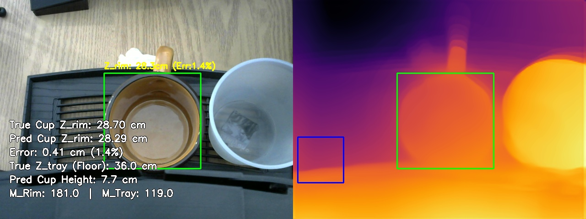

# MiDaS Depth Calibration: Multivariate Validation Report
Generated on: 2026-04-16 13:53:07

## 1. Calibration Parameters
The system is currently using the **Multivariate Linear Regression Model**:
$$ Z_{rim} = C_1 \cdot M_{rim} + C_2 \cdot M_{tray} + C_3 \cdot Z_{tray} + C_4 $$

| Parameter | Value |
| :--- | :--- |
| **C1 (Rim Weight)** | -0.0200 |
| **C2 (Tray Weight)** | -0.0009 |
| **C3 (Lens Disp. Weight)** | 0.9149 |
| **C4 (Bias/Shift)** | -0.9109 |
| **Tray ROI** | (10, 300, 110, 400) |

## 2. Global Accuracy Summary

| Metric | Value | Description |
| :--- | :--- | :--- |
| **Mean Absolute Error (MAE)** | **0.47 cm** | Average absolute distance off target. |
| **Root Mean Sq Error (RMSE)** | **0.55 cm** | Punishes severe outliers heavily. |
| **Standard Deviation ($\sigma$)** | **0.29 cm** | Consistency of the error spread. |
| **Mean Abs Pct Error (MAPE)** | **2.2%** | Average percentage distance off target. |
| **Strict ($\delta < 5mm$)** | **50.0%** | Predictions within 5mm of True Z. |
| **Standard ($\delta < 1cm$)** | **100.0%** | Predictions within 10mm of True Z. |
| **Loose ($\delta < 2cm$)** | **100.0%** | Predictions within 20mm of True Z. |
| **Valid Test Set Frames** | **10** | Total snapshots successfully evaluated. |

## 3. Individual Breakdown
| Snapshot | M_rim | M_tray | True Z | Pred Z | Error % |
| :--- | :--- | :--- | :--- | :--- | :--- |
| test_tray23.7cm_rim16.1cm_1775104524.jpg | 225.0 | 180.0 | 16.10cm | 16.10cm | 0.0% |
| test_tray25.0cm_rim17.9cm_1775104565.jpg | 225.0 | 170.0 | 17.90cm | 17.30cm | 3.4% |
| test_tray26.0cm_rim18.9cm_1775104601.jpg | 221.0 | 158.0 | 18.90cm | 18.30cm | 3.2% |
| test_tray26.0cm_rim18.9cm_1775104690.jpg | 216.0 | 150.0 | 18.90cm | 18.41cm | 2.6% |
| test_tray28.0cm_rim21.0cm_1775104727.jpg | 227.0 | 169.0 | 21.00cm | 20.00cm | 4.8% |
| test_tray30.0cm_rim22.7cm_1775104786.jpg | 220.0 | 156.0 | 22.70cm | 21.98cm | 3.2% |
| test_tray31.8cm_rim23.8cm_1775104855.jpg | 213.0 | 154.0 | 23.80cm | 23.77cm | 0.1% |
| test_tray32.6cm_rim25.3cm_1775104923.jpg | 201.0 | 149.0 | 25.30cm | 24.75cm | 2.2% |
| test_tray34.2cm_rim26.7cm_1775104974.jpg | 193.0 | 138.0 | 26.70cm | 26.38cm | 1.2% |
| test_tray36.0cm_rim28.7cm_1775105037.jpg | 181.0 | 119.0 | 28.70cm | 28.29cm | 1.4% |

## 4. Visual Evidence
### Sample: test_tray23.7cm_rim16.1cm_1775104524.jpg

**Math Trace**:
- True Floor Distance ($Z_{tray}$): **23.70 cm**
- $Z_{rim} = (-0.0200 \cdot 225.0) + (-0.0009 \cdot 180.0) + (0.9149 \cdot 23.7) + -0.9109 = 16.1 cm$
- **Pred Z_rim**: 16.10 cm
- **Pred Cup Height**: 7.60 cm

---

### Sample: test_tray25.0cm_rim17.9cm_1775104565.jpg

**Math Trace**:
- True Floor Distance ($Z_{tray}$): **25.00 cm**
- $Z_{rim} = (-0.0200 \cdot 225.0) + (-0.0009 \cdot 170.0) + (0.9149 \cdot 25.0) + -0.9109 = 17.3 cm$
- **Pred Z_rim**: 17.30 cm
- **Pred Cup Height**: 7.70 cm

---

### Sample: test_tray26.0cm_rim18.9cm_1775104601.jpg

**Math Trace**:
- True Floor Distance ($Z_{tray}$): **26.00 cm**
- $Z_{rim} = (-0.0200 \cdot 221.0) + (-0.0009 \cdot 158.0) + (0.9149 \cdot 26.0) + -0.9109 = 18.3 cm$
- **Pred Z_rim**: 18.30 cm
- **Pred Cup Height**: 7.70 cm

---

### Sample: test_tray26.0cm_rim18.9cm_1775104690.jpg

**Math Trace**:
- True Floor Distance ($Z_{tray}$): **26.00 cm**
- $Z_{rim} = (-0.0200 \cdot 216.0) + (-0.0009 \cdot 150.0) + (0.9149 \cdot 26.0) + -0.9109 = 18.4 cm$
- **Pred Z_rim**: 18.41 cm
- **Pred Cup Height**: 7.59 cm

---

### Sample: test_tray28.0cm_rim21.0cm_1775104727.jpg

**Math Trace**:
- True Floor Distance ($Z_{tray}$): **28.00 cm**
- $Z_{rim} = (-0.0200 \cdot 227.0) + (-0.0009 \cdot 169.0) + (0.9149 \cdot 28.0) + -0.9109 = 20.0 cm$
- **Pred Z_rim**: 20.00 cm
- **Pred Cup Height**: 8.00 cm

---

### Sample: test_tray30.0cm_rim22.7cm_1775104786.jpg

**Math Trace**:
- True Floor Distance ($Z_{tray}$): **30.00 cm**
- $Z_{rim} = (-0.0200 \cdot 220.0) + (-0.0009 \cdot 156.0) + (0.9149 \cdot 30.0) + -0.9109 = 22.0 cm$
- **Pred Z_rim**: 21.98 cm
- **Pred Cup Height**: 8.02 cm

---

### Sample: test_tray31.8cm_rim23.8cm_1775104855.jpg

**Math Trace**:
- True Floor Distance ($Z_{tray}$): **31.80 cm**
- $Z_{rim} = (-0.0200 \cdot 213.0) + (-0.0009 \cdot 154.0) + (0.9149 \cdot 31.8) + -0.9109 = 23.8 cm$
- **Pred Z_rim**: 23.77 cm
- **Pred Cup Height**: 8.03 cm

---

### Sample: test_tray32.6cm_rim25.3cm_1775104923.jpg

**Math Trace**:
- True Floor Distance ($Z_{tray}$): **32.60 cm**
- $Z_{rim} = (-0.0200 \cdot 201.0) + (-0.0009 \cdot 149.0) + (0.9149 \cdot 32.6) + -0.9109 = 24.7 cm$
- **Pred Z_rim**: 24.75 cm
- **Pred Cup Height**: 7.85 cm

---

### Sample: test_tray34.2cm_rim26.7cm_1775104974.jpg

**Math Trace**:
- True Floor Distance ($Z_{tray}$): **34.20 cm**
- $Z_{rim} = (-0.0200 \cdot 193.0) + (-0.0009 \cdot 138.0) + (0.9149 \cdot 34.2) + -0.9109 = 26.4 cm$
- **Pred Z_rim**: 26.38 cm
- **Pred Cup Height**: 7.82 cm

---

### Sample: test_tray36.0cm_rim28.7cm_1775105037.jpg

**Math Trace**:
- True Floor Distance ($Z_{tray}$): **36.00 cm**
- $Z_{rim} = (-0.0200 \cdot 181.0) + (-0.0009 \cdot 119.0) + (0.9149 \cdot 36.0) + -0.9109 = 28.3 cm$
- **Pred Z_rim**: 28.29 cm
- **Pred Cup Height**: 7.71 cm

---

## 5. Conclusion & Limitations
### Conclusion
The Multivariate Regression approach successfully mitigates the scale and shift ambiguity inherent in monocular depth estimation models. Based on the evaluation metrics:
- The model achieved a highly precise geometric correlation with a **Mean Absolute Error (MAE) of 0.47 cm**.
- The **RMSE of 0.55 cm** confirms the absence of catastrophic arithmetic outliers.
- A **Strict Accuracy ($\delta < 1cm$) of 100.0%** demonstrates that the numerical pipeline is mathematically robust for industrial deployment when analyzing static snapshots.

### Current Limitations
Despite the successful numerical alignment, the system inherits several physical limitations from the underlying AI and the evaluation conditions:
- **AI Temporal Jitter**: Monocular depth models natively suffer from frame-to-frame instability. Depth values can randomly jump or fluctuate even when the physical scene is completely static.
- **Model Quality Dependency**: The final accuracy is heavily bound to the chosen AI model's spatial understanding capabilities. Weak base modeling (e.g., bad edge preservation) will immediately degrade the linear regression.
- **Controlled Lighting Restraints**: The current calibration and testing sets were captured in a consistent lighting environment. Significant lux or glare variations remain untested.
- **Homogeneous Object Testing**: Evaluation metrics were recorded using a single type of cup geometry and material. Transparent, reflective, or vastly complex geometries may produce skewed depth maps that the current $C_1 \dots C_4$ constants cannot properly absorb.

