# MiDaS Depth Calibration: Multivariate Validation Report
Generated on: 2026-04-29 11:47:56

## 1. Calibration Parameters
The system is currently using the **Multivariate Linear Regression Model**:
$$ Z_{rim} = C_1 \cdot M_{rim} + C_2 \cdot M_{tray} + C_3 \cdot Z_{tray} + C_4 $$

| Parameter | Value |
| :--- | :--- |
| **C1 (Rim Weight)** | -0.0026 |
| **C2 (Tray Weight)** | 0.0095 |
| **C3 (Lens Disp. Weight)** | 1.1113 |
| **C4 (Bias/Shift)** | -12.8446 |
| **Tray ROI** | (0, 260, 30, 350) |

## 2. Global Accuracy Summary

| Metric | Value | Description |
| :--- | :--- | :--- |
| **Mean Absolute Error (MAE)** | **2.01 cm** | Average absolute distance off target. |
| **Root Mean Sq Error (RMSE)** | **2.52 cm** | Punishes severe outliers heavily. |
| **Standard Deviation ($\sigma$)** | **1.72 cm** | Consistency of the error spread. |
| **Mean Abs Pct Error (MAPE)** | **15.8%** | Average percentage distance off target. |
| **Strict ($\delta < 5mm$)** | **21.3%** | Predictions within 5mm of True Z. |
| **Standard ($\delta < 1cm$)** | **34.4%** | Predictions within 10mm of True Z. |
| **Loose ($\delta < 2cm$)** | **49.2%** | Predictions within 20mm of True Z. |
| **Valid Test Set Frames** | **61** | Total snapshots successfully evaluated. |

## 3. Individual Breakdown
| Snapshot | M_rim | M_tray | True Z | Pred Z | Error % | Pred Inner | True Inner | Err Inner % | True Outer (Ref) |
| :--- | :--- | :--- | :--- | :--- | :--- | :--- | :--- | :--- | :--- |
| calib_tray21.5cm_rim10.2cm_1776158949.jpg | 944.7 | 675.6 | 10.20cm | 15.01cm | 47.1% | 9.9cm | N/A | N/A | N/A |
| calib_tray21.5cm_rim11.5cm_1776158396.jpg | 818.1 | 563.5 | 11.50cm | 14.27cm | 24.1% | 9.1cm | N/A | N/A | N/A |
| calib_tray21.5cm_rim14.0cm_1776158896.jpg | 715.5 | 584.0 | 14.00cm | 14.74cm | 5.3% | 7.7cm | N/A | N/A | N/A |
| calib_tray22.1cm_rim12.1cm_1776158441.jpg | 652.8 | 493.7 | 12.10cm | 14.71cm | 21.5% | 9.1cm | N/A | N/A | N/A |
| calib_tray22.6cm_rim11.3cm_1776158992.jpg | 769.1 | 525.6 | 11.30cm | 15.26cm | 35.1% | 9.3cm | N/A | N/A | N/A |
| calib_tray23.2cm_rim11.9cm_1776159058.jpg | 819.1 | 550.1 | 11.90cm | 16.03cm | 34.7% | 9.3cm | N/A | N/A | N/A |
| calib_tray23.2cm_rim15.7cm_1776158843.jpg | 739.4 | 558.0 | 15.70cm | 16.32cm | 3.9% | 7.6cm | N/A | N/A | N/A |
| calib_tray23.3cm_rim13.3cm_1776158495.jpg | 723.3 | 500.0 | 13.30cm | 15.92cm | 19.7% | 9.1cm | N/A | N/A | N/A |
| calib_tray24.3cm_rim13.0cm_1776159117.jpg | 688.0 | 538.2 | 13.00cm | 17.48cm | 34.5% | 9.3cm | N/A | N/A | N/A |
| calib_tray24.3cm_rim14.3cm_1776158726.jpg | 613.9 | 451.8 | 14.30cm | 16.85cm | 17.9% | 8.9cm | N/A | N/A | N/A |
| calib_tray24.3cm_rim16.8cm_1776158781.jpg | 704.1 | 465.4 | 16.80cm | 16.75cm | 0.3% | 7.5cm | N/A | N/A | N/A |
| calib_tray25.2cm_rim15.2cm_1776158574.jpg | 678.5 | 411.7 | 15.20cm | 17.30cm | 13.8% | 8.4cm | N/A | N/A | N/A |
| calib_tray25.2cm_rim17.7cm_1776158631.jpg | 676.3 | 397.0 | 17.70cm | 17.17cm | 3.0% | 6.8cm | N/A | N/A | N/A |
| calib_tray25.8cm_rim14.5cm_1776159171.jpg | 667.9 | 439.3 | 14.50cm | 18.26cm | 25.9% | 8.9cm | N/A | N/A | N/A |
| calib_tray26.4cm_rim18.3cm_diam7.2cm_1775104073.jpg | 731.1 | 457.8 | 18.30cm | 18.94cm | 3.5% | 10.0cm | 7.2cm | 38.3% | N/A |
| calib_tray28.3cm_rim20.1cm_diam7.2cm_1775103379.jpg | 723.3 | 478.5 | 20.10cm | 21.27cm | 5.8% | 10.2cm | 7.2cm | 42.3% | N/A |
| calib_tray29.3cm_rim21.9cm_diam7.2cm_1775104111.jpg | 680.8 | 482.0 | 21.90cm | 22.52cm | 2.8% | 10.1cm | 7.2cm | 40.8% | N/A |
| calib_tray33.0cm_rim25.1cm_diam7.2cm_1775103562.jpg | 606.4 | 432.1 | 25.10cm | 26.35cm | 5.0% | 10.0cm | 7.2cm | 38.3% | N/A |
| calib_tray33.3cm_rim26.5cm_diam7.2cm_1775104186.jpg | 563.1 | 395.4 | 26.50cm | 26.45cm | 0.2% | 9.4cm | 7.2cm | 30.7% | N/A |
| calib_tray36.0cm_rim28.6cm_diam7.2cm_1775103633.jpg | 542.6 | 373.1 | 28.60cm | 29.29cm | 2.4% | 9.8cm | 7.2cm | 36.4% | N/A |
| test_tray18.5cm_rim11.0cm_1777272964.jpg | 420.4 | 444.4 | 11.00cm | 10.84cm | 1.4% | 6.7cm | N/A | N/A | N/A |
| test_tray18.8cm_rim11.2cm_1777273681.jpg | 507.0 | 510.8 | 11.20cm | 11.58cm | 3.4% | 7.0cm | N/A | N/A | N/A |
| test_tray20.5cm_rim10.3cm_1777276090.jpg | 555.1 | 485.8 | 10.30cm | 13.11cm | 27.3% | 9.0cm | N/A | N/A | N/A |
| test_tray20.6cm_rim13.0cm_1777273119.jpg | 621.4 | 494.1 | 13.00cm | 13.13cm | 1.0% | 6.9cm | N/A | N/A | N/A |
| test_tray20.7cm_rim10.5cm_1777276149.jpg | 682.0 | 527.0 | 10.50cm | 13.39cm | 27.5% | 9.2cm | N/A | N/A | N/A |
| test_tray21.0cm_rim13.4cm_1777273958.jpg | 644.8 | 513.6 | 13.40cm | 13.69cm | 2.2% | 7.4cm | N/A | N/A | N/A |
| test_tray21.1cm_rim13.0cm_1777272620.jpg | 661.9 | 541.3 | 13.00cm | 14.03cm | 7.9% | 7.2cm | N/A | N/A | N/A |
| test_tray21.2cm_rim11.0cm_1777275784.jpg | 616.9 | 443.3 | 11.00cm | 13.32cm | 21.1% | 8.6cm | N/A | N/A | N/A |
| test_tray21.2cm_rim13.1cm_1777272848.jpg | 635.6 | 464.2 | 13.10cm | 13.47cm | 2.8% | 7.2cm | N/A | N/A | N/A |
| test_tray21.5cm_rim10.4cm_1776319920.jpg | 700.0 | 488.4 | 10.40cm | 13.87cm | 33.3% | 9.1cm | N/A | N/A | N/A |
| test_tray21.5cm_rim14.0cm_1776319380.jpg | 621.2 | 423.7 | 14.00cm | 13.46cm | 3.9% | 6.8cm | N/A | N/A | N/A |
| test_tray21.6cm_rim11.4cm_1777276288.jpg | 670.9 | 435.7 | 11.40cm | 13.55cm | 18.9% | 8.6cm | N/A | N/A | N/A |
| test_tray21.7cm_rim14.3cm_1777273361.jpg | 643.7 | 373.2 | 14.30cm | 13.14cm | 8.1% | 6.7cm | N/A | N/A | N/A |
| test_tray22.1cm_rim11.9cm_1777275722.jpg | 640.4 | 334.3 | 11.90cm | 13.22cm | 11.1% | 8.0cm | N/A | N/A | N/A |
| test_tray22.4cm_rim11.2cm_1777274219.jpg | 748.1 | 420.3 | 11.20cm | 14.09cm | 25.8% | 8.7cm | N/A | N/A | N/A |
| test_tray22.6cm_rim11.4cm_1777274335.jpg | 760.0 | 447.9 | 11.40cm | 14.55cm | 27.6% | 8.7cm | N/A | N/A | N/A |
| test_tray22.8cm_rim15.3cm_1776319430.jpg | 663.7 | 387.7 | 15.30cm | 14.45cm | 5.6% | 6.8cm | N/A | N/A | N/A |
| test_tray23.0cm_rim11.1cm_1776319882.jpg | 687.0 | 461.9 | 11.10cm | 15.32cm | 38.0% | 8.8cm | N/A | N/A | N/A |
| test_tray23.0cm_rim12.8cm_1777275628.jpg | 612.6 | 377.4 | 12.80cm | 14.71cm | 14.9% | 8.2cm | N/A | N/A | N/A |
| test_tray23.3cm_rim11.9cm_1777274426.jpg | 683.8 | 396.0 | 11.90cm | 15.03cm | 26.3% | 8.5cm | N/A | N/A | N/A |
| test_tray23.4cm_rim15.9cm_1777272457.jpg | 634.5 | 448.7 | 15.90cm | 15.77cm | 0.8% | 7.0cm | N/A | N/A | N/A |
| test_tray23.4cm_rim15.9cm_1777272475.jpg | 648.8 | 500.4 | 15.90cm | 16.23cm | 2.0% | 7.3cm | N/A | N/A | N/A |
| test_tray23.5cm_rim16.0cm_1776319468.jpg | 559.9 | 414.0 | 16.00cm | 15.75cm | 1.6% | 7.0cm | N/A | N/A | N/A |
| test_tray23.7cm_rim13.5cm_1777275440.jpg | 560.2 | 380.9 | 13.50cm | 15.65cm | 16.0% | 8.5cm | N/A | N/A | N/A |
| test_tray23.8cm_rim12.0cm_1777274556.jpg | 634.8 | 405.8 | 12.00cm | 15.81cm | 31.7% | 8.8cm | N/A | N/A | N/A |
| test_tray24.0cm_rim13.9cm_1776319711.jpg | 599.8 | 327.0 | 13.90cm | 15.37cm | 10.6% | 8.1cm | N/A | N/A | N/A |
| test_tray24.0cm_rim16.4cm_1777273247.jpg | 562.8 | 292.0 | 16.40cm | 15.13cm | 7.7% | 6.8cm | N/A | N/A | N/A |
| test_tray24.1cm_rim12.9cm_1777274769.jpg | 638.0 | 349.1 | 12.90cm | 15.59cm | 20.9% | 8.3cm | N/A | N/A | N/A |
| test_tray24.5cm_rim13.3cm_1777274870.jpg | 693.4 | 409.5 | 13.30cm | 16.47cm | 23.8% | 8.5cm | N/A | N/A | N/A |
| test_tray24.6cm_rim17.1cm_1776319507.jpg | 610.6 | 403.2 | 17.10cm | 16.73cm | 2.1% | 7.1cm | N/A | N/A | N/A |
| test_tray24.7cm_rim14.5cm_1777275384.jpg | 595.7 | 365.0 | 14.50cm | 16.52cm | 13.9% | 8.3cm | N/A | N/A | N/A |
| test_tray24.95cm_rim14.85cm_1776319655.jpg | 594.5 | 325.3 | 14.85cm | 16.42cm | 10.6% | 8.2cm | N/A | N/A | N/A |
| test_tray25.1cm_rim10.4cm_1776319971.jpg | 595.4 | 356.5 | 10.40cm | 16.88cm | 62.4% | 8.3cm | N/A | N/A | N/A |
| test_tray25.1cm_rim13.9cm_1777274943.jpg | 692.0 | 438.4 | 13.90cm | 17.41cm | 25.3% | 8.6cm | N/A | N/A | N/A |
| test_tray25.4cm_rim14.3cm_1777275019.jpg | 735.0 | 461.5 | 14.30cm | 17.85cm | 24.8% | 8.4cm | N/A | N/A | N/A |
| test_tray25.4cm_rim18.0cm_1777272752.jpg | 715.9 | 492.4 | 18.00cm | 18.20cm | 1.1% | 7.3cm | N/A | N/A | N/A |
| test_tray25.9cm_rim18.4cm_1776319547.jpg | 582.9 | 441.5 | 18.40cm | 18.62cm | 1.2% | 7.4cm | N/A | N/A | N/A |
| test_tray26.0cm_rim14.8cm_1777275098.jpg | 657.5 | 474.4 | 14.80cm | 18.85cm | 27.3% | 8.5cm | N/A | N/A | N/A |
| test_tray26.3cm_rim16.1cm_1777275315.jpg | 598.3 | 453.2 | 16.10cm | 19.13cm | 18.8% | 8.9cm | N/A | N/A | N/A |
| test_tray26.6cm_rim15.4cm_1777275167.jpg | 663.8 | 470.5 | 15.40cm | 19.46cm | 26.4% | 8.5cm | N/A | N/A | N/A |
| test_tray26.6cm_rim16.5cm_1777275227.jpg | 685.4 | 482.1 | 16.50cm | 19.51cm | 18.3% | 8.8cm | N/A | N/A | N/A |

## 4. Visual Evidence
### Sample: calib_tray21.5cm_rim10.2cm_1776158949.jpg
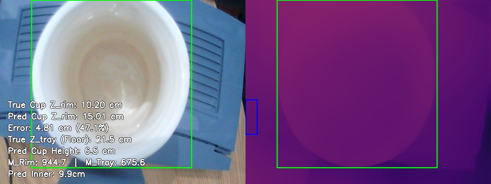

**Math Trace**:
- True Floor Distance ($Z_{tray}$): **21.50 cm**
- $Z_{rim} = (-0.0026 \cdot 944.7) + (0.0095 \cdot 675.6) + (1.1113 \cdot 21.5) + -12.8446 = 15.0 cm$
- **Pred Z_rim**: 15.01 cm
- **Pred Cup Height**: 6.49 cm
- True Cup Outer Diameter:  (Not Provided)
- **Pred Cup Inner Diameter**: 9.85 cm

---

### Sample: calib_tray21.5cm_rim11.5cm_1776158396.jpg
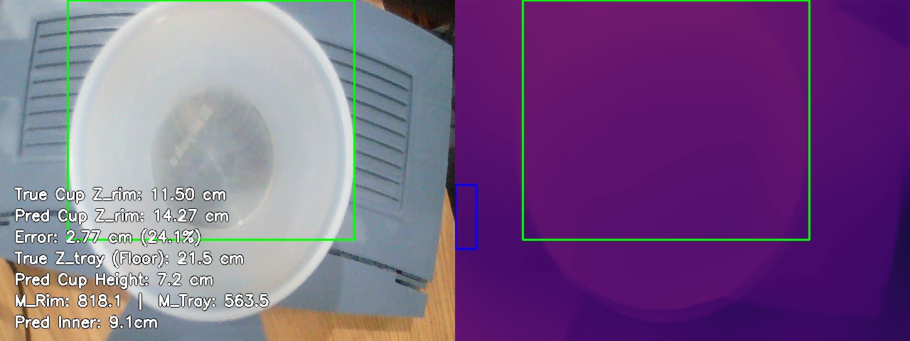

**Math Trace**:
- True Floor Distance ($Z_{tray}$): **21.50 cm**
- $Z_{rim} = (-0.0026 \cdot 818.1) + (0.0095 \cdot 563.5) + (1.1113 \cdot 21.5) + -12.8446 = 14.3 cm$
- **Pred Z_rim**: 14.27 cm
- **Pred Cup Height**: 7.23 cm
- True Cup Outer Diameter:  (Not Provided)
- **Pred Cup Inner Diameter**: 9.05 cm

---

### Sample: calib_tray21.5cm_rim14.0cm_1776158896.jpg
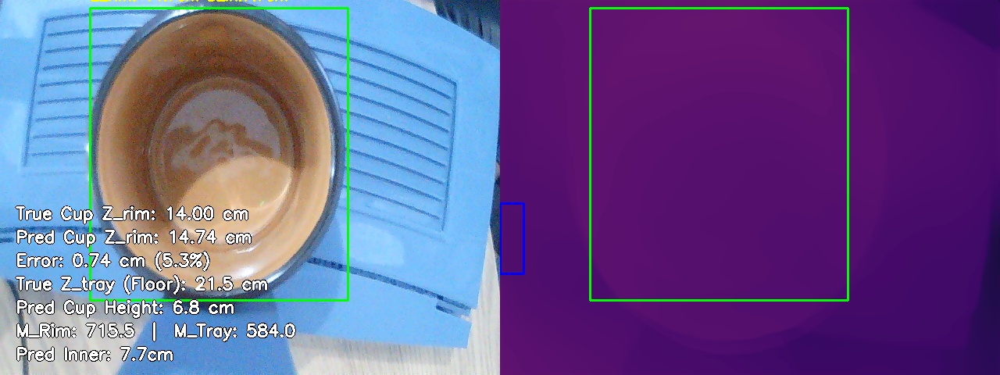

**Math Trace**:
- True Floor Distance ($Z_{tray}$): **21.50 cm**
- $Z_{rim} = (-0.0026 \cdot 715.5) + (0.0095 \cdot 584.0) + (1.1113 \cdot 21.5) + -12.8446 = 14.7 cm$
- **Pred Z_rim**: 14.74 cm
- **Pred Cup Height**: 6.76 cm
- True Cup Outer Diameter:  (Not Provided)
- **Pred Cup Inner Diameter**: 7.65 cm

---

### Sample: calib_tray22.1cm_rim12.1cm_1776158441.jpg
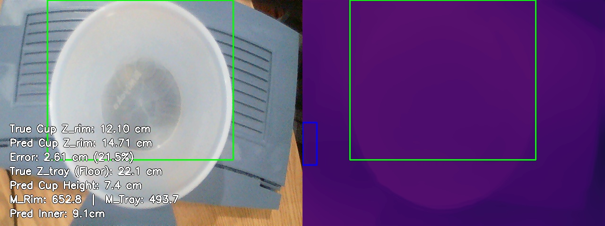

**Math Trace**:
- True Floor Distance ($Z_{tray}$): **22.10 cm**
- $Z_{rim} = (-0.0026 \cdot 652.8) + (0.0095 \cdot 493.7) + (1.1113 \cdot 22.1) + -12.8446 = 14.7 cm$
- **Pred Z_rim**: 14.71 cm
- **Pred Cup Height**: 7.39 cm
- True Cup Outer Diameter:  (Not Provided)
- **Pred Cup Inner Diameter**: 9.10 cm

---

### Sample: calib_tray22.6cm_rim11.3cm_1776158992.jpg
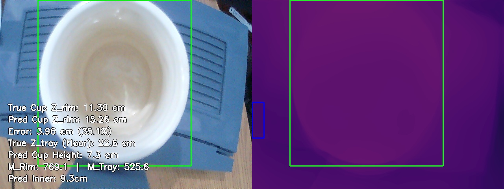

**Math Trace**:
- True Floor Distance ($Z_{tray}$): **22.60 cm**
- $Z_{rim} = (-0.0026 \cdot 769.1) + (0.0095 \cdot 525.6) + (1.1113 \cdot 22.6) + -12.8446 = 15.3 cm$
- **Pred Z_rim**: 15.26 cm
- **Pred Cup Height**: 7.34 cm
- True Cup Outer Diameter:  (Not Provided)
- **Pred Cup Inner Diameter**: 9.35 cm

---

### Sample: calib_tray23.2cm_rim11.9cm_1776159058.jpg
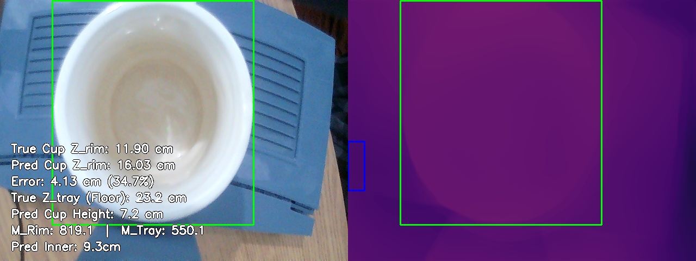

**Math Trace**:
- True Floor Distance ($Z_{tray}$): **23.20 cm**
- $Z_{rim} = (-0.0026 \cdot 819.1) + (0.0095 \cdot 550.1) + (1.1113 \cdot 23.2) + -12.8446 = 16.0 cm$
- **Pred Z_rim**: 16.03 cm
- **Pred Cup Height**: 7.17 cm
- True Cup Outer Diameter:  (Not Provided)
- **Pred Cup Inner Diameter**: 9.34 cm

---

### Sample: calib_tray23.2cm_rim15.7cm_1776158843.jpg
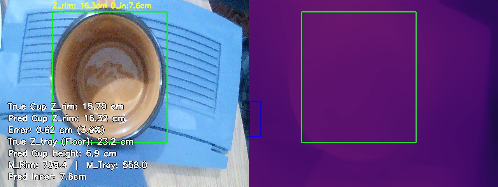

**Math Trace**:
- True Floor Distance ($Z_{tray}$): **23.20 cm**
- $Z_{rim} = (-0.0026 \cdot 739.4) + (0.0095 \cdot 558.0) + (1.1113 \cdot 23.2) + -12.8446 = 16.3 cm$
- **Pred Z_rim**: 16.32 cm
- **Pred Cup Height**: 6.88 cm
- True Cup Outer Diameter:  (Not Provided)
- **Pred Cup Inner Diameter**: 7.55 cm

---

### Sample: calib_tray23.3cm_rim13.3cm_1776158495.jpg
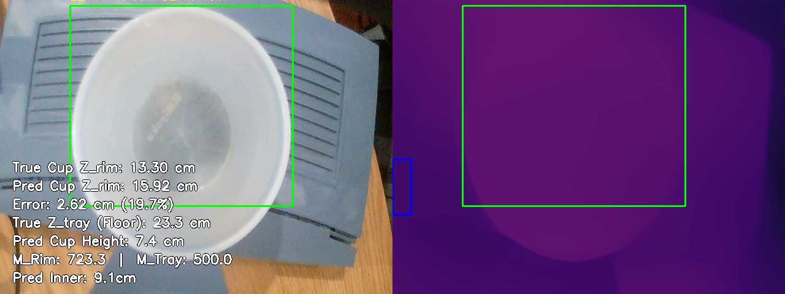

**Math Trace**:
- True Floor Distance ($Z_{tray}$): **23.30 cm**
- $Z_{rim} = (-0.0026 \cdot 723.3) + (0.0095 \cdot 500.0) + (1.1113 \cdot 23.3) + -12.8446 = 15.9 cm$
- **Pred Z_rim**: 15.92 cm
- **Pred Cup Height**: 7.38 cm
- True Cup Outer Diameter:  (Not Provided)
- **Pred Cup Inner Diameter**: 9.09 cm

---

### Sample: calib_tray24.3cm_rim13.0cm_1776159117.jpg
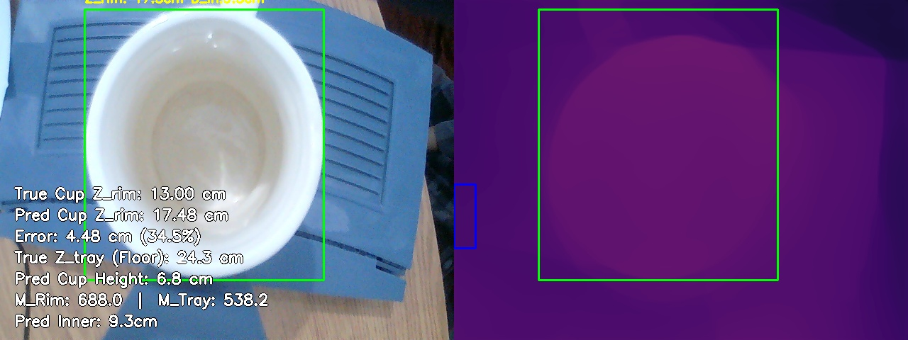

**Math Trace**:
- True Floor Distance ($Z_{tray}$): **24.30 cm**
- $Z_{rim} = (-0.0026 \cdot 688.0) + (0.0095 \cdot 538.2) + (1.1113 \cdot 24.3) + -12.8446 = 17.5 cm$
- **Pred Z_rim**: 17.48 cm
- **Pred Cup Height**: 6.82 cm
- True Cup Outer Diameter:  (Not Provided)
- **Pred Cup Inner Diameter**: 9.27 cm

---

### Sample: calib_tray24.3cm_rim14.3cm_1776158726.jpg
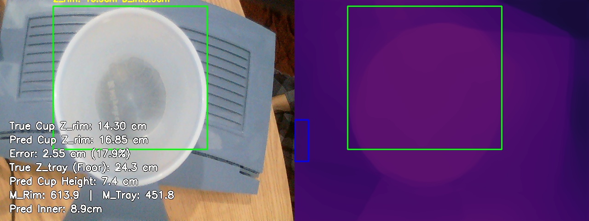

**Math Trace**:
- True Floor Distance ($Z_{tray}$): **24.30 cm**
- $Z_{rim} = (-0.0026 \cdot 613.9) + (0.0095 \cdot 451.8) + (1.1113 \cdot 24.3) + -12.8446 = 16.9 cm$
- **Pred Z_rim**: 16.85 cm
- **Pred Cup Height**: 7.45 cm
- True Cup Outer Diameter:  (Not Provided)
- **Pred Cup Inner Diameter**: 8.89 cm

---

### Sample: calib_tray24.3cm_rim16.8cm_1776158781.jpg
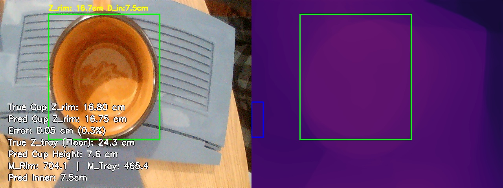

**Math Trace**:
- True Floor Distance ($Z_{tray}$): **24.30 cm**
- $Z_{rim} = (-0.0026 \cdot 704.1) + (0.0095 \cdot 465.4) + (1.1113 \cdot 24.3) + -12.8446 = 16.7 cm$
- **Pred Z_rim**: 16.75 cm
- **Pred Cup Height**: 7.55 cm
- True Cup Outer Diameter:  (Not Provided)
- **Pred Cup Inner Diameter**: 7.46 cm

---

### Sample: calib_tray25.2cm_rim15.2cm_1776158574.jpg
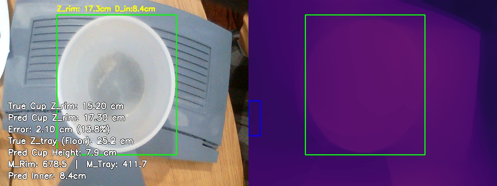

**Math Trace**:
- True Floor Distance ($Z_{tray}$): **25.20 cm**
- $Z_{rim} = (-0.0026 \cdot 678.5) + (0.0095 \cdot 411.7) + (1.1113 \cdot 25.2) + -12.8446 = 17.3 cm$
- **Pred Z_rim**: 17.30 cm
- **Pred Cup Height**: 7.90 cm
- True Cup Outer Diameter:  (Not Provided)
- **Pred Cup Inner Diameter**: 8.39 cm

---

### Sample: calib_tray25.2cm_rim17.7cm_1776158631.jpg
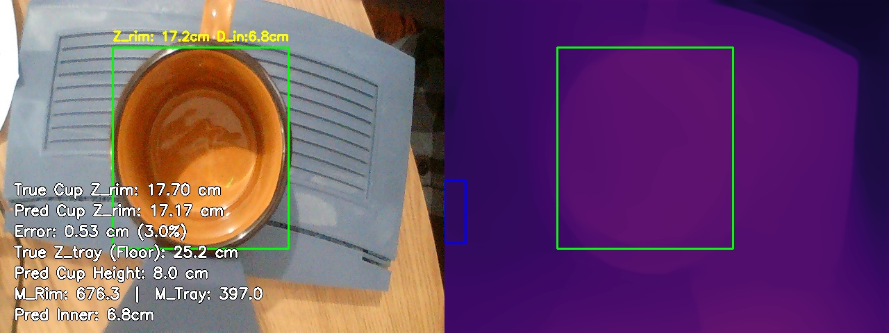

**Math Trace**:
- True Floor Distance ($Z_{tray}$): **25.20 cm**
- $Z_{rim} = (-0.0026 \cdot 676.3) + (0.0095 \cdot 397.0) + (1.1113 \cdot 25.2) + -12.8446 = 17.2 cm$
- **Pred Z_rim**: 17.17 cm
- **Pred Cup Height**: 8.03 cm
- True Cup Outer Diameter:  (Not Provided)
- **Pred Cup Inner Diameter**: 6.84 cm

---

### Sample: calib_tray25.8cm_rim14.5cm_1776159171.jpg
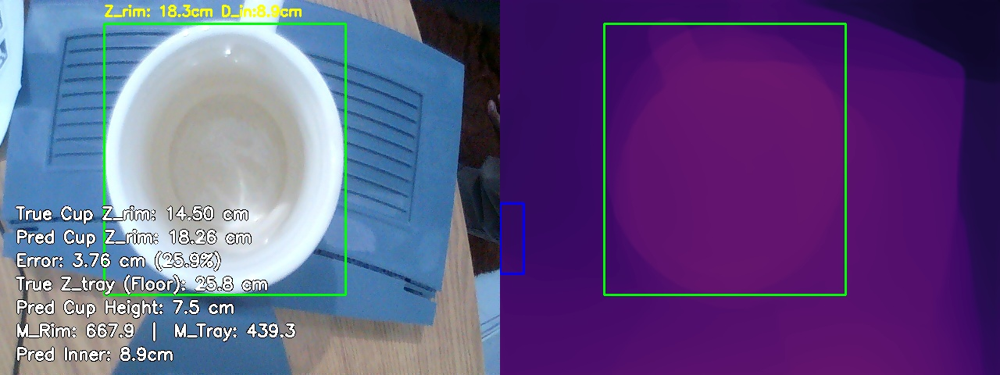

**Math Trace**:
- True Floor Distance ($Z_{tray}$): **25.80 cm**
- $Z_{rim} = (-0.0026 \cdot 667.9) + (0.0095 \cdot 439.3) + (1.1113 \cdot 25.8) + -12.8446 = 18.3 cm$
- **Pred Z_rim**: 18.26 cm
- **Pred Cup Height**: 7.54 cm
- True Cup Outer Diameter:  (Not Provided)
- **Pred Cup Inner Diameter**: 8.88 cm

---

### Sample: calib_tray26.4cm_rim18.3cm_diam7.2cm_1775104073.jpg
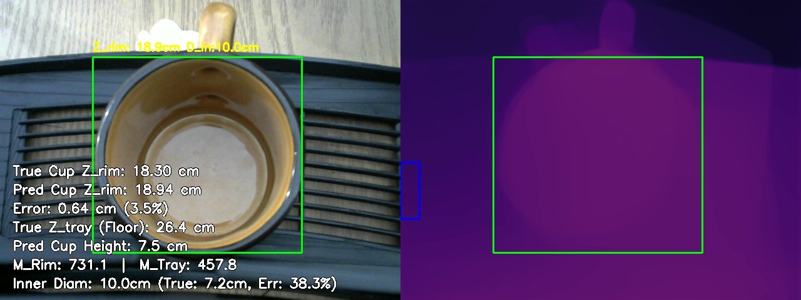

**Math Trace**:
- True Floor Distance ($Z_{tray}$): **26.40 cm**
- $Z_{rim} = (-0.0026 \cdot 731.1) + (0.0095 \cdot 457.8) + (1.1113 \cdot 26.4) + -12.8446 = 18.9 cm$
- **Pred Z_rim**: 18.94 cm
- **Pred Cup Height**: 7.46 cm
- True Cup Outer Diameter:  (Not Provided)
- **Pred Cup Inner Diameter**: 9.96 cm (True: 7.20 cm)

---

### Sample: calib_tray28.3cm_rim20.1cm_diam7.2cm_1775103379.jpg
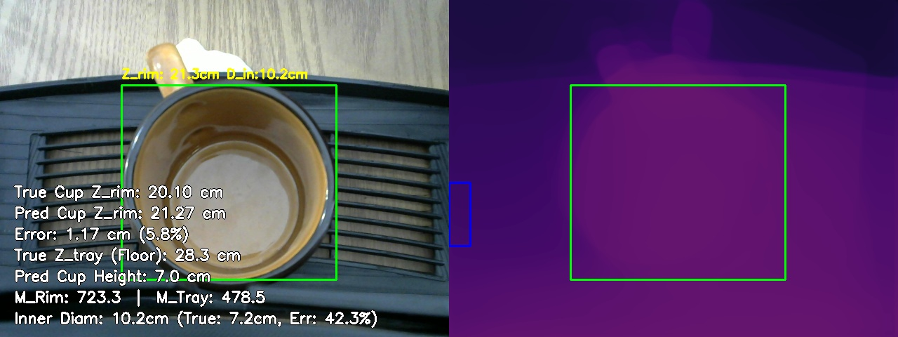

**Math Trace**:
- True Floor Distance ($Z_{tray}$): **28.30 cm**
- $Z_{rim} = (-0.0026 \cdot 723.3) + (0.0095 \cdot 478.5) + (1.1113 \cdot 28.3) + -12.8446 = 21.3 cm$
- **Pred Z_rim**: 21.27 cm
- **Pred Cup Height**: 7.03 cm
- True Cup Outer Diameter:  (Not Provided)
- **Pred Cup Inner Diameter**: 10.24 cm (True: 7.20 cm)

---

### Sample: calib_tray29.3cm_rim21.9cm_diam7.2cm_1775104111.jpg
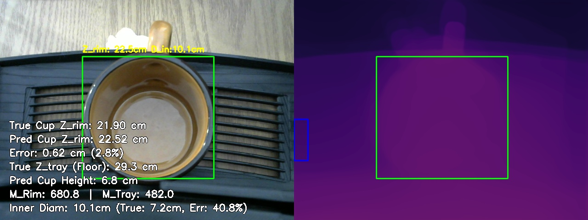

**Math Trace**:
- True Floor Distance ($Z_{tray}$): **29.30 cm**
- $Z_{rim} = (-0.0026 \cdot 680.8) + (0.0095 \cdot 482.0) + (1.1113 \cdot 29.3) + -12.8446 = 22.5 cm$
- **Pred Z_rim**: 22.52 cm
- **Pred Cup Height**: 6.78 cm
- True Cup Outer Diameter:  (Not Provided)
- **Pred Cup Inner Diameter**: 10.14 cm (True: 7.20 cm)

---

### Sample: calib_tray33.0cm_rim25.1cm_diam7.2cm_1775103562.jpg
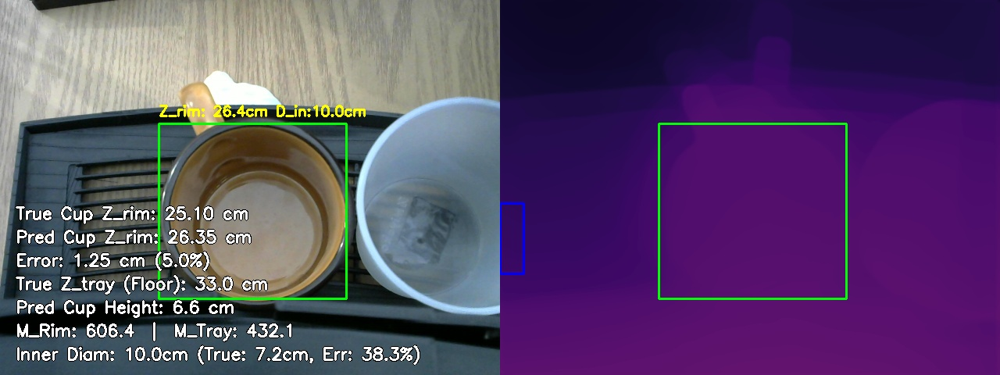

**Math Trace**:
- True Floor Distance ($Z_{tray}$): **33.00 cm**
- $Z_{rim} = (-0.0026 \cdot 606.4) + (0.0095 \cdot 432.1) + (1.1113 \cdot 33.0) + -12.8446 = 26.4 cm$
- **Pred Z_rim**: 26.35 cm
- **Pred Cup Height**: 6.65 cm
- True Cup Outer Diameter:  (Not Provided)
- **Pred Cup Inner Diameter**: 9.96 cm (True: 7.20 cm)

---

### Sample: calib_tray33.3cm_rim26.5cm_diam7.2cm_1775104186.jpg
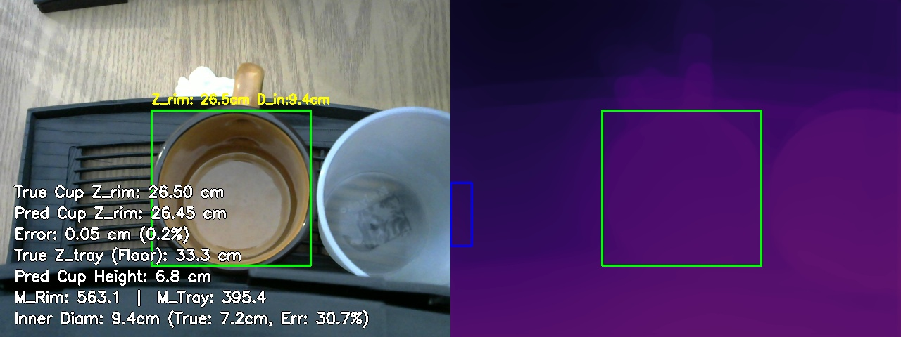

**Math Trace**:
- True Floor Distance ($Z_{tray}$): **33.30 cm**
- $Z_{rim} = (-0.0026 \cdot 563.1) + (0.0095 \cdot 395.4) + (1.1113 \cdot 33.3) + -12.8446 = 26.5 cm$
- **Pred Z_rim**: 26.45 cm
- **Pred Cup Height**: 6.85 cm
- True Cup Outer Diameter:  (Not Provided)
- **Pred Cup Inner Diameter**: 9.41 cm (True: 7.20 cm)

---

### Sample: calib_tray36.0cm_rim28.6cm_diam7.2cm_1775103633.jpg
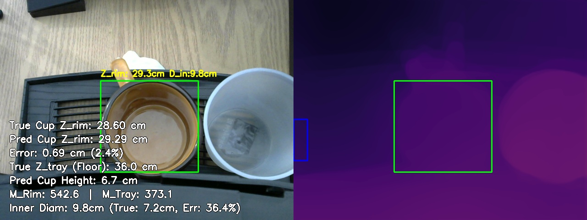

**Math Trace**:
- True Floor Distance ($Z_{tray}$): **36.00 cm**
- $Z_{rim} = (-0.0026 \cdot 542.6) + (0.0095 \cdot 373.1) + (1.1113 \cdot 36.0) + -12.8446 = 29.3 cm$
- **Pred Z_rim**: 29.29 cm
- **Pred Cup Height**: 6.71 cm
- True Cup Outer Diameter:  (Not Provided)
- **Pred Cup Inner Diameter**: 9.82 cm (True: 7.20 cm)

---

### Sample: test_tray18.5cm_rim11.0cm_1777272964.jpg
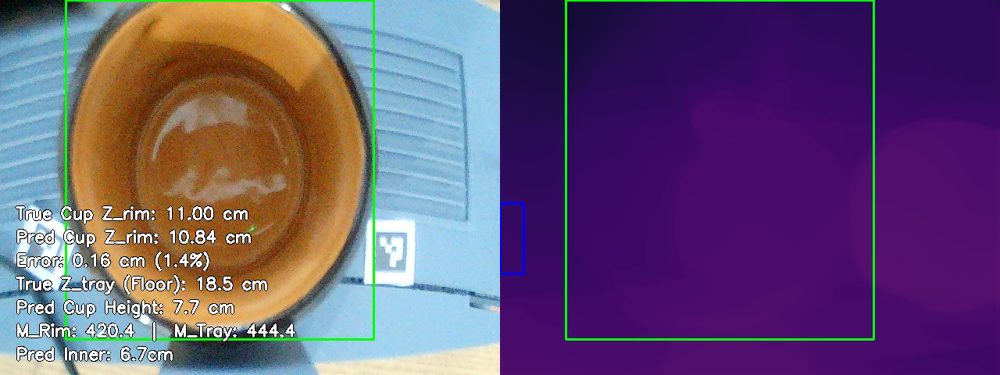

**Math Trace**:
- True Floor Distance ($Z_{tray}$): **18.50 cm**
- $Z_{rim} = (-0.0026 \cdot 420.4) + (0.0095 \cdot 444.4) + (1.1113 \cdot 18.5) + -12.8446 = 10.8 cm$
- **Pred Z_rim**: 10.84 cm
- **Pred Cup Height**: 7.66 cm
- True Cup Outer Diameter:  (Not Provided)
- **Pred Cup Inner Diameter**: 6.73 cm

---

### Sample: test_tray18.8cm_rim11.2cm_1777273681.jpg
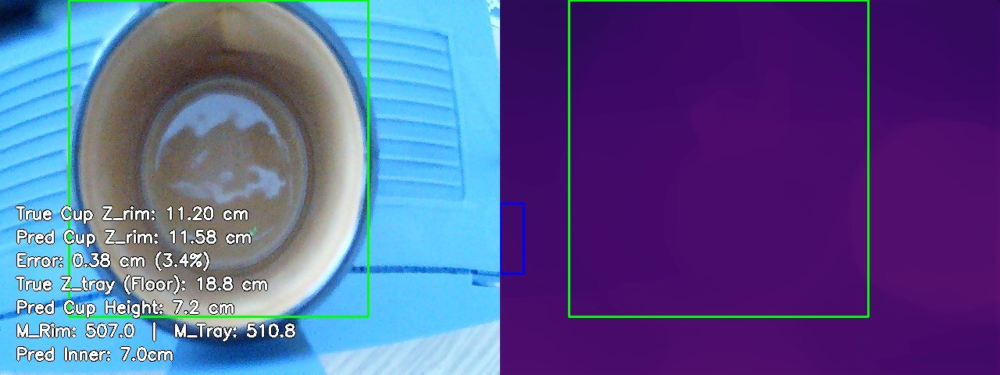

**Math Trace**:
- True Floor Distance ($Z_{tray}$): **18.80 cm**
- $Z_{rim} = (-0.0026 \cdot 507.0) + (0.0095 \cdot 510.8) + (1.1113 \cdot 18.8) + -12.8446 = 11.6 cm$
- **Pred Z_rim**: 11.58 cm
- **Pred Cup Height**: 7.22 cm
- True Cup Outer Diameter:  (Not Provided)
- **Pred Cup Inner Diameter**: 6.98 cm

---

### Sample: test_tray20.5cm_rim10.3cm_1777276090.jpg
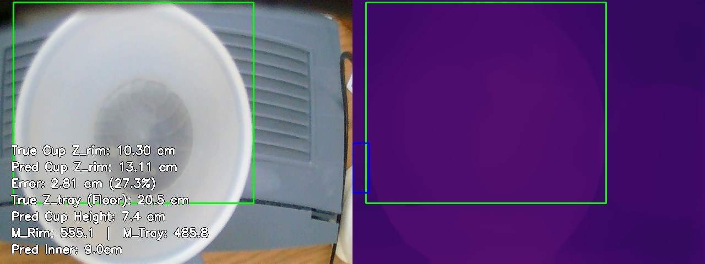

**Math Trace**:
- True Floor Distance ($Z_{tray}$): **20.50 cm**
- $Z_{rim} = (-0.0026 \cdot 555.1) + (0.0095 \cdot 485.8) + (1.1113 \cdot 20.5) + -12.8446 = 13.1 cm$
- **Pred Z_rim**: 13.11 cm
- **Pred Cup Height**: 7.39 cm
- True Cup Outer Diameter:  (Not Provided)
- **Pred Cup Inner Diameter**: 9.00 cm

---

### Sample: test_tray20.6cm_rim13.0cm_1777273119.jpg
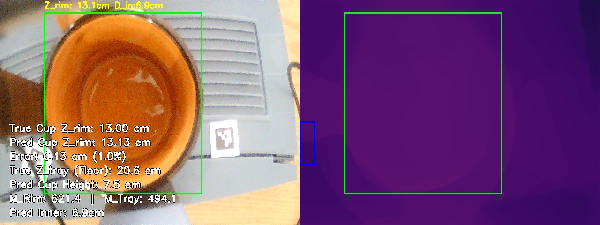

**Math Trace**:
- True Floor Distance ($Z_{tray}$): **20.60 cm**
- $Z_{rim} = (-0.0026 \cdot 621.4) + (0.0095 \cdot 494.1) + (1.1113 \cdot 20.6) + -12.8446 = 13.1 cm$
- **Pred Z_rim**: 13.13 cm
- **Pred Cup Height**: 7.47 cm
- True Cup Outer Diameter:  (Not Provided)
- **Pred Cup Inner Diameter**: 6.94 cm

---

### Sample: test_tray20.7cm_rim10.5cm_1777276149.jpg
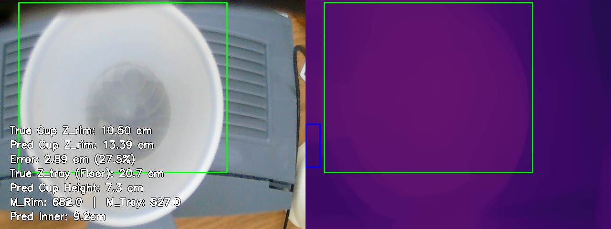

**Math Trace**:
- True Floor Distance ($Z_{tray}$): **20.70 cm**
- $Z_{rim} = (-0.0026 \cdot 682.0) + (0.0095 \cdot 527.0) + (1.1113 \cdot 20.7) + -12.8446 = 13.4 cm$
- **Pred Z_rim**: 13.39 cm
- **Pred Cup Height**: 7.31 cm
- True Cup Outer Diameter:  (Not Provided)
- **Pred Cup Inner Diameter**: 9.19 cm

---

### Sample: test_tray21.0cm_rim13.4cm_1777273958.jpg
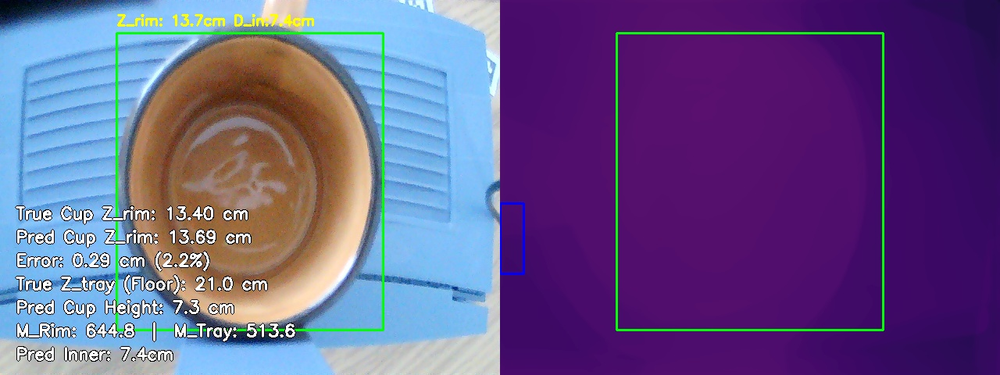

**Math Trace**:
- True Floor Distance ($Z_{tray}$): **21.00 cm**
- $Z_{rim} = (-0.0026 \cdot 644.8) + (0.0095 \cdot 513.6) + (1.1113 \cdot 21.0) + -12.8446 = 13.7 cm$
- **Pred Z_rim**: 13.69 cm
- **Pred Cup Height**: 7.31 cm
- True Cup Outer Diameter:  (Not Provided)
- **Pred Cup Inner Diameter**: 7.35 cm

---

### Sample: test_tray21.1cm_rim13.0cm_1777272620.jpg
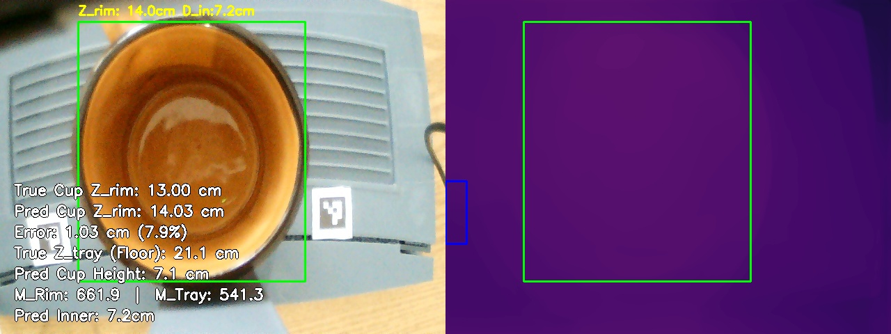

**Math Trace**:
- True Floor Distance ($Z_{tray}$): **21.10 cm**
- $Z_{rim} = (-0.0026 \cdot 661.9) + (0.0095 \cdot 541.3) + (1.1113 \cdot 21.1) + -12.8446 = 14.0 cm$
- **Pred Z_rim**: 14.03 cm
- **Pred Cup Height**: 7.07 cm
- True Cup Outer Diameter:  (Not Provided)
- **Pred Cup Inner Diameter**: 7.20 cm

---

### Sample: test_tray21.2cm_rim11.0cm_1777275784.jpg
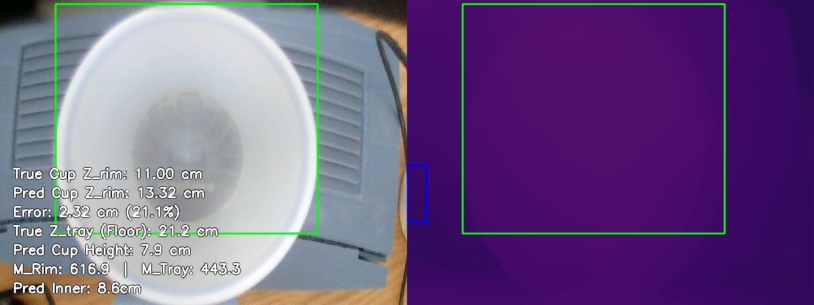

**Math Trace**:
- True Floor Distance ($Z_{tray}$): **21.20 cm**
- $Z_{rim} = (-0.0026 \cdot 616.9) + (0.0095 \cdot 443.3) + (1.1113 \cdot 21.2) + -12.8446 = 13.3 cm$
- **Pred Z_rim**: 13.32 cm
- **Pred Cup Height**: 7.88 cm
- True Cup Outer Diameter:  (Not Provided)
- **Pred Cup Inner Diameter**: 8.64 cm

---

### Sample: test_tray21.2cm_rim13.1cm_1777272848.jpg
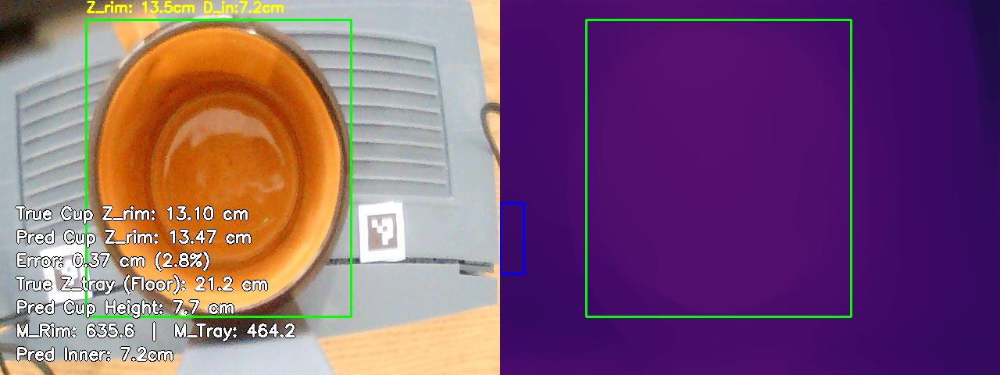

**Math Trace**:
- True Floor Distance ($Z_{tray}$): **21.20 cm**
- $Z_{rim} = (-0.0026 \cdot 635.6) + (0.0095 \cdot 464.2) + (1.1113 \cdot 21.2) + -12.8446 = 13.5 cm$
- **Pred Z_rim**: 13.47 cm
- **Pred Cup Height**: 7.73 cm
- True Cup Outer Diameter:  (Not Provided)
- **Pred Cup Inner Diameter**: 7.19 cm

---

### Sample: test_tray21.5cm_rim10.4cm_1776319920.jpg
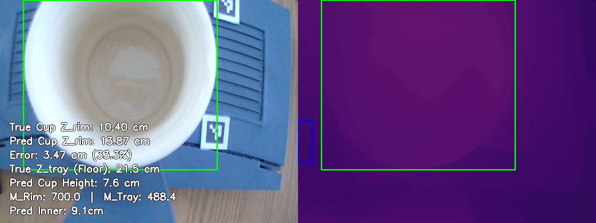

**Math Trace**:
- True Floor Distance ($Z_{tray}$): **21.50 cm**
- $Z_{rim} = (-0.0026 \cdot 700.0) + (0.0095 \cdot 488.4) + (1.1113 \cdot 21.5) + -12.8446 = 13.9 cm$
- **Pred Z_rim**: 13.87 cm
- **Pred Cup Height**: 7.63 cm
- True Cup Outer Diameter:  (Not Provided)
- **Pred Cup Inner Diameter**: 9.08 cm

---

### Sample: test_tray21.5cm_rim14.0cm_1776319380.jpg
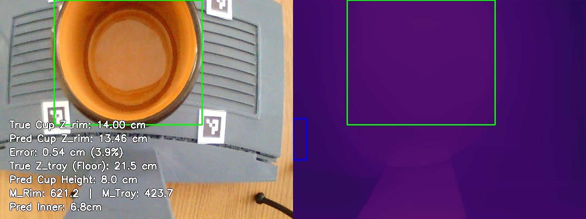

**Math Trace**:
- True Floor Distance ($Z_{tray}$): **21.50 cm**
- $Z_{rim} = (-0.0026 \cdot 621.2) + (0.0095 \cdot 423.7) + (1.1113 \cdot 21.5) + -12.8446 = 13.5 cm$
- **Pred Z_rim**: 13.46 cm
- **Pred Cup Height**: 8.04 cm
- True Cup Outer Diameter:  (Not Provided)
- **Pred Cup Inner Diameter**: 6.84 cm

---

### Sample: test_tray21.6cm_rim11.4cm_1777276288.jpg
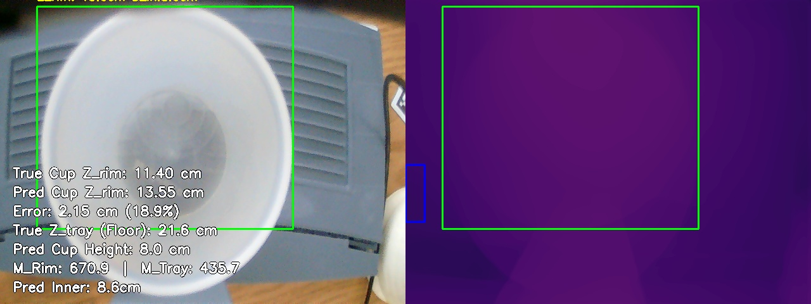

**Math Trace**:
- True Floor Distance ($Z_{tray}$): **21.60 cm**
- $Z_{rim} = (-0.0026 \cdot 670.9) + (0.0095 \cdot 435.7) + (1.1113 \cdot 21.6) + -12.8446 = 13.6 cm$
- **Pred Z_rim**: 13.55 cm
- **Pred Cup Height**: 8.05 cm
- True Cup Outer Diameter:  (Not Provided)
- **Pred Cup Inner Diameter**: 8.62 cm

---

### Sample: test_tray21.7cm_rim14.3cm_1777273361.jpg
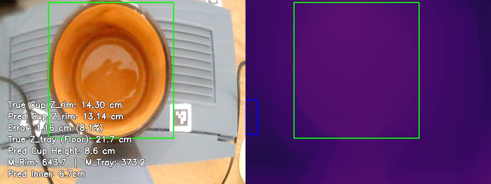

**Math Trace**:
- True Floor Distance ($Z_{tray}$): **21.70 cm**
- $Z_{rim} = (-0.0026 \cdot 643.7) + (0.0095 \cdot 373.2) + (1.1113 \cdot 21.7) + -12.8446 = 13.1 cm$
- **Pred Z_rim**: 13.14 cm
- **Pred Cup Height**: 8.56 cm
- True Cup Outer Diameter:  (Not Provided)
- **Pred Cup Inner Diameter**: 6.74 cm

---

### Sample: test_tray22.1cm_rim11.9cm_1777275722.jpg
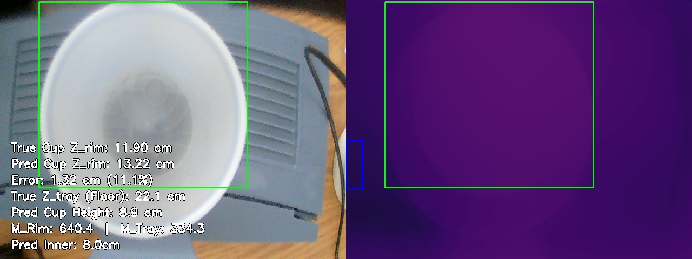

**Math Trace**:
- True Floor Distance ($Z_{tray}$): **22.10 cm**
- $Z_{rim} = (-0.0026 \cdot 640.4) + (0.0095 \cdot 334.3) + (1.1113 \cdot 22.1) + -12.8446 = 13.2 cm$
- **Pred Z_rim**: 13.22 cm
- **Pred Cup Height**: 8.88 cm
- True Cup Outer Diameter:  (Not Provided)
- **Pred Cup Inner Diameter**: 8.01 cm

---

### Sample: test_tray22.4cm_rim11.2cm_1777274219.jpg
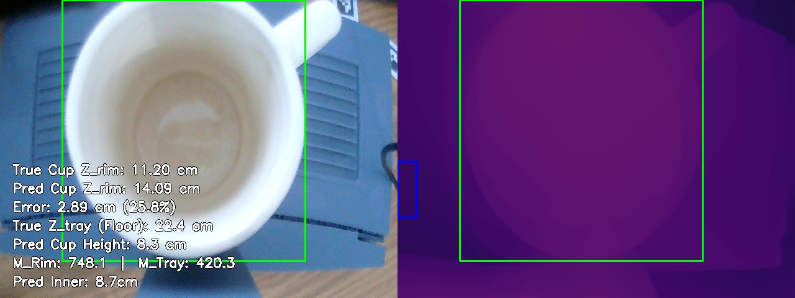

**Math Trace**:
- True Floor Distance ($Z_{tray}$): **22.40 cm**
- $Z_{rim} = (-0.0026 \cdot 748.1) + (0.0095 \cdot 420.3) + (1.1113 \cdot 22.4) + -12.8446 = 14.1 cm$
- **Pred Z_rim**: 14.09 cm
- **Pred Cup Height**: 8.31 cm
- True Cup Outer Diameter:  (Not Provided)
- **Pred Cup Inner Diameter**: 8.67 cm

---

### Sample: test_tray22.6cm_rim11.4cm_1777274335.jpg
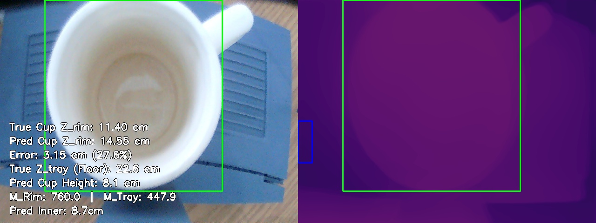

**Math Trace**:
- True Floor Distance ($Z_{tray}$): **22.60 cm**
- $Z_{rim} = (-0.0026 \cdot 760.0) + (0.0095 \cdot 447.9) + (1.1113 \cdot 22.6) + -12.8446 = 14.5 cm$
- **Pred Z_rim**: 14.55 cm
- **Pred Cup Height**: 8.05 cm
- True Cup Outer Diameter:  (Not Provided)
- **Pred Cup Inner Diameter**: 8.72 cm

---

### Sample: test_tray22.8cm_rim15.3cm_1776319430.jpg
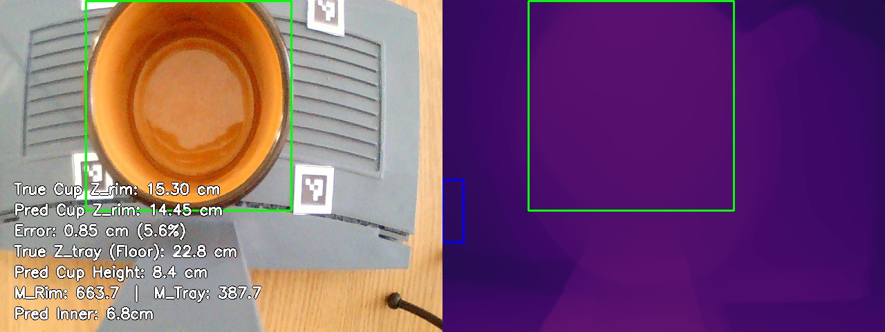

**Math Trace**:
- True Floor Distance ($Z_{tray}$): **22.80 cm**
- $Z_{rim} = (-0.0026 \cdot 663.7) + (0.0095 \cdot 387.7) + (1.1113 \cdot 22.8) + -12.8446 = 14.4 cm$
- **Pred Z_rim**: 14.45 cm
- **Pred Cup Height**: 8.35 cm
- True Cup Outer Diameter:  (Not Provided)
- **Pred Cup Inner Diameter**: 6.75 cm

---

### Sample: test_tray23.0cm_rim11.1cm_1776319882.jpg
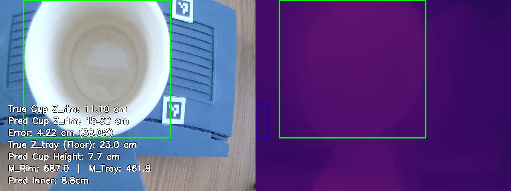

**Math Trace**:
- True Floor Distance ($Z_{tray}$): **23.00 cm**
- $Z_{rim} = (-0.0026 \cdot 687.0) + (0.0095 \cdot 461.9) + (1.1113 \cdot 23.0) + -12.8446 = 15.3 cm$
- **Pred Z_rim**: 15.32 cm
- **Pred Cup Height**: 7.68 cm
- True Cup Outer Diameter:  (Not Provided)
- **Pred Cup Inner Diameter**: 8.85 cm

---

### Sample: test_tray23.0cm_rim12.8cm_1777275628.jpg
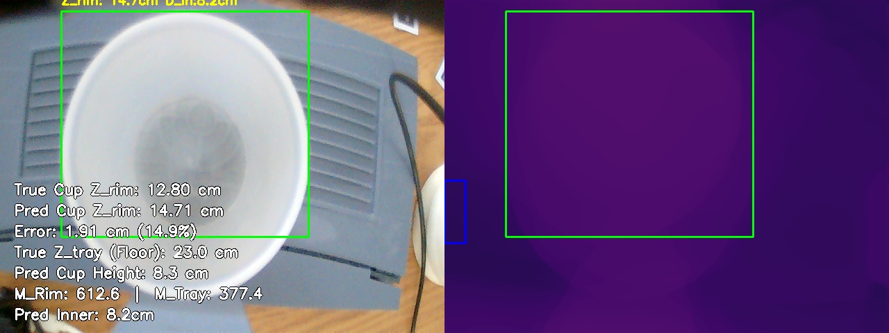

**Math Trace**:
- True Floor Distance ($Z_{tray}$): **23.00 cm**
- $Z_{rim} = (-0.0026 \cdot 612.6) + (0.0095 \cdot 377.4) + (1.1113 \cdot 23.0) + -12.8446 = 14.7 cm$
- **Pred Z_rim**: 14.71 cm
- **Pred Cup Height**: 8.29 cm
- True Cup Outer Diameter:  (Not Provided)
- **Pred Cup Inner Diameter**: 8.24 cm

---

### Sample: test_tray23.3cm_rim11.9cm_1777274426.jpg
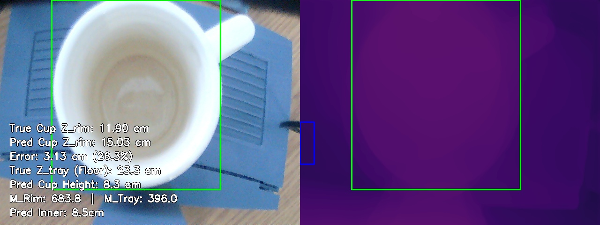

**Math Trace**:
- True Floor Distance ($Z_{tray}$): **23.30 cm**
- $Z_{rim} = (-0.0026 \cdot 683.8) + (0.0095 \cdot 396.0) + (1.1113 \cdot 23.3) + -12.8446 = 15.0 cm$
- **Pred Z_rim**: 15.03 cm
- **Pred Cup Height**: 8.27 cm
- True Cup Outer Diameter:  (Not Provided)
- **Pred Cup Inner Diameter**: 8.52 cm

---

### Sample: test_tray23.4cm_rim15.9cm_1777272457.jpg
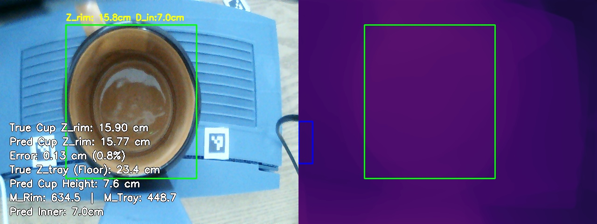

**Math Trace**:
- True Floor Distance ($Z_{tray}$): **23.40 cm**
- $Z_{rim} = (-0.0026 \cdot 634.5) + (0.0095 \cdot 448.7) + (1.1113 \cdot 23.4) + -12.8446 = 15.8 cm$
- **Pred Z_rim**: 15.77 cm
- **Pred Cup Height**: 7.63 cm
- True Cup Outer Diameter:  (Not Provided)
- **Pred Cup Inner Diameter**: 6.95 cm

---

### Sample: test_tray23.4cm_rim15.9cm_1777272475.jpg
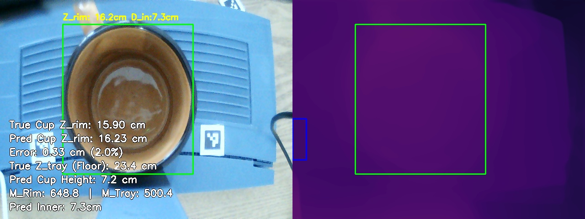

**Math Trace**:
- True Floor Distance ($Z_{tray}$): **23.40 cm**
- $Z_{rim} = (-0.0026 \cdot 648.8) + (0.0095 \cdot 500.4) + (1.1113 \cdot 23.4) + -12.8446 = 16.2 cm$
- **Pred Z_rim**: 16.23 cm
- **Pred Cup Height**: 7.17 cm
- True Cup Outer Diameter:  (Not Provided)
- **Pred Cup Inner Diameter**: 7.28 cm

---

### Sample: test_tray23.5cm_rim16.0cm_1776319468.jpg
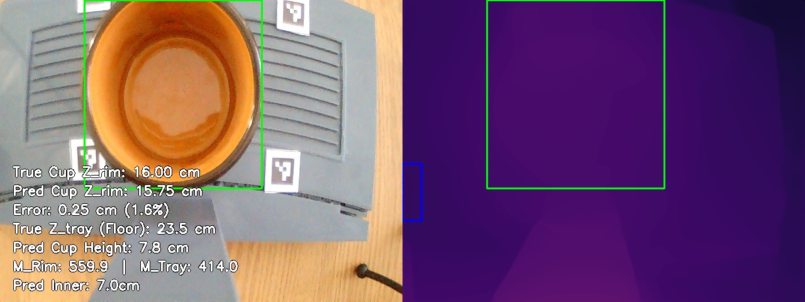

**Math Trace**:
- True Floor Distance ($Z_{tray}$): **23.50 cm**
- $Z_{rim} = (-0.0026 \cdot 559.9) + (0.0095 \cdot 414.0) + (1.1113 \cdot 23.5) + -12.8446 = 15.7 cm$
- **Pred Z_rim**: 15.75 cm
- **Pred Cup Height**: 7.75 cm
- True Cup Outer Diameter:  (Not Provided)
- **Pred Cup Inner Diameter**: 6.99 cm

---

### Sample: test_tray23.7cm_rim13.5cm_1777275440.jpg
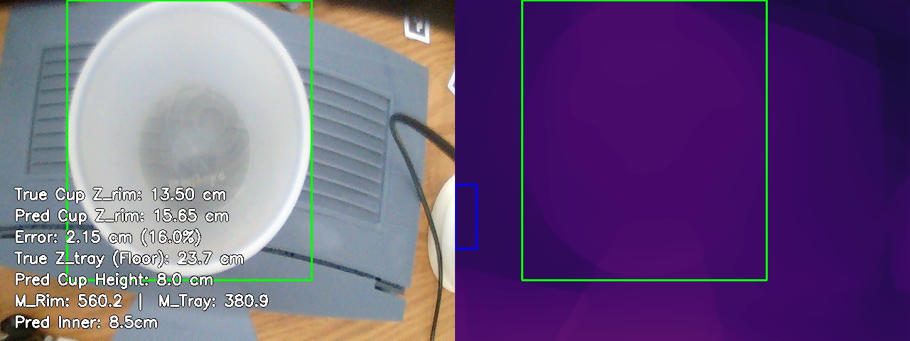

**Math Trace**:
- True Floor Distance ($Z_{tray}$): **23.70 cm**
- $Z_{rim} = (-0.0026 \cdot 560.2) + (0.0095 \cdot 380.9) + (1.1113 \cdot 23.7) + -12.8446 = 15.7 cm$
- **Pred Z_rim**: 15.65 cm
- **Pred Cup Height**: 8.05 cm
- True Cup Outer Diameter:  (Not Provided)
- **Pred Cup Inner Diameter**: 8.48 cm

---

### Sample: test_tray23.8cm_rim12.0cm_1777274556.jpg
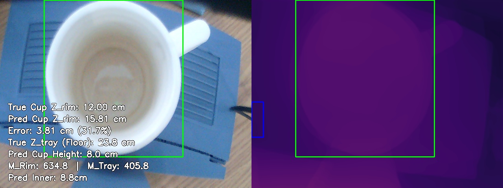

**Math Trace**:
- True Floor Distance ($Z_{tray}$): **23.80 cm**
- $Z_{rim} = (-0.0026 \cdot 634.8) + (0.0095 \cdot 405.8) + (1.1113 \cdot 23.8) + -12.8446 = 15.8 cm$
- **Pred Z_rim**: 15.81 cm
- **Pred Cup Height**: 7.99 cm
- True Cup Outer Diameter:  (Not Provided)
- **Pred Cup Inner Diameter**: 8.78 cm

---

### Sample: test_tray24.0cm_rim13.9cm_1776319711.jpg
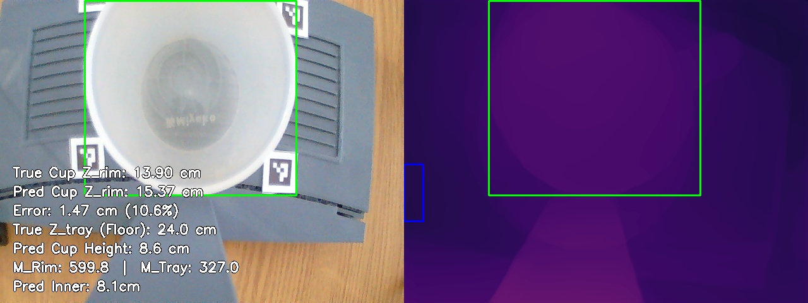

**Math Trace**:
- True Floor Distance ($Z_{tray}$): **24.00 cm**
- $Z_{rim} = (-0.0026 \cdot 599.8) + (0.0095 \cdot 327.0) + (1.1113 \cdot 24.0) + -12.8446 = 15.4 cm$
- **Pred Z_rim**: 15.37 cm
- **Pred Cup Height**: 8.63 cm
- True Cup Outer Diameter:  (Not Provided)
- **Pred Cup Inner Diameter**: 8.11 cm

---

### Sample: test_tray24.0cm_rim16.4cm_1777273247.jpg
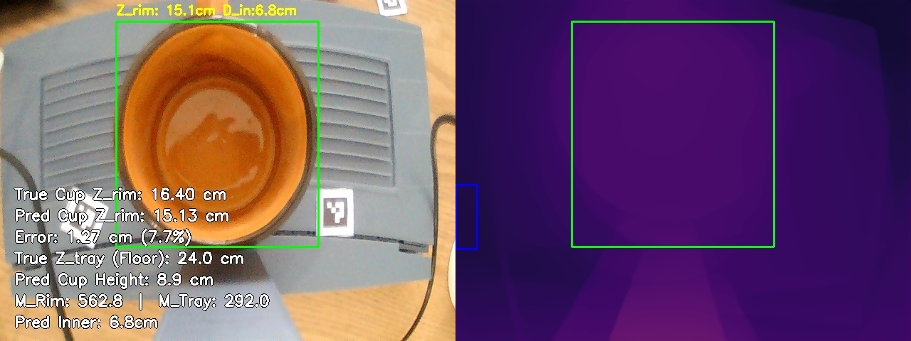

**Math Trace**:
- True Floor Distance ($Z_{tray}$): **24.00 cm**
- $Z_{rim} = (-0.0026 \cdot 562.8) + (0.0095 \cdot 292.0) + (1.1113 \cdot 24.0) + -12.8446 = 15.1 cm$
- **Pred Z_rim**: 15.13 cm
- **Pred Cup Height**: 8.87 cm
- True Cup Outer Diameter:  (Not Provided)
- **Pred Cup Inner Diameter**: 6.77 cm

---

### Sample: test_tray24.1cm_rim12.9cm_1777274769.jpg
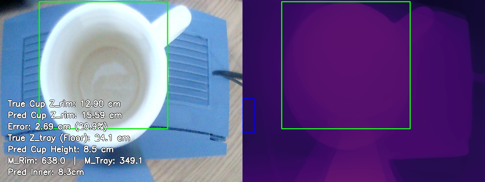

**Math Trace**:
- True Floor Distance ($Z_{tray}$): **24.10 cm**
- $Z_{rim} = (-0.0026 \cdot 638.0) + (0.0095 \cdot 349.1) + (1.1113 \cdot 24.1) + -12.8446 = 15.6 cm$
- **Pred Z_rim**: 15.59 cm
- **Pred Cup Height**: 8.51 cm
- True Cup Outer Diameter:  (Not Provided)
- **Pred Cup Inner Diameter**: 8.32 cm

---

### Sample: test_tray24.5cm_rim13.3cm_1777274870.jpg
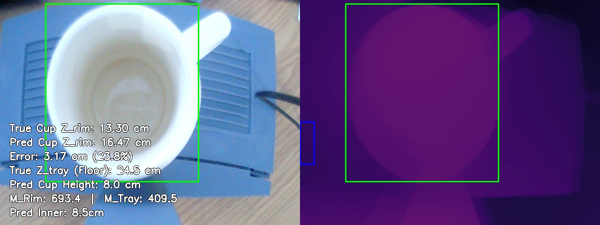

**Math Trace**:
- True Floor Distance ($Z_{tray}$): **24.50 cm**
- $Z_{rim} = (-0.0026 \cdot 693.4) + (0.0095 \cdot 409.5) + (1.1113 \cdot 24.5) + -12.8446 = 16.5 cm$
- **Pred Z_rim**: 16.47 cm
- **Pred Cup Height**: 8.03 cm
- True Cup Outer Diameter:  (Not Provided)
- **Pred Cup Inner Diameter**: 8.45 cm

---

### Sample: test_tray24.6cm_rim17.1cm_1776319507.jpg
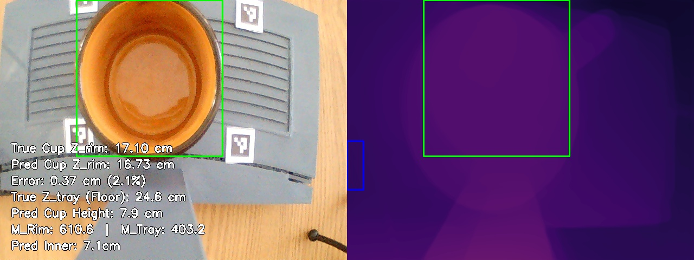

**Math Trace**:
- True Floor Distance ($Z_{tray}$): **24.60 cm**
- $Z_{rim} = (-0.0026 \cdot 610.6) + (0.0095 \cdot 403.2) + (1.1113 \cdot 24.6) + -12.8446 = 16.7 cm$
- **Pred Z_rim**: 16.73 cm
- **Pred Cup Height**: 7.87 cm
- True Cup Outer Diameter:  (Not Provided)
- **Pred Cup Inner Diameter**: 7.09 cm

---

### Sample: test_tray24.7cm_rim14.5cm_1777275384.jpg
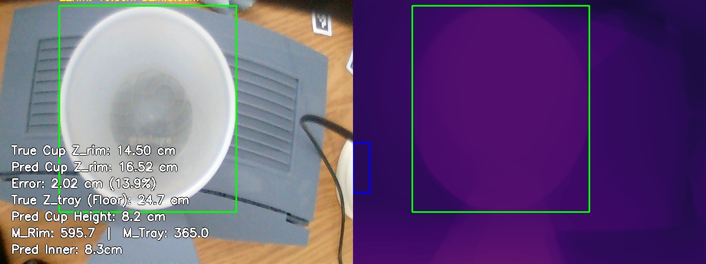

**Math Trace**:
- True Floor Distance ($Z_{tray}$): **24.70 cm**
- $Z_{rim} = (-0.0026 \cdot 595.7) + (0.0095 \cdot 365.0) + (1.1113 \cdot 24.7) + -12.8446 = 16.5 cm$
- **Pred Z_rim**: 16.52 cm
- **Pred Cup Height**: 8.18 cm
- True Cup Outer Diameter:  (Not Provided)
- **Pred Cup Inner Diameter**: 8.35 cm

---

### Sample: test_tray24.95cm_rim14.85cm_1776319655.jpg
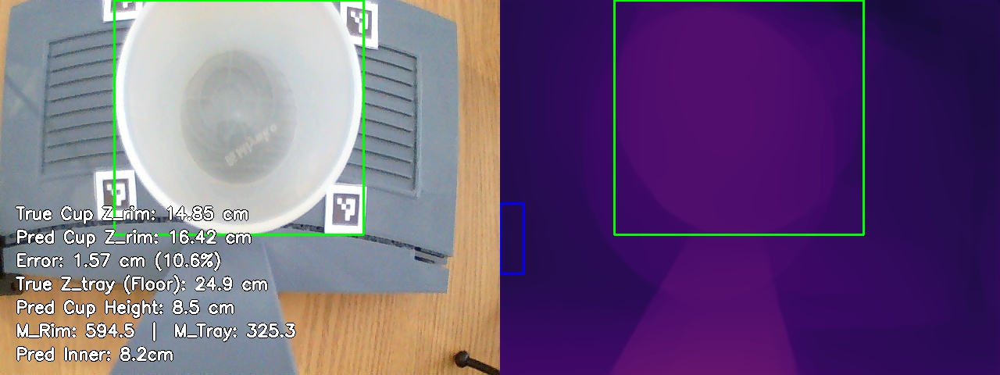

**Math Trace**:
- True Floor Distance ($Z_{tray}$): **24.95 cm**
- $Z_{rim} = (-0.0026 \cdot 594.5) + (0.0095 \cdot 325.3) + (1.1113 \cdot 24.9) + -12.8446 = 16.4 cm$
- **Pred Z_rim**: 16.42 cm
- **Pred Cup Height**: 8.53 cm
- True Cup Outer Diameter:  (Not Provided)
- **Pred Cup Inner Diameter**: 8.25 cm

---

### Sample: test_tray25.1cm_rim10.4cm_1776319971.jpg
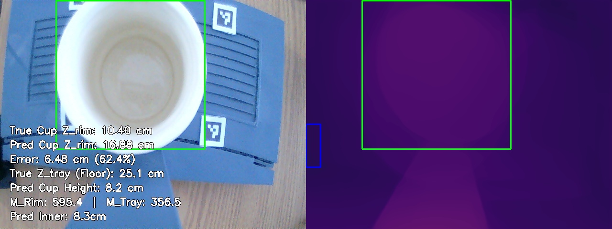

**Math Trace**:
- True Floor Distance ($Z_{tray}$): **25.10 cm**
- $Z_{rim} = (-0.0026 \cdot 595.4) + (0.0095 \cdot 356.5) + (1.1113 \cdot 25.1) + -12.8446 = 16.9 cm$
- **Pred Z_rim**: 16.88 cm
- **Pred Cup Height**: 8.22 cm
- True Cup Outer Diameter:  (Not Provided)
- **Pred Cup Inner Diameter**: 8.27 cm

---

### Sample: test_tray25.1cm_rim13.9cm_1777274943.jpg
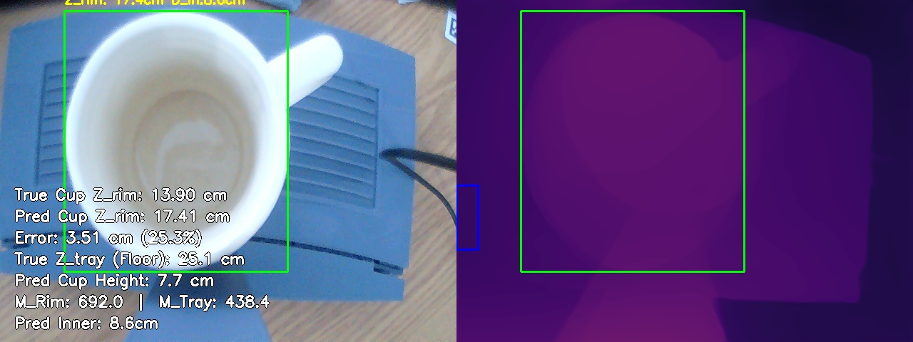

**Math Trace**:
- True Floor Distance ($Z_{tray}$): **25.10 cm**
- $Z_{rim} = (-0.0026 \cdot 692.0) + (0.0095 \cdot 438.4) + (1.1113 \cdot 25.1) + -12.8446 = 17.4 cm$
- **Pred Z_rim**: 17.41 cm
- **Pred Cup Height**: 7.69 cm
- True Cup Outer Diameter:  (Not Provided)
- **Pred Cup Inner Diameter**: 8.58 cm

---

### Sample: test_tray25.4cm_rim14.3cm_1777275019.jpg
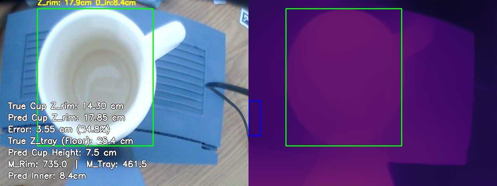

**Math Trace**:
- True Floor Distance ($Z_{tray}$): **25.40 cm**
- $Z_{rim} = (-0.0026 \cdot 735.0) + (0.0095 \cdot 461.5) + (1.1113 \cdot 25.4) + -12.8446 = 17.9 cm$
- **Pred Z_rim**: 17.85 cm
- **Pred Cup Height**: 7.55 cm
- True Cup Outer Diameter:  (Not Provided)
- **Pred Cup Inner Diameter**: 8.37 cm

---

### Sample: test_tray25.4cm_rim18.0cm_1777272752.jpg
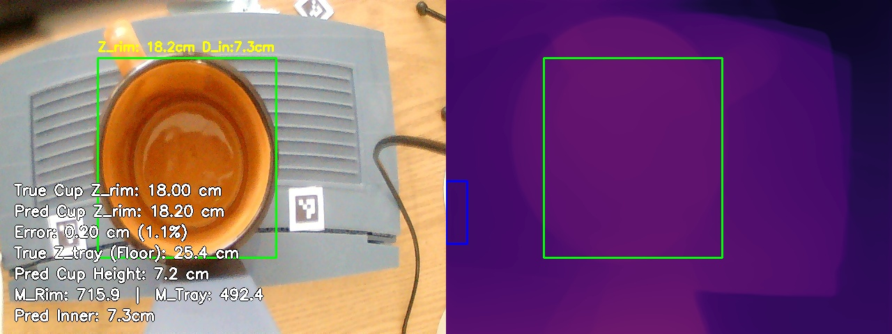

**Math Trace**:
- True Floor Distance ($Z_{tray}$): **25.40 cm**
- $Z_{rim} = (-0.0026 \cdot 715.9) + (0.0095 \cdot 492.4) + (1.1113 \cdot 25.4) + -12.8446 = 18.2 cm$
- **Pred Z_rim**: 18.20 cm
- **Pred Cup Height**: 7.20 cm
- True Cup Outer Diameter:  (Not Provided)
- **Pred Cup Inner Diameter**: 7.33 cm

---

### Sample: test_tray25.9cm_rim18.4cm_1776319547.jpg
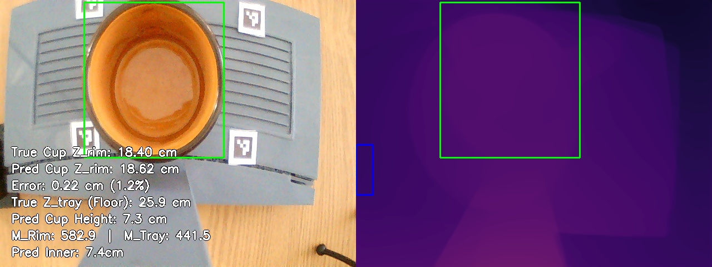

**Math Trace**:
- True Floor Distance ($Z_{tray}$): **25.90 cm**
- $Z_{rim} = (-0.0026 \cdot 582.9) + (0.0095 \cdot 441.5) + (1.1113 \cdot 25.9) + -12.8446 = 18.6 cm$
- **Pred Z_rim**: 18.62 cm
- **Pred Cup Height**: 7.28 cm
- True Cup Outer Diameter:  (Not Provided)
- **Pred Cup Inner Diameter**: 7.36 cm

---

### Sample: test_tray26.0cm_rim14.8cm_1777275098.jpg
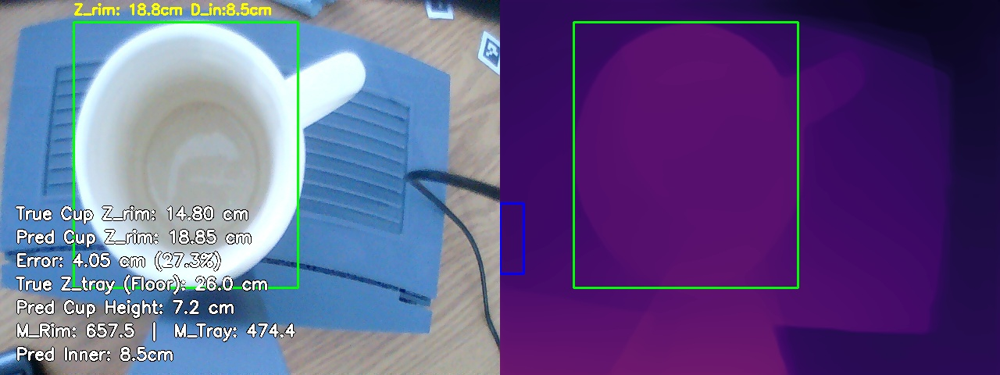

**Math Trace**:
- True Floor Distance ($Z_{tray}$): **26.00 cm**
- $Z_{rim} = (-0.0026 \cdot 657.5) + (0.0095 \cdot 474.4) + (1.1113 \cdot 26.0) + -12.8446 = 18.8 cm$
- **Pred Z_rim**: 18.85 cm
- **Pred Cup Height**: 7.15 cm
- True Cup Outer Diameter:  (Not Provided)
- **Pred Cup Inner Diameter**: 8.51 cm

---

### Sample: test_tray26.3cm_rim16.1cm_1777275315.jpg
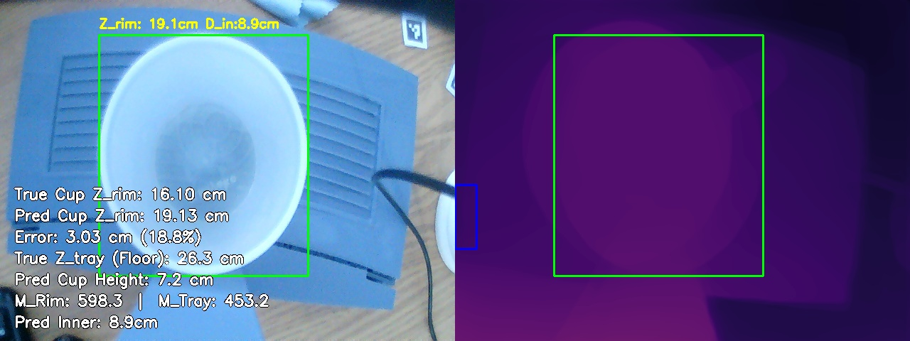

**Math Trace**:
- True Floor Distance ($Z_{tray}$): **26.30 cm**
- $Z_{rim} = (-0.0026 \cdot 598.3) + (0.0095 \cdot 453.2) + (1.1113 \cdot 26.3) + -12.8446 = 19.1 cm$
- **Pred Z_rim**: 19.13 cm
- **Pred Cup Height**: 7.17 cm
- True Cup Outer Diameter:  (Not Provided)
- **Pred Cup Inner Diameter**: 8.85 cm

---

### Sample: test_tray26.6cm_rim15.4cm_1777275167.jpg
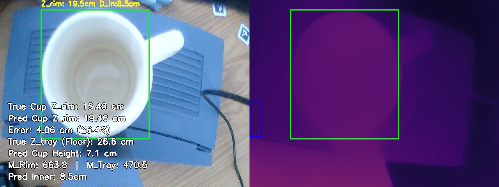

**Math Trace**:
- True Floor Distance ($Z_{tray}$): **26.60 cm**
- $Z_{rim} = (-0.0026 \cdot 663.8) + (0.0095 \cdot 470.5) + (1.1113 \cdot 26.6) + -12.8446 = 19.5 cm$
- **Pred Z_rim**: 19.46 cm
- **Pred Cup Height**: 7.14 cm
- True Cup Outer Diameter:  (Not Provided)
- **Pred Cup Inner Diameter**: 8.48 cm

---

### Sample: test_tray26.6cm_rim16.5cm_1777275227.jpg
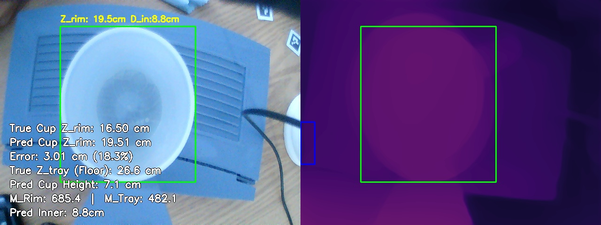

**Math Trace**:
- True Floor Distance ($Z_{tray}$): **26.60 cm**
- $Z_{rim} = (-0.0026 \cdot 685.4) + (0.0095 \cdot 482.1) + (1.1113 \cdot 26.6) + -12.8446 = 19.5 cm$
- **Pred Z_rim**: 19.51 cm
- **Pred Cup Height**: 7.09 cm
- True Cup Outer Diameter:  (Not Provided)
- **Pred Cup Inner Diameter**: 8.85 cm

---

## 5. Conclusion & Limitations
### Conclusion
The Multivariate Regression approach successfully mitigates the scale and shift ambiguity inherent in monocular depth estimation models. Based on the evaluation metrics:
- The model achieved a highly precise geometric correlation with a **Mean Absolute Error (MAE) of 2.01 cm**.
- The **RMSE of 2.52 cm** confirms the absence of catastrophic arithmetic outliers.
- A **Strict Accuracy ($\delta < 1cm$) of 34.4%** demonstrates that the numerical pipeline is mathematically robust for industrial deployment when analyzing static snapshots.

### Current Limitations
Despite the successful numerical alignment, the system inherits several physical limitations from the underlying AI and the evaluation conditions:
- **AI Temporal Jitter**: Monocular depth models natively suffer from frame-to-frame instability. Depth values can randomly jump or fluctuate even when the physical scene is completely static.
- **Model Quality Dependency**: The final accuracy is heavily bound to the chosen AI model's spatial understanding capabilities. Weak base modeling (e.g., bad edge preservation) will immediately degrade the linear regression.
- **Controlled Lighting Restraints**: The current calibration and testing sets were captured in a consistent lighting environment. Significant lux or glare variations remain untested.
- **Homogeneous Object Testing**: Evaluation metrics were recorded using a single type of cup geometry and material. Transparent, reflective, or vastly complex geometries may produce skewed depth maps that the current $C_1 \dots C_4$ constants cannot properly absorb.

