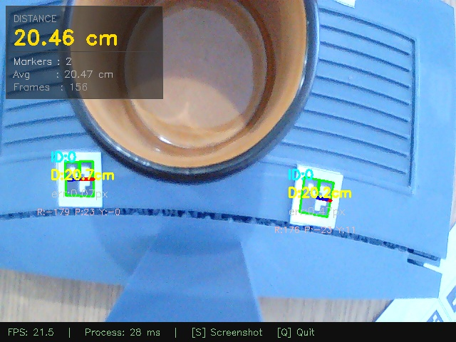

# ArUco Depth Verification: Session Report
Generated on: 2026-04-15 15-09-48

## 1. Session Parameters
Parameters used during this ArUco detection session:

| Parameter | Value |
| :--- | :--- |
| **ArUco Dictionary** | DICT_4X4_50 |
| **Physical Marker Size** | 1.5 cm |
| **Focal Length (K)** | 660.8 px |
| **Lock Focus** | OFF |

## 2. Global Stability Summary
Statistical summary of distance measurements gathered over 210 frames:

| Metric | Value | Description |
| :--- | :--- | :--- |
| **Average Distance** | **20.47 cm** | Mean of all valid detections. |
| **Standard Deviation ($\sigma$)** | **0.11 cm** | Consistency of the detection. |
| **Minimum Distance** | 20.16 cm | Closest measured point. |
| **Maximum Distance** | 20.83 cm | Furthest measured point. |
| **Distance Spread** | 0.67 cm | Range between min and max. |
| **Detection Rate** | 100.0% | Percentage of frames with marker. |

## 3. Visual Evidence
### Distance Tracking Chart

### Captured Screenshots

## 4. Conclusion
The session shows high detection stability and consistent distance reporting.
