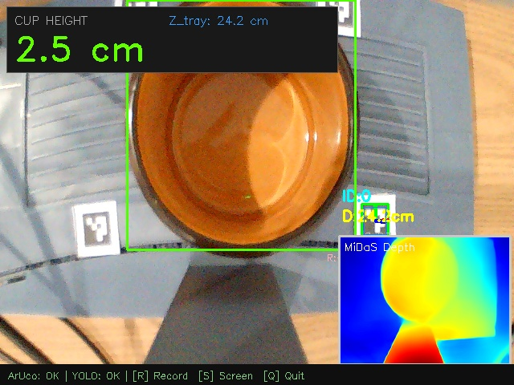

# ArUco + MiDaS Fusion Session Report

**Date/Time:** 2026-04-20 17-04-51

## 1. Parameters
- Marker Size: 1.5 cm
- Formula Alpha: 1.0
- Camera Focal Length: 660.8 px

## 2. Global Results
- **Avg Cup Height**: 2.39 cm
- **Min / Max Cup Height**: 1.97 cm / 2.74 cm
- **Standard Deviation (Precision jitter)**: ± 0.27 cm
- **Avg Z_tray Anchor**: 24.25 cm
- Total Frames Streamed: 6
- Total MiDaS Inferences: 6

## 3. Session Chart

## 4. Screenshots
- 
