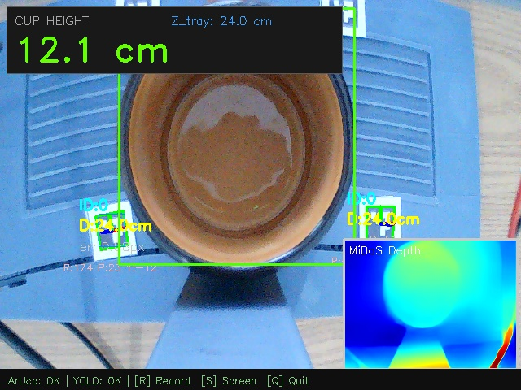

# ArUco + MiDaS Fusion Session Report

**Date/Time:** 2026-04-21 09-36-31

## 1. Parameters
- Marker Size: 1.5 cm
- Formula Alpha: 0.76
- Camera Focal Length: 660.8 px

## 2. Global Results
- **Avg Cup Height**: 12.30 cm
- **Min / Max Cup Height**: 10.71 cm / 15.60 cm
- **Standard Deviation (Precision jitter)**: ± 1.18 cm
- **Avg Z_tray Anchor**: 23.82 cm
- Total Frames Streamed: 147
- Total MiDaS Inferences: 56

## 3. Session Chart

## 4. Screenshots
- 
