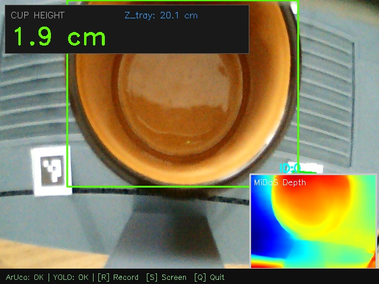

# ArUco + MiDaS Fusion Session Report

**Date/Time:** 2026-04-21 10-34-31

## 1. Parameters
- Marker Size: 1.5 cm
- Formula Alpha: 1.08
- Camera Focal Length: 660.8 px

## 2. Global Results
- **Avg Cup Height**: 2.51 cm
- **Min / Max Cup Height**: 0.59 cm / 6.07 cm
- **Standard Deviation (Precision jitter)**: ± 0.79 cm
- **Avg Z_tray Anchor**: 20.23 cm
- Total Frames Streamed: 63
- Total MiDaS Inferences: 63

## 3. Session Chart

## 4. Screenshots
- 
