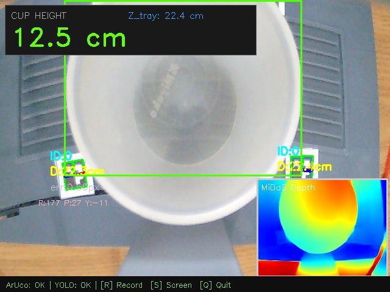

# ArUco + MiDaS Fusion Session Report

**Date/Time:** 2026-04-21 11-17-50

## 1. Parameters
- Marker Size: 1.5 cm
- Calibration K Factor: 0.76107
- Camera Focal Length: 660.8 px

## 2. Global Results
- **Avg Cup Height**: 12.99 cm
- **Min / Max Cup Height**: 12.28 cm / 13.79 cm
- **Standard Deviation (Precision jitter)**: ± 0.43 cm
- **Avg Z_tray Anchor**: 22.38 cm
- Total Frames Streamed: 30
- Total MiDaS Inferences: 30

## 3. Session Chart

## 4. Screenshots
- 
