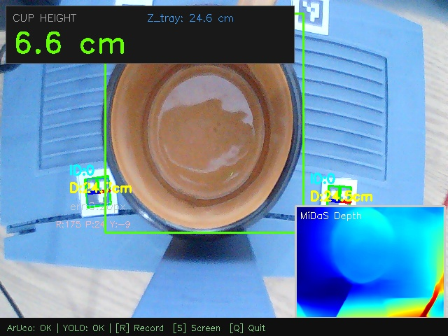

# ArUco + MiDaS Fusion Session Report

**Date/Time:** 2026-04-22 10-42-41

## 1. Parameters
Parameters used during this AI depth fusion session:

| Parameter | Value |
| :--- | :--- |
| **Physical Marker Size** | 1.5 cm |
| **Calibration Model** | 1-Point K-Factor (K=0.86013) |
| **Camera Focal Length** | 660.8 px |

## 2. Global Stability Summary
Statistical summary of cup height predictions gathered over the running frames:

| Metric | Value | Description |
| :--- | :--- | :--- |
| **Average Cup Height** | **6.69 cm** | Mean of all valid predictions. |
| **Median Height (P50)** | **6.67 cm** | Most representative single value. |
| **Precision Error (P95−P5)** | **2.29 cm** | 90% of readings fall within this range. |
| **Standard Deviation ($\sigma$)** | 0.71 cm | Consistency / jitter of the AI model. |
| **Tray Anchor Depth (Z)** | 24.43 cm | Average physical depth of the tray. |
| **Minimum / Maximum Height** | 5.29 / 8.28 cm | Extremes recorded. |
| **Total Frames / Inferences** | 50 / 50 | Pipeline tracking efficiency. |

## 3. Visual Evidence
### Depth Tracking Chart

## 4. Screenshots
- 
