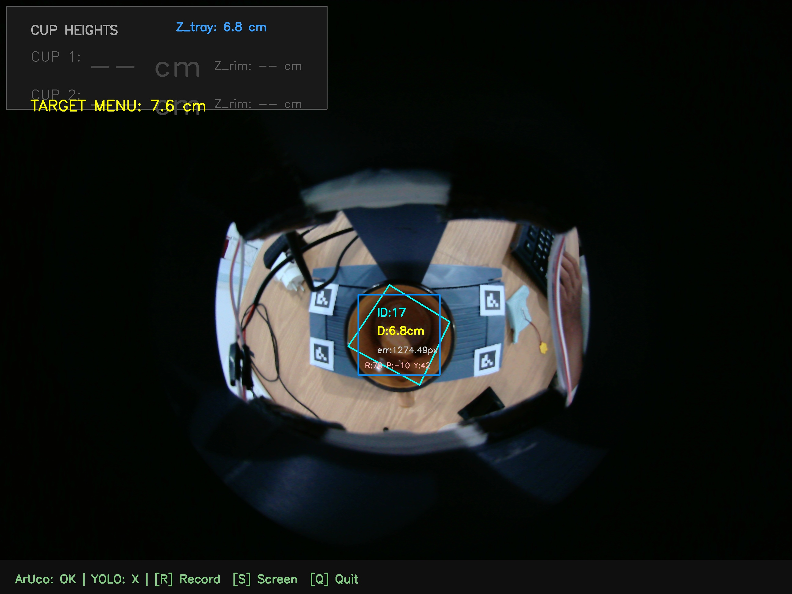
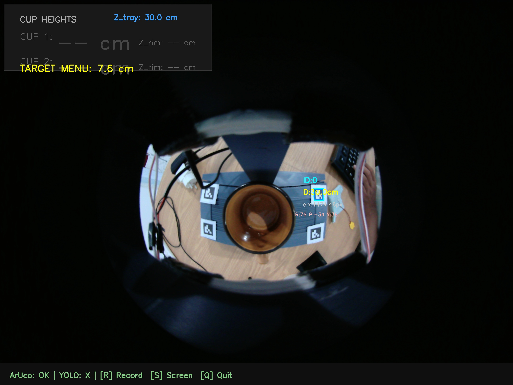

# ArUco + MiDaS Fusion Session Report

**Date/Time:** 2026-04-29 15-43-48

## 1. Parameters
Parameters used during this AI depth fusion session:

| Parameter | Value |
| :--- | :--- |
| **Physical Marker Size** | 2.5 cm |
| **Calibration Model** | 5-Geometric Z-Grid |
| **Camera Focal Length** | 660.8 px |

## 2. Global Stability Summary
Statistical summary of cup height predictions gathered over the running frames:

| Metric | Value | Description |
| :--- | :--- | :--- |
| **Average Cup Height** | **0.00 cm** | Mean of all valid predictions. |
| **Standard Deviation ($\sigma$)** | 0.00 cm | Consistency / jitter of the AI model. |
| **Tray Anchor Depth (Z)** | 17.53 cm | Average physical depth of the tray. |
| **Minimum / Maximum Height** | 0.00 / 0.00 cm | Extremes recorded. |
| **Total Frames / Inferences** | 11 / 0 | Pipeline tracking efficiency. |

## 3. Visual Evidence
### Depth Tracking Chart

## 4. Screenshots
- 
- 
