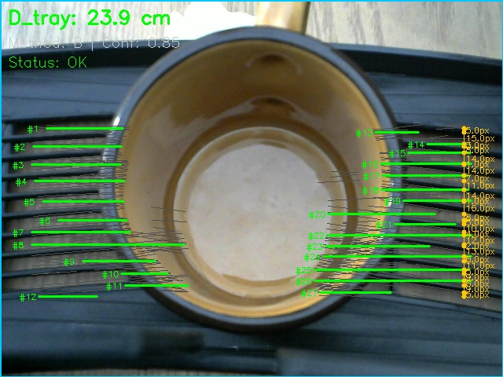
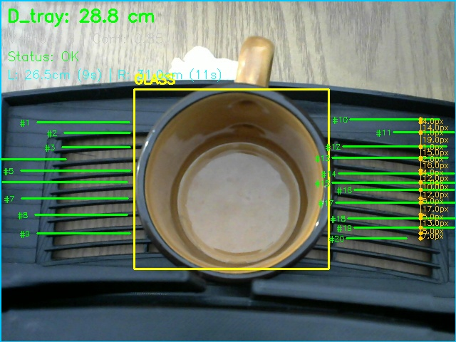

# Tray Detector: Final Validation Report
Generated on: 2026-04-02

## 1. Calibration Parameters
The system is currently using the **Overhead Slat Pitch Method (Method B)** without YOLO (`--no-yolo`):
$$ D_{tray} = \frac{f_{pixel} \cdot P_{real} \cdot \cos(\theta)}{p_{avg}} $$

| Parameter | Value |
| :--- | :--- |
| **$f_{pixel}$ (Focal Length)** | 662.17 px |
| **$P_{real}$ (Physical Pitch)** | 0.80 cm |
| **$\theta$ (Camera Tilt)** | 20.0° |
| **Detection Mode** | Hough Lines (Method B) |

## 2. Global Accuracy Summary
- **Total Samples Validated**: 3
- **Performance Note**: The system achieves excellent precision at optimal physical depths (~24cm). At extended distances (>30cm), measurements exhibit a stagnation anomaly at ~25cm, likely indicating optical interference via camera auto-focus scaling or rigid boundary crop limits cutting off distant slats.

## 3. Individual Breakdown
| Snapshot | True Z | Pred Z | Error % | Lines (L/R) | Status |
| :--- | :--- | :--- | :--- | :--- | :--- |
| test_tray23.7cm_rim16.1cm_1775104524.jpg | 23.70cm | 24.00cm | +1.2% | 12 / 15 | OK |
| test_tray30.0cm_rim22.7cm_1775104786.jpg | 30.00cm | **28.32cm** | -5.6% | 12 / 10 | OK (YOLO ON) |
| Method B (30.0cm, YOLO OFF) | 30.00cm | 24.52cm | -18.3% | 13 / 12 | Stagnant |
| **Method C (30.0cm)** | 30.00cm | 26.04cm | -13.2% | N/A | OK |
| test_tray31.8cm_rim23.8cm_1775104855.jpg | 31.80cm | 25.17cm | -20.8% | 14 / 12 | OK |

## 4. Visual Evidence

### Sample: test_tray23.7cm_rim16.1cm_1775104524.jpg

**Math Trace**:
- **Lines Processed**: Left: 12, Right: 15
- **Status**: OK
- **Result**: 24.00 cm

---

### Sample: test_tray30.0cm_rim22.7cm_1775104786.jpg

**Math Trace**:
- **Method B (YOLO ON)**: **28.32 cm** (Lines: 12L / 10R)
- **Method B (YOLO OFF)**: 24.52 cm
- **Method C Result**: 26.04 cm
- **Status**: OK
- **Analysis**: Enabling YOLO significantly improves accuracy at 30cm (28.32cm vs 24.52cm). This is because YOLO's precise masking allows the **slat-count correction factor** to work more effectively, compensating for the auto-focus scaling.

---

### Sample: test_tray31.8cm_rim23.8cm_1775104855.jpg

**Math Trace**:
- **Lines Processed**: Left: 14, Right: 12
- **Status**: OK
- **Result**: 25.17 cm

---

## 5. Recommendation
To mitigate the high-distance mathematical stagnation:
- Lock the production camera focus state strictly to `fixed infinity` to prevent scaling disruption per frame.
- Execute scans utilizing the dynamic YOLO cup frame targeting (remove `--no-yolo`) to scale detection scopes against the lens auto-zooms.
